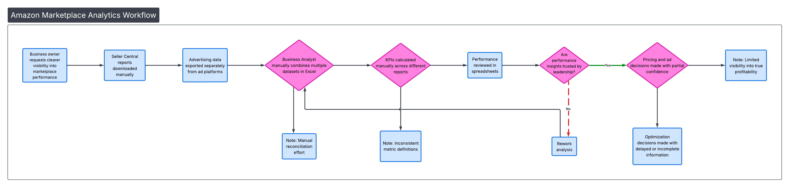
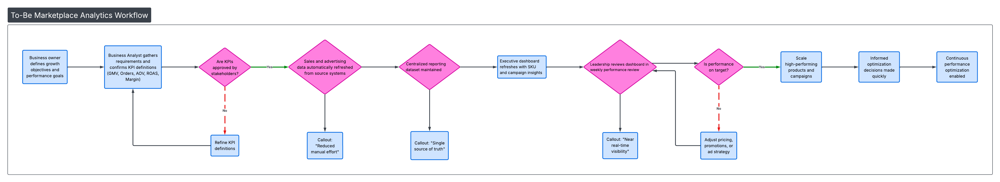
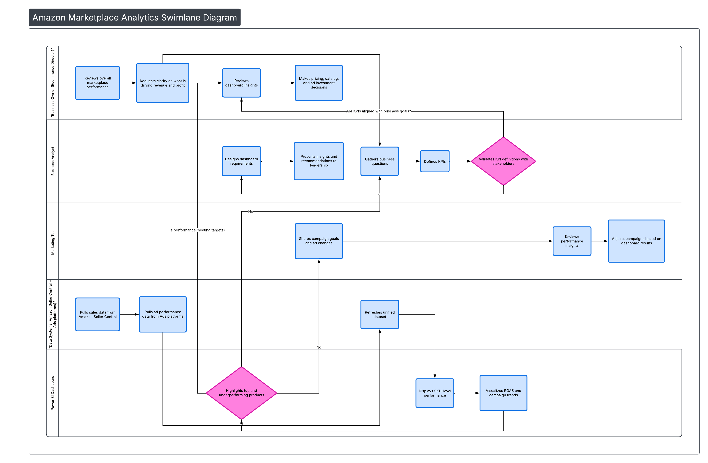

## 📐 Process Diagrams

### As-Is Workflow (Current State)
Manual reporting, inconsistent metrics, limited trust in insights.

---

### To-Be Workflow (Future State)
Automated data refresh, aligned KPIs, leadership trust in insights.

---

### Swimlane Diagram
Shows how responsibilities flow across:
- Business Owner  
- Business Analyst  
- Marketing Team  
- Data Systems  
- Dashboard  

