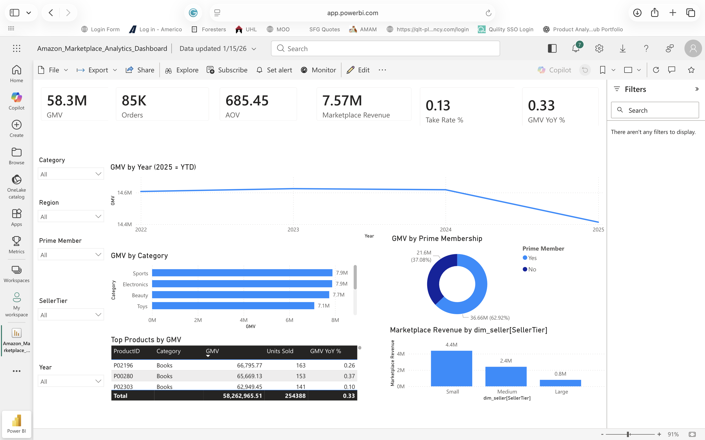
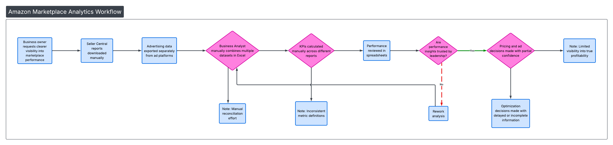
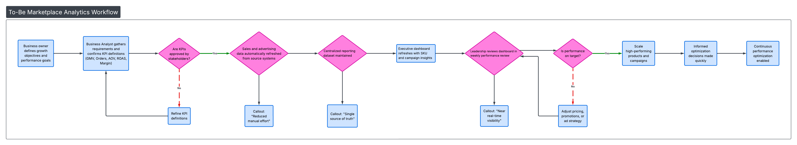
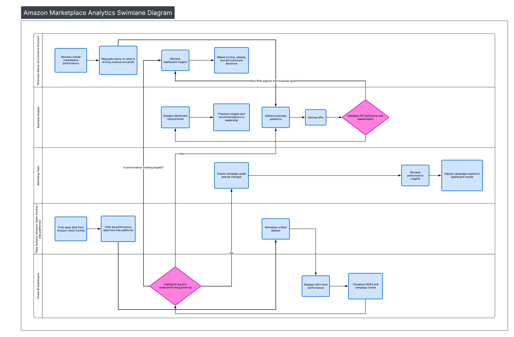
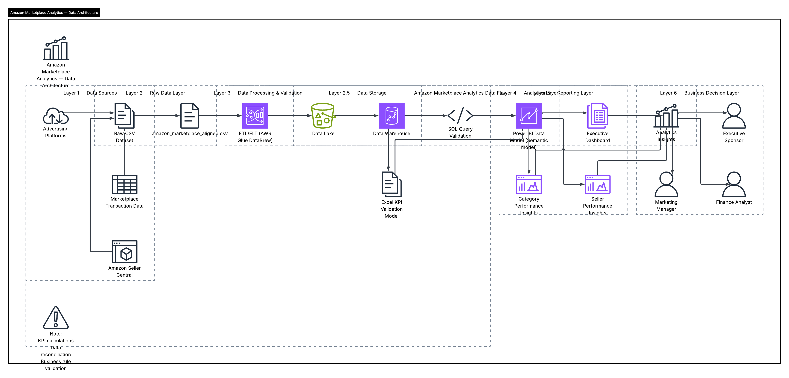
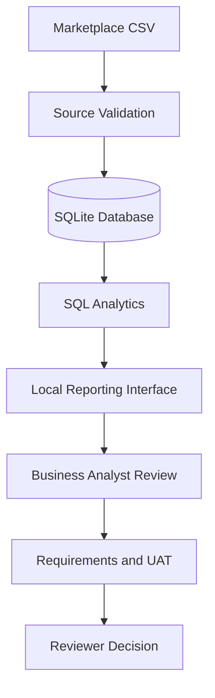
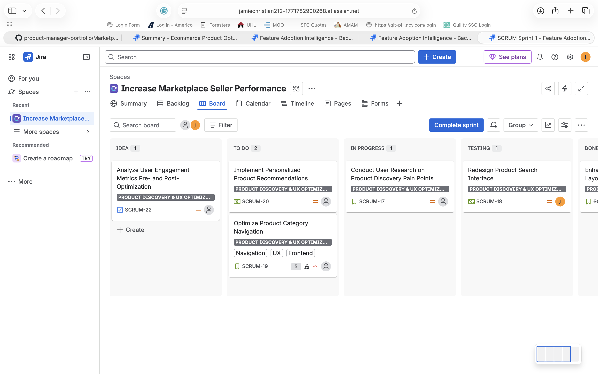

# 🛒 Amazon Marketplace Analytics | Business Analysis & Systems Case Study

<div align="center">

### 📊 From Marketplace Data to Business Requirements, Trusted KPIs & Actionable Decisions

**End-to-End Business Analysis • SQL Analytics • Process Improvement • Business Systems Implementation**


**Jamie Christian | Business Analyst & Business Systems Analyst Portfolio**

[](../README.md)
[](https://www.linkedin.com/in/jamiechristian2/)

</div>

---

## 👋 Executive Summary

This project examines how a marketplace operations team can strengthen reporting, standardize business metrics, evaluate seller performance, and make evidence-based decisions.

The case study demonstrates the full business analysis lifecycle:

**Business Problem → Requirements → Data Analysis → Process Modeling → Gap Assessment → Solution Design → Testing → Decision Support**

It combines five reproducible SQL analyses, Power BI reporting, Excel workbooks, business requirements, cross-functional process diagrams, Agile planning artifacts, and a working local Python/SQLite business analysis application.

> **Project transparency:** This is an independent portfolio simulation using supplied marketplace data, not an Amazon client engagement. Financial amounts are interpreted as USD for this exercise. Executed analytical findings are distinguished from proposed business improvements and production requirements.

### 📌 Project at a Glance

| Portfolio Component | Verified Scope |
|---|---:|
| 📦 Source Records | **5,500** |
| 📅 Reporting Period | **July–December 2025** |
| 🏪 Marketplace Sellers | **4** |
| 📊 SQL Analyses | **5** |
| 📋 Business Requirements | **8** |
| 📝 Linked User Stories | **8** |
| 🧪 Planned UAT Cases | **24** |
| 🔍 Detailed Gap Assessments | **8** |
| 💻 Working Local Business System | **Implemented** |

### 🧭 Quick Navigation

[🎯 Business Problem](#-business-problem--objectives) · [📊 Results](#-verified-marketplace-performance) · [📈 Dashboard](#-dashboard--reporting-evidence) · [📐 Process Diagrams](#-professional-process-modeling) · [🎯 Business Impact](#-business-findings--recommendations) · [🔍 Gap Analysis](#-detailed-gap-analysis) · [📋 Requirements](#-requirements-engineering--traceability) · [🧪 UAT](#-uat--delivery-governance) · [💻 Working System](#-working-business-systems-implementation) · [📂 Artifacts](#-project-artifacts--evidence)

---

# 🎯 Business Problem & Objectives

## 🏢 Business Context

Marketplace operations teams need reliable reporting to understand transaction activity, seller contribution, product performance, and revenue generation.

Without consistent KPI definitions and reporting controls, decision-makers risk:

- Confusing gross merchandise value with platform revenue.
- Misinterpreting seller concentration.
- Using inaccurate weighted performance metrics.
- Drawing unsupported profitability conclusions.
- Making decisions without documented evidence.
- Releasing reports without adequate reconciliation and approval.

### 🔎 Central Business Question

**Which seller and category combinations deserve an operational review, and which KPI definitions must be standardized before the next monthly business review?**

## 🎯 Project Objectives

1. Establish clear definitions for marketplace financial and operational KPIs.
2. Analyze seller, product, category, and monthly performance.
3. Validate source records and reconcile financial totals.
4. Document business and functional requirements.
5. Identify current-state reporting and governance gaps.
6. Design improved future-state workflows.
7. Prepare acceptance criteria and UAT scenarios.
8. Connect analytical findings to measurable business recommendations.

### 👥 Illustrative Stakeholders

| Stakeholder | Business Responsibility |
|---|---|
| Marketplace General Manager | Sponsorship and business release |
| Marketplace Operations Manager | KPI ownership and business requirements |
| Seller Performance Analyst | Seller and category reviews |
| Data / BI Engineer | Data processing, reporting, and validation |
| Source System Administrator | Source data integrity and contracts |
| Finance / Security Reviewer | Financial controls and access review |

Stakeholder responsibilities are proposed for the case study; they do not represent actual interviews or approvals.

---

# 📊 Verified Marketplace Performance

The following results are supported by executed SQL queries and saved analytical outputs.

## 🏆 Executive KPI Scorecard

| KPI | Verified Result | Calculation |
|---|---:|---|
| 💰 Gross Merchandise Value | **$239,161.36** | SUM(GMV) |
| 💵 Platform Revenue | **$33,393.15** | SUM(Platform Revenue) |
| 🛍️ Total Orders | **5,500** | SUM(Orders) |
| 📦 Units Sold | **6,803** | SUM(Units) |
| ⚖️ Weighted Take Rate | **13.96%** | Platform Revenue ÷ GMV |
| 🧾 Average Order Value | **$43.48** | GMV ÷ Orders |

**Business interpretation:** GMV represents gross marketplace transaction value, whereas platform revenue represents the supplied marketplace revenue amount. Neither metric should be presented as product profit.

**[🔗 SQL Control Totals](./SQL/Q01.sql)** · **[📄 Executed Output](./Analysis/Q01.csv)**

## 📅 Monthly GMV Analysis

| Month | GMV | Month-over-Month |
|---|---:|---:|
| July 2025 | $41,096.54 | Baseline |
| August 2025 | $40,022.16 | −2.61% |
| September 2025 | $38,572.50 | −3.62% |
| October 2025 | $40,225.22 | +4.28% |
| November 2025 | $38,156.60 | −5.14% |
| December 2025 | $41,088.34 | +7.68% |

### 💡 Business Finding

December recorded the largest positive month-over-month GMV increase in the reporting period.

**Recommended investigation:** Compare changes in order volume, product categories, and seller contributions before attributing the movement to seasonality or pricing.

**[🔗 Monthly SQL](./SQL/Q02.sql)** · **[📄 Monthly Results](./Analysis/Q02.csv)**

## 🏪 Seller Performance Analysis

| Seller | GMV | GMV Share |
|---|---:|---:|
| Apex Outdoor | $60,512.15 | 25.30% |
| Apex Value | $59,789.51 | 25.00% |
| Apex Prime | $59,630.57 | 24.93% |
| Apex Essentials | $59,229.13 | 24.77% |

### 💡 Business Finding

Marketplace GMV is relatively evenly distributed across the four sellers.

The largest seller contributes approximately **25.30%** of total GMV, indicating that the available data does not show a single dominant seller.

**Recommendation:** Introduce standardized seller performance reviews, supported by validated fulfillment, returns, and service metrics when those data sources become available.

**[🔗 Seller Analysis SQL](./SQL/Q03.sql)** · **[📄 Seller Results](./Analysis/Q03.csv)**

## 📦 Product Contribution Analysis

The portfolio contains 80 products in its product contribution analysis.

**The top 16 products contribute 24.44% of total GMV.**

This result challenges an unsupported assumption that the top 20% of products automatically generate 80% of marketplace revenue.

### 💡 Business Finding

Product performance should be evaluated using actual ranked contribution, not generalized assumptions.

**Recommendation:** Review product assortment and category contribution using reproducible SQL calculations, while requesting cost and returns data before evaluating profitability.

**[🔗 Product Analysis SQL](./SQL/Q04.sql)** · **[📄 Product Results](./Analysis/Q04.csv)**

---

# 📈 Dashboard & Reporting Evidence

## 🖼️ Marketplace Performance Dashboard



The dashboard provides a visual reporting artifact for marketplace performance analysis.

### 📊 Analytical Coverage

| Reporting Area | Business Application |
|---|---|
| 💰 GMV | Monitor gross transaction value |
| 💵 Platform Revenue | Evaluate supplied platform earnings |
| 📅 Monthly Performance | Investigate period-over-period changes |
| 🏪 Seller Contribution | Compare seller activity |
| 📦 Product Performance | Evaluate product-level GMV |
| 🗂️ Category Analysis | Investigate marketplace composition |
| ⚖️ Weighted Metrics | Support consistent KPI interpretation |

**[📊 Open Power BI Dashboard](./Dashboard/Amazon_Marketplace_Analytics_Dashboard.pbix)** · **[📄 Review Reproducible Results](./Analysis/RESULTS.md)**

> The Power BI file is a retained dashboard artifact. Its native calculations and interactions require independent reconciliation against the current SQL definitions before being considered a certified reporting implementation.

---

# 📐 Professional Process Modeling


Process modeling communicates current-state activities, future-state recommendations, responsibility boundaries, and technical dependencies.

## 🔴 Current-State Process — As-Is



**Analysis focus:** Reporting handoffs, metric inconsistencies, manual review activities, and potential control weaknesses.

## 🟢 Future-State Process — To-Be



**Proposed improvement:** Introduce consistent KPI definitions, validation checkpoints, exception tracking, and controlled reporting workflows.

## 🏊 Cross-Functional Swimlane



**Business purpose:** Clarify roles, decisions, responsibilities, and process handoffs across analytical and operational functions.

## 🏗️ Marketplace Data Architecture



**Technical purpose:** Illustrate source data, analytical processing, and reporting relationships.

**[📂 Explore All Process Diagrams](./Diagrams)** · **[📘 Process & Gap Analysis](./Docs/04_Process_and_Gap_Analysis.md)** · **[📐 System Design](./Docs/07_BI_and_System_Design.md)**

---

# 🎯 Business Findings & Recommendations


The goal of the analysis is to translate verified findings into recommendations that stakeholders can evaluate.

## 📋 Findings-to-Action Matrix

| Finding | Business Implication | Recommended Action | Success Measure |
|---|---|---|---|
| $239,161.36 GMV vs. $33,393.15 platform revenue | Different financial measures must remain separate | Standardize KPI definitions | Reconciled financial reporting |
| 13.96% weighted take rate | Simple averages can misstate aggregate performance | Use ratio-of-sums calculations | Independent KPI validation |
| Largest seller contributes 25.30% | Seller performance requires contextual review | Establish seller review procedures | Documented review completion |
| Top 20% of products contribute 24.44% GMV | Generic Pareto assumptions are unsupported | Use measured product contribution | Accurate cumulative ranking |
| Monthly GMV fluctuates | Performance drivers need investigation | Introduce monthly variance analysis | Reproducible trend explanations |

## 📏 Proposed Business Benefits Framework

| Improvement Area | Required Baseline | Validation Method |
|---|---|---|
| ⏱️ Reporting Efficiency | Current reporting cycle time | Before-and-after comparison |
| 🧹 Data Quality | Existing exception rate | Validation and reconciliation |
| 📊 KPI Consistency | Current definition discrepancies | Metric definition audit |
| 🧪 Testing Coverage | Requirement-to-test mapping | Traceability review |
| 🔍 Gap Resolution | Open gap inventory | Evidence-based closure |
| 📈 Reporting Adoption | Current user workflow | Pilot task completion |

**Important:** These are proposed improvements and measurement criteria. No unverified productivity gains, cost savings, or revenue increases are claimed.

**[📘 Business Findings](./Docs/05_Case_Study_and_Findings.md)** · **[📑 Executive Decision Brief](./Docs/08_Executive_Decision_Brief.md)**

---

# 🔍 Detailed Gap Analysis


Gap analysis compares existing capabilities against the target reporting and governance requirements.

## 📋 Gap Assessment Matrix

| Gap ID | Current Limitation | Target Capability | Priority |
|---|---|---|---|
| MKT-GAP-01 | Missing order business identifier | Validated transaction key | P1 |
| MKT-GAP-02 | Missing costs and returns | Reconciled profitability inputs | P2 |
| MKT-GAP-03 | Missing seller service context | Context-rich seller reviews | P2 |
| MKT-GAP-04 | Native BI model not certified | Verified semantic reporting model | P2 |
| MKT-GAP-05 | Enterprise identity controls absent | Approved SSO and access policies | P1 |
| MKT-GAP-06 | Business UAT not executed | Evidence-based acceptance | P1 |
| MKT-GAP-07 | Operational scheduling absent | Monitored automated refresh | P2 |
| MKT-GAP-08 | No measured benefits baseline | Validated pilot measurement | P2 |

### 🔄 Gap Resolution Lifecycle


```mermaid
flowchart LR
    A[Current State] --> B[Identify Gap]
    B --> C[Assess Impact]
    C --> D[Prioritize]
    D --> E[Plan Remediation]
    E --> F[Validate Evidence]
    F --> G[Review Closure]
```

### 🛡️ Closure Governance

A gap should not be marked resolved solely because a related feature has been developed.

Closure requires relevant implementation evidence, testing, and review appropriate to the affected business requirement.

**[🔍 Detailed Gap Analysis](./Docs/10_Detailed_Gap_Analysis.md)** · **[📄 Gap Register](./Delivery/gap_register.csv)**

---

# 📋 Requirements Engineering & Traceability


The project defines eight requirements supported by user stories, acceptance criteria, analytical evidence, and UAT planning.

## 📑 Requirements Inventory

| Requirement | Business Capability | Priority |
|---|---|---|
| MKT-REQ-01 | Ingest marketplace records | Must |
| MKT-REQ-02 | Separate GMV and platform revenue | Must |
| MKT-REQ-03 | Calculate weighted take rate | Must |
| MKT-REQ-04 | Review seller concentration | Must |
| MKT-REQ-05 | Evaluate product contribution | Should |
| MKT-REQ-06 | Analyze monthly changes | Should |
| MKT-REQ-07 | Govern access and exports | Must |
| MKT-REQ-08 | Document evidence-backed actions | Should |

### 🔗 Requirements Traceability Lifecycle


```mermaid
flowchart LR
    A[Business Objective] --> B[Requirement]
    B --> C[User Story]
    C --> D[Acceptance Criteria]
    D --> E[Implementation Evidence]
    E --> F[UAT Case]
    F --> G[Review Decision]
```

### 🧪 Example Acceptance Criteria

**Requirement: MKT-REQ-03 — Weighted Take Rate**

The solution must calculate:

`SUM(platform_revenue) / SUM(gmv)`

A test fixture with unequal GMV values must produce the correctly weighted result. A zero-GMV denominator must return an undefined value rather than a misleading zero.

**[📘 Business Requirements](./Docs/01_Business_Requirements.md)** · **[📗 Functional Specification](./Docs/02_Functional_and_Data_Specification.md)** · **[🔗 Requirements Traceability](./Delivery/requirements_traceability.csv)**

---

# 🧪 UAT & Delivery Governance

The project includes **24 planned UAT cases**, covering acceptance, boundary conditions, and business review.

## 🔬 Testing Coverage

| Testing Area | Validation Focus |
|---|---|
| Source Ingestion | Record counts and lineage |
| Financial Reporting | Monetary reconciliation |
| Weighted KPIs | Calculation accuracy |
| Seller Analysis | Contribution totals |
| Product Ranking | Cumulative contribution |
| Monthly Analysis | Chronological comparisons |
| Access Governance | Authorized and unauthorized actions |
| Business Review | Interpretation and evidence |

### 📋 Delivery Management Artifacts

- Requirements traceability matrix
- User story backlog
- UAT register
- Defect log
- RAID register
- Change-control records
- Decision log
- Gap register

**UAT status:** The business UAT cases are planned, not externally executed or approved. Local analytical tests and application integration tests are separate technical evidence.

**[🧪 UAT Register](./Delivery/uat_cases.csv)** · **[🐛 Defects](./Delivery/defect_log.csv)** · **[⚠️ RAID](./Delivery/raid_log.csv)** · **[🔄 Change Control](./Delivery/change_request.csv)** · **[📘 Delivery Guide](./Docs/06_Delivery_UAT_and_Change_Control.md)**

---

# 💻 Working Business Systems Implementation


The parent portfolio contains a working Python/SQLite business analysis application that supports the marketplace case study.

## ⚙️ Implemented Capabilities

| Capability | Business Purpose |
|---|---|
| 📊 SQL-Backed Reporting | Marketplace KPI analysis |
| 🔎 Interactive Filters | Investigate selected reporting populations |
| 📂 Source Drilldown | Review supporting records |
| 📤 CSV Export | Export analytical results |
| 📋 Requirements Tracking | Maintain business requirements |
| 🧪 UAT Management | Record test activity |
| 🔍 Gap Management | Track remediation reviews |
| 👥 Role-Based Access | Separate application permissions |
| 🛡️ Audit History | Record workflow changes |
| 🔄 Transactional Refresh | Validate source updates |

## 🏗️ System Architecture


```mermaid
flowchart TD
    A[Marketplace CSV] --> B[Source Validation]
    B --> C[(SQLite Database)]
    C --> D[SQL Analytics]
    D --> E[Local Reporting Interface]
    E --> F[Business Analyst Review]
    F --> G[Requirements and UAT]
    G --> H[Reviewer Decision]
```

### ▶️ Run the Application

From the repository root:

```bash
python3 Local_System/server.py
```

Open **http://127.0.0.1:8765**.

### 🧪 Run Integration Tests

```bash
python3 Local_System/test_system.py
```

The shared application includes 16 integration tests.

**Deployment scope:** This is a working local application, not a live Amazon integration or production enterprise deployment.

**[📂 Working Application](../Local_System)** · **[📐 Technical Architecture](../Local_System/ARCHITECTURE.md)** · **[📘 Setup Instructions](../Local_System/README.md)**

---

# 📗 Advanced Excel & Agile Artifacts

## 📊 Excel Deliverables

| Workbook | Business Application |
|---|---|
| [Marketplace Analytics Workbook](./Excel/Amazon_Marketplace_Analytics_Project_Workbook.xlsx) | Marketplace analytical calculations |
| [Project Delivery Workbook](./Excel/Amazon_Marketplace_Analytics_Project_Project_Workbook.xlsx) | Project and delivery tracking |
| [UAT Workbook](./Excel/Amazon_Marketplace_UAT.xlsx) | Acceptance testing |
| [User Story Backlog](./Excel/Amazon_Marketplace_User_Story_Backlog.xlsx) | Agile planning |

## 🗓️ Agile Planning



The Agile artifacts demonstrate portfolio backlog and sprint-planning approaches. They do not represent verified ceremonies in a live delivery organization.

**[📂 Agile Artifacts](./Jira)** · **[📋 User Story Backlog](./Delivery/user_story_backlog.csv)**

---

# 🗃️ SQL Analysis & Reproducibility

Five SQL queries support the marketplace case study.

| Query | Analytical Focus | Evidence |
|---|---|---|
| Q01 | Control totals and weighted KPIs | [SQL](./SQL/Q01.sql) · [CSV](./Analysis/Q01.csv) |
| Q02 | Monthly performance | [SQL](./SQL/Q02.sql) · [CSV](./Analysis/Q02.csv) |
| Q03 | Seller contribution | [SQL](./SQL/Q03.sql) · [CSV](./Analysis/Q03.csv) |
| Q04 | Product concentration | [SQL](./SQL/Q04.sql) · [CSV](./Analysis/Q04.csv) |
| Q05 | Category and seller analysis | [SQL](./SQL/Q05.sql) · [CSV](./Analysis/Q05.csv) |

### 🔄 Analytical Workflow


```mermaid
flowchart LR
    A[Business Question] --> B[Data Requirements]
    B --> C[Data Validation]
    C --> D[SQL Analysis]
    D --> E[KPI Reporting]
    E --> F[Recommendations]
```

**[📄 Complete Analytical Results](./Analysis/RESULTS.md)** · **[📂 SQL Files](./SQL)** · **[🗃️ Source Dataset](./Data/amazon_marketplace_aligned.csv)**

---

# ⚠️ Data Limitations & Responsible Interpretation

The supplied dataset does not contain:

- Reliable order-level business identifiers
- Item-level cost information
- Returns and refunds
- Complete commercial fee schedules
- Seller service-level performance
- Inventory information
- Experiment assignment data
- Verified operational efficiency baselines

Consequently, this analysis cannot establish actual product profit margins, pricing causality, or realized organizational financial benefits.

### 🛡️ Analytical Quality Principles

- Preserve source-row lineage.
- Reconcile additive monetary values.
- Calculate aggregate rates from matched sums.
- Distinguish GMV from platform revenue.
- Avoid unsupported causal claims.
- Document assumptions and unresolved limitations.
- Require evidence before business acceptance.

---

# 📂 Project Artifacts & Evidence

| Deliverable | Repository Location |
|---|---|
| 📊 SQL Results | [Analysis](./Analysis) |
| 🗃️ Source Dataset | [Data](./Data) |
| 📈 Power BI Dashboard | [Dashboard](./Dashboard) |
| 📋 Business Requirements | [Documentation](./Docs) |
| 📐 Process & Architecture Diagrams | [Diagrams](./Diagrams) |
| 📗 Excel Workbooks | [Excel](./Excel) |
| 🧪 UAT & Governance | [Delivery](./Delivery) |
| 🗓️ Agile Planning | [Jira](./Jira) |
| 💻 Working Application | [Local System](../Local_System) |
| 📑 Executive Presentation | [Executive Deck](./Deck/Executive_Deck.pdf) |

---

# 🎯 Professional Competencies Demonstrated

| Competency | Supporting Evidence |
|---|---|
| 🧠 Business Problem-Solving | Marketplace decision framing |
| 📋 Requirements Engineering | BRD, FRD, user stories, acceptance criteria |
| 🔍 Gap Analysis | Eight detailed assessments |
| 📐 Process Modeling | As-Is, To-Be, swimlane, architecture |
| 📊 SQL Analytics | Five reproducible analyses |
| 📈 Business Intelligence | Power BI dashboard artifact |
| 📗 Excel | Analytical and delivery workbooks |
| 🧪 Testing | UAT planning and integration tests |
| 🛡️ Governance | RAID, change control, defects |
| 💻 Business Systems | Working local application |
| 🤝 Business Communication | Executive findings and recommendations |

---

# 👤 About the Author

**Jamie Christian**

🎓 **B.S. Entrepreneurial Management, Cum Laude**  
Virginia Union University

I develop practical business analysis projects that combine requirements engineering, process improvement, data analysis, and technical implementation.

My career interests include:

**Business Analyst | Business Systems Analyst | Technical Business Analyst | Systems Analyst | Implementation Analyst | BI Analyst**

---

<div align="center">

## 🤝 Connect With Me

[](../README.md)

[](https://www.linkedin.com/in/jamiechristian2/)

### 💡 Turning Marketplace Data Into Trusted Metrics, Better Processes & Business Decisions

**Business Analysis • Requirements Engineering • SQL • Advanced Excel • Power BI • Gap Analysis • Working Systems**

⭐ **Explore the supporting evidence to see the complete business analysis lifecycle.**

</div>
