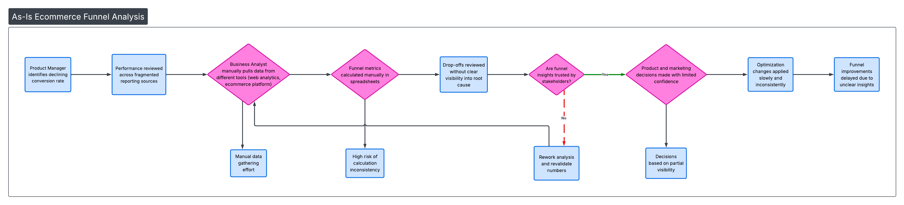
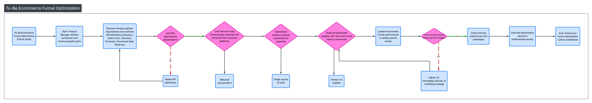
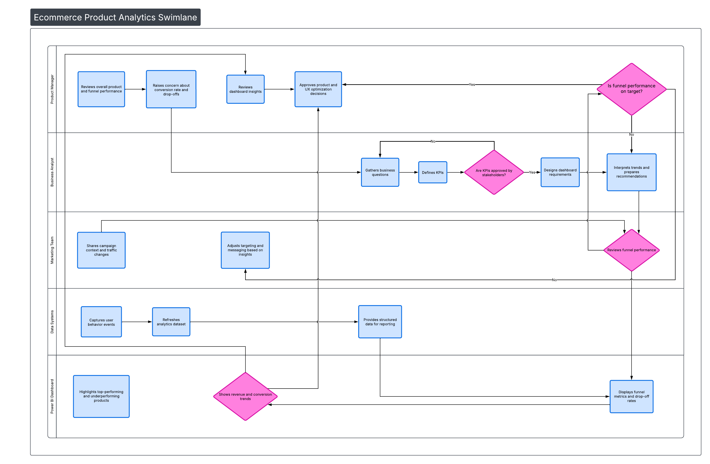

# Ecommerce Product Analytics Project (Dashboard-aligned)

Job-ready Business Analyst case study demonstrating end-to-end analytics, stakeholder alignment, process improvement, and executive-ready insights for an ecommerce product environment.

This project showcases how a Business Analyst supports product and revenue decisions through structured requirements, data analysis, visualization, and process optimization.

---

## 📌 Business Scenario

Leadership requested better visibility into ecommerce product performance to answer key questions such as:
- Which products are driving revenue and margin?
- Where are customers dropping off in the funnel?
- Which campaigns and categories are underperforming?
- How can decision-making be improved with clearer metrics?

The initial process was fragmented and slow. This project demonstrates both the **current (As-Is)** state and the **optimized (To-Be)** future state.

---

## 📊 Dashboard Overview
The dashboard supports:
- Revenue and order trends  
- Product performance by category  
- Conversion and funnel analysis  
- Campaign effectiveness  
- Actionable performance insights  

> Dashboard screenshots are located in the `/Dashboard` folder.

---

## 📐 Process Diagrams

### As-Is Workflow (Current State)
Shows the original process where reporting is fragmented, definitions vary, and insights are delayed.

---

### To-Be Workflow (Future State)
Illustrates the optimized workflow with aligned KPIs, improved visibility, and faster business decision-making.

---

### Swimlane Diagram (Cross-Functional Flow)
Demonstrates collaboration across:
- Product Management  
- Business Analysis  
- Marketing  
- Data / Analytics  
- Leadership  

---

## 📂 Project Deliverables

This project includes realistic Business Analyst artifacts:

| Folder | Contents |
|------|----------|
| `/Dashboard` | Dashboard files and screenshots |
| `/Data` | Simulated datasets aligned to the dashboard |
| `/Excel` | Business analysis models, pivots, and calculations |
| `/SQL` | Queries used to generate KPIs and tables |
| `/Docs` | BRD, FRD, requirements, and stakeholder artifacts |
| `/Deck` | Executive-ready presentation |
| `/Diagrams` | As-Is, To-Be, and Swimlane diagrams |

---

## 🧠 Skills Demonstrated

- Business requirements gathering  
- KPI definition and stakeholder alignment  
- Process mapping (As-Is / To-Be / Swimlane)  
- Data analysis and interpretation  
- Dashboard-driven storytelling  
- Executive communication  
- Structured documentation  
- Business impact thinking  

---

## 🎯 Outcome
This project demonstrates how a Business Analyst:
- Turns vague questions into structured requirements  
- Aligns stakeholders on metrics and definitions  
- Builds artifacts that support confident decisions  
- Improves operational clarity and performance  

---

## 👤 Author
Jamie Christian  
LinkedIn: https://www.linkedin.com/in/jamiechristian2/
