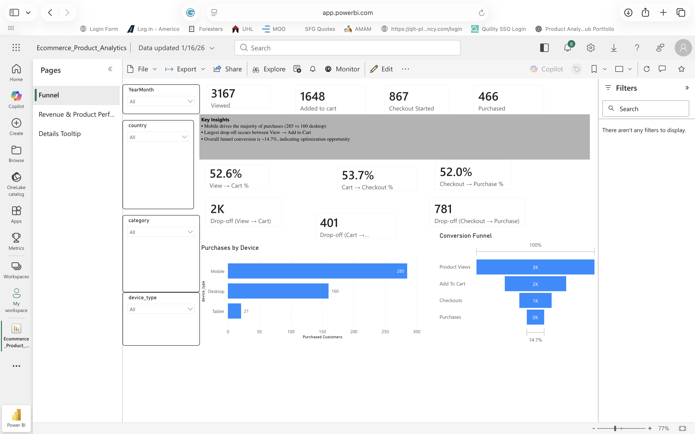
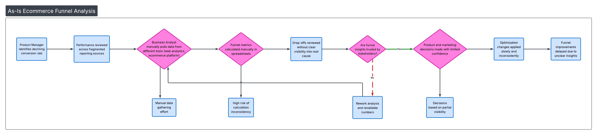
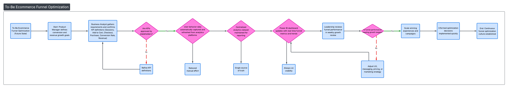
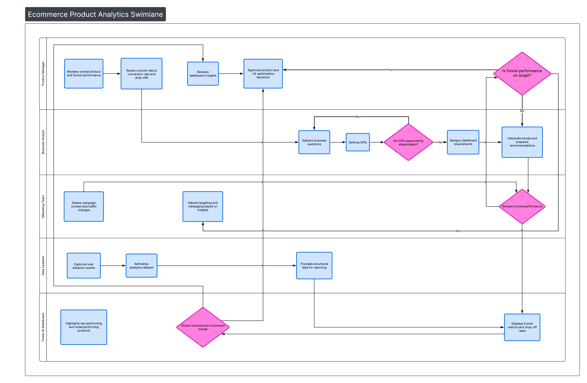
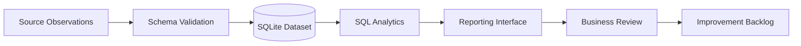

# 🛒 Ecommerce Product Analytics | Business Analysis & Conversion Optimization

<div align="center">

### 📊 From Ecommerce Data to Business Requirements, Conversion Insights & Actionable Decisions

**Business Analysis • Product Analytics • SQL • Power BI • Advanced Excel • Process Improvement • Business Systems**


**Jamie Christian | Business Analyst & Business Systems Analyst Portfolio**

[🏠 Main Portfolio](../README.md) · [📊 Analysis Results](Analysis/RESULTS.md) · [📋 Requirements](Docs/01_Business_Requirements.md) · [💻 Working System](../Local_System/README.md) · [🔗 LinkedIn](https://www.linkedin.com/in/jamiechristian2/)

</div>

---

## 🎯 Executive Summary

**Business Decision:** Which ecommerce funnel transition and device should be investigated first, and what additional instrumentation is required to test a checkout improvement?

This independent portfolio case study demonstrates how a Business Analyst can translate ecommerce data into validated KPIs, business requirements, process improvements, and evidence-backed recommendations.

The project covers the complete business analysis lifecycle:

**Business Problem → Data Discovery → Requirements → SQL Analysis → Process Modeling → Gap Assessment → Solution Design → Testing → Decision Support**

It combines reproducible SQL analysis, Power BI reporting, Excel modeling, business and functional requirements, cross-functional process diagrams, detailed gap analysis, Agile delivery registers, and a working Python/SQLite business analysis application.

> **Project transparency:** This is an independent portfolio simulation using supplied ecommerce data, not a live client engagement. Financial values are treated as USD for this exercise. Executed analytical findings are distinguished from proposed business improvements and production requirements.

### 📌 Project at a Glance

| Component | Verified Scope |
|---|---:|
| 📦 Source Observations | **14,000** |
| 📅 Reporting Period | **July–December 2025** |
| 📊 SQL Analyses | **5** |
| 🛒 Purchase Observations | **1,200** |
| 📋 Business Requirements | **8** |
| 📝 Linked User Stories | **8** |
| 🧪 Planned UAT Cases | **24** |
| 🔍 Detailed Gap Assessments | **8** |
| 💻 Working Local System | **Implemented** |

### 🧭 Quick Navigation

[🎯 Business Problem](#-business-problem--objectives) · [📊 Results](#-verified-ecommerce-performance) · [🔄 Funnel](#-conversion-funnel-analysis) · [📱 Devices](#-device-performance-analysis) · [📈 Dashboard](#-dashboard--visual-evidence) · [📐 Diagrams](#-process-modeling--architecture) · [💡 Recommendations](#-business-findings--recommendations) · [🔍 Gaps](#-detailed-gap-analysis) · [📋 Requirements](#-requirements-uat--delivery-controls) · [📗 Excel](#-excel--project-deliverables) · [💻 System](#-working-business-systems-implementation)

---

# 🎯 Business Problem & Objectives

## 🏢 Business Context

Ecommerce organizations need reliable analytics to understand how visitors interact with products, progress through purchase stages, and contribute to revenue.

However, incomplete event tracking, inconsistent KPI definitions, and disconnected reporting processes can limit decision-making.

Potential business risks include:

- Inconsistent funnel conversion calculations.
- Limited visibility into device-specific performance.
- Unsupported explanations for cart or checkout abandonment.
- Missing customer journey instrumentation.
- Dashboard metrics that are not reconciled to source data.
- Insufficient testing and approval controls.

### 🔎 Central Business Question

**Which funnel transition and device should the ecommerce team investigate first, and what additional data is needed to test a proposed improvement?**

### 🎯 Project Objectives

1. Establish accurate ecommerce funnel KPIs.
2. Analyze progression through the purchase journey.
3. Compare conversion performance across devices.
4. Evaluate acquisition-channel revenue and supplied profitability.
5. Analyze monthly revenue trends.
6. Document business requirements and acceptance criteria.
7. Model current-state and future-state workflows.
8. Identify and prioritize system and process gaps.
9. Recommend an evidence-based improvement strategy.

### 👥 Illustrative Stakeholders

| Stakeholder | Responsibility |
|---|---|
| Head of Ecommerce | Sponsorship and release approval |
| Checkout Product Manager | KPI ownership and business requirements |
| Product Analyst | Funnel and device analysis |
| Data / BI Engineer | Data processing and reporting |
| Source System Administrator | Source integrity and event contracts |
| Finance / Security Reviewer | Financial controls and governance |

These roles are proposed for the portfolio scenario rather than representing completed stakeholder interviews.

---

# 📊 Verified Ecommerce Performance

## 🏆 Executive KPI Scorecard

| KPI | Verified Result |
|---|---:|
| 👁️ View Observations | **14,000** |
| 🛒 Cart Observations | **2,406** |
| 💳 Checkout Observations | **1,608** |
| ✅ Purchase Observations | **1,200** |
| 📦 Recorded Orders | **1,200** |
| 💰 Revenue | **$94,277.20** |
| 📈 Supplied Profit | **$23,418.34** |
| 🎯 View-to-Purchase Rate | **8.57%** |
| 🧾 Average Order Value | **$78.56** |
| ⚖️ Supplied Profit Margin | **24.84%** |

**Measurement note:** These are observations in the supplied dataset, not verified distinct customers or sessions. The supplied profit value is not independently reconciled against a complete cost ledger.

[🔗 KPI SQL](SQL/Q01.sql) · [📄 Executed Results](Analysis/Q01.csv) · [📊 Complete Results](Analysis/RESULTS.md)

---

# 🔄 Conversion Funnel Analysis

## 📊 Funnel Overview


```mermaid
flowchart LR
    A["👁️ Views: 14,000"] -->|"17.19%"| B["🛒 Carts: 2,406"]
    B -->|"66.83%"| C["💳 Checkouts: 1,608"]
    C -->|"74.63%"| D["✅ Purchases: 1,200"]
```

## 🔍 Funnel Performance

| Transition | Progression Rate | Non-Progression Rate |
|---|---:|---:|
| View → Cart | **17.19%** | **82.81%** |
| Cart → Checkout | **66.83%** | **33.17%** |
| Checkout → Purchase | **74.63%** | **25.37%** |

### 💡 Primary Business Finding

The largest proportional funnel loss occurs between **View and Cart**.

Of the 14,000 view observations, 11,594 do not progress to a cart observation.

### 🎯 Recommended Investigation

Prioritize early shopping-stage performance by examining product discoverability, product information, interaction errors, and device-specific behavior.

These are investigation hypotheses, not proven causes of conversion loss.

---

# 📱 Device Performance Analysis

| Device | Views | Purchases | View-to-Purchase Rate |
|---|---:|---:|---:|
| 📱 Mobile | 9,003 | 672 | **7.46%** |
| 💻 Desktop | 4,425 | 468 | **10.58%** |
| 📲 Tablet | 572 | 60 | **10.49%** |

### 💡 Business Finding

Desktop has the highest observed view-to-purchase conversion rate.

Mobile accounts for the largest volume of view observations but has a lower observed conversion rate.

**Desktop exceeds mobile by approximately 3.11 percentage points.**

### 🎯 Recommended Actions

- Investigate mobile product-page usability.
- Examine cart progression by device.
- Compare acquisition-channel composition.
- Collect validated page-error and loading-performance events.
- Introduce session-level tracking before making customer-level claims.

**[🔗 Device SQL](SQL/Q02.sql)** · **[📄 Device Results](Analysis/Q02.csv)**

---

# 📣 Acquisition Channel Analysis

| Channel | Revenue | Supplied Profit |
|---|---:|---:|
| Organic | $37,144.42 | $9,189.99 |
| Paid Search | $20,771.30 | $5,164.76 |
| Paid Social | $15,748.23 | $3,913.98 |
| Email | $14,242.56 | $3,540.10 |
| Referral | $6,370.69 | $1,609.51 |

### 💡 Business Finding

Organic contributes the largest observed revenue amount.

### 🎯 Recommended Action

Review acquisition-channel conversion and revenue composition before recommending changes to marketing investment.

Validated acquisition spend, attribution rules, and complete costs are required to evaluate marketing return on investment.

**[🔗 Channel SQL](SQL/Q03.sql)** · **[📄 Channel Results](Analysis/Q03.csv)**

---

# 📅 Monthly Revenue Trends

| Month | Revenue | Month-over-Month |
|---|---:|---:|
| July 2025 | $15,718.71 | — |
| August 2025 | $15,641.85 | −0.49% |
| September 2025 | $13,689.16 | −12.48% |
| October 2025 | $17,395.70 | **+27.08%** |
| November 2025 | $14,771.39 | −15.09% |
| December 2025 | $17,060.39 | +15.50% |

### 💡 Business Finding

October recorded the largest positive month-over-month revenue change during the reporting period.

### 🎯 Recommended Action

Investigate purchase volume, conversion, and acquisition-channel composition before attributing the change to a particular campaign or product initiative.

**[🔗 Monthly SQL](SQL/Q04.sql)** · **[📄 Monthly Results](Analysis/Q04.csv)**

---

# 📈 Dashboard & Visual Evidence

## 🖼️ Ecommerce Product Analytics Dashboard



**[📊 Open Power BI Dashboard](Dashboard/Ecommerce_Product_Analytics-2.pbix)** · **[📄 Review SQL Results](Analysis/RESULTS.md)**

The dashboard preview is an existing repository image. The PBIX is a retained reporting artifact, but its native calculations and interactions have not been independently certified against the current canonical SQL results.

---

# 📐 Process Modeling & Architecture

## 🔴 Current-State Process — As-Is



**Purpose:** Model existing reporting activities and identify potential validation, handoff, and governance weaknesses.

## 🟢 Future-State Process — To-Be



**Purpose:** Illustrate proposed improvements involving validated data, standardized KPIs, controlled reporting, and review checkpoints.

## 🏊 Cross-Functional Swimlane



**Purpose:** Clarify proposed responsibilities across product, analytics, engineering, and business review.

## 🏗️ Proposed Analytical Architecture


```mermaid
flowchart LR
    A[Source Observations] --> B[Schema Validation]
    B --> C[(SQLite Dataset)]
    C --> D[SQL Analytics]
    D --> E[Reporting Interface]
    E --> F[Business Review]
    F --> G[Improvement Backlog]
```

**[📂 Process Diagrams](Diagrams/)** · **[📘 Process & Gap Analysis](Docs/04_Process_and_Gap_Analysis.md)** · **[📐 System Design](Docs/07_BI_and_System_Design.md)**

---

# 💡 Business Findings & Recommendations

| Finding | Recommendation | Success Evidence |
|---|---|---|
| 82.81% view-to-cart non-progression | Investigate early shopping experience | Validated funnel-stage performance |
| Mobile 7.46% vs. desktop 10.58% | Review mobile journey and traffic composition | Comparable device analysis |
| Organic revenue $37,144.42 | Assess channel contribution | Verified attribution and economics |
| Supplied profit $23,418.34 | Confirm profit methodology | Finance-approved reconciliation |
| No experiment assignment data | Define controlled testing requirements | Validated assignment and exposure events |
| No benefits baseline | Conduct a measured reporting pilot | Comparable cycle times and task outcomes |

### 🎯 Recommended Implementation Sequence

**Approve KPI Definitions → Resolve Event Identity → Improve Instrumentation → Investigate Funnel Loss → Design Controlled Experiment → Validate Results**

No realized conversion uplift, revenue increase, or cost savings is claimed.

**[📘 Business Findings](Docs/05_Case_Study_and_Findings.md)** · **[📑 Executive Decision Brief](Docs/08_Executive_Decision_Brief.md)**

---

# 🔍 Detailed Gap Analysis

| Gap ID | Current Limitation | Target Capability | Priority |
|---|---|---|---|
| ECOM-GAP-01 | Anonymous observations; 138 repeated complete rows | Validated event and session identifiers | P1 |
| ECOM-GAP-02 | Missing shipping, payment-error, and exposure events | Complete event instrumentation | P2 |
| ECOM-GAP-03 | Supplied profit not reconciled to complete costs | Finance-approved economic definitions | P2 |
| ECOM-GAP-04 | Native BI model not certified | Verified semantic reporting model | P2 |
| ECOM-GAP-05 | Enterprise SSO and scoped RLS absent | Approved identity and access controls | P1 |
| ECOM-GAP-06 | Business UAT not executed | Documented acceptance and approval | P1 |
| ECOM-GAP-07 | Unattended scheduling and monitoring absent | Controlled operational refresh | P2 |
| ECOM-GAP-08 | No verified benefits baseline | Measurable pilot outcomes | P2 |

### 🔄 Gap Resolution Lifecycle


```mermaid
flowchart LR
    A[Current State] --> B[Identify Gap]
    B --> C[Assess Impact]
    C --> D[Prioritize]
    D --> E[Plan Remediation]
    E --> F[Validate Evidence]
    F --> G[Independent Review]
```

**P1:** Production release control.

**P2:** Capability improvement or benefits measurement.

**[🔍 Detailed Gap Analysis](Docs/10_Detailed_Gap_Analysis.md)** · **[📄 Gap Register](Delivery/gap_register.csv)**

---

# 📋 Requirements, UAT & Delivery Controls

## 📑 Business Requirements

| Requirement | Capability | Priority |
|---|---|---|
| ECOM-REQ-01 | Preserve source observations and lineage | Must |
| ECOM-REQ-02 | Validate monotonic funnel stages | Must |
| ECOM-REQ-03 | Calculate accurate aggregate funnel rates | Must |
| ECOM-REQ-04 | Compare device performance | Must |
| ECOM-REQ-05 | Evaluate acquisition channels | Should |
| ECOM-REQ-06 | Analyze monthly conversion | Should |
| ECOM-REQ-07 | Specify future experiments | Should |
| ECOM-REQ-08 | Protect customer data and exports | Must |

### 🔗 Requirements Traceability


```mermaid
flowchart LR
    A[Business Objective] --> B[Requirement]
    B --> C[User Story]
    C --> D[Acceptance Criteria]
    D --> E[Implementation Evidence]
    E --> F[UAT Case]
    F --> G[Reviewer Decision]
```

### 🧪 Example Acceptance Criterion

**ECOM-REQ-03 — Funnel Rate Calculation**

The reporting solution must calculate conversion using consistent aggregate counts:

`SUM(purchases) / SUM(views)`

Zero denominators must produce undefined results instead of misleading zeros.

### 📂 Governance Artifacts

| Deliverable | Evidence |
|---|---|
| Business Requirements | [BRD](Docs/01_Business_Requirements.md) |
| Functional Specification | [FRD](Docs/02_Functional_and_Data_Specification.md) |
| Requirements Traceability | [RTM](Delivery/requirements_traceability.csv) |
| User Story Backlog | [Backlog](Delivery/user_story_backlog.csv) |
| Planned UAT | [24 UAT Cases](Delivery/uat_cases.csv) |
| Defect Management | [Defect Log](Delivery/defect_log.csv) |
| Change Control | [Change Requests](Delivery/change_request.csv) |
| Risk Management | [RAID Log](Delivery/raid_log.csv) |
| Decision Tracking | [Decision Log](Delivery/decision_log.csv) |

**Testing status:** The 24 project-level UAT cases are planned, not externally executed. Technical testing and business acceptance are separate activities.

---

# 📗 Excel & Project Deliverables

| Workbook | Business Purpose |
|---|---|
| [Ecommerce Funnel Optimization Excel Model](Excel/Ecommerce_Funnel_Optimization_Excel_Model.xlsx) | Funnel analysis and optimization modeling |
| [Project Delivery Workbook](Excel/Ecommerce_Product_Analytics_Project_Project_Workbook.xlsx) | Project and delivery tracking |
| [UAT Workbook](Excel/Ecommerce_Product_Analytics_UAT.xlsx) | Acceptance testing |
| [User Story Backlog Workbook](Excel/Ecommerce_Product_Analytics_User_Story_Backlog.xlsx) | Agile requirements planning |

These links point to actual Excel deliverables. Their detailed features should be evaluated directly rather than inferred from the filenames.

**[📑 Executive Presentation](Deck/Executive_Deck.pdf)** · **[📋 Stakeholder Plan](Docs/03_Discovery_and_Stakeholder_Plan.md)**

---

# 💻 Working Business Systems Implementation

The parent portfolio contains a working Python/SQLite business analysis application supporting the ecommerce case study.

## ⚙️ Implemented Capabilities

| Capability | Business Application |
|---|---|
| 📊 Filtered SQL Reporting | Analyze ecommerce KPIs |
| 🔎 Source Drilldown | Review underlying observations |
| 📤 CSV Export | Share analytical outputs |
| 📋 Requirements Tracking | Maintain requirement records |
| 🧪 UAT Management | Record testing evidence |
| 🔍 Gap Management | Track remediation decisions |
| 👥 Local Application Roles | Separate user responsibilities |
| 🛡️ Audit History | Preserve workflow activity |
| 🔄 Transactional Refresh | Validate source updates |
| 🔐 Version Checks | Protect concurrent edits |

### ▶️ Run the Application

From the repository root:

```bash
python3 Local_System/server.py
```

Open **http://127.0.0.1:8765**.

### 🧪 Run Integration Tests

```bash
python3 Local_System/test_system.py
```

The shared application includes 16 integration tests.

**Scope boundary:** The system is implemented locally. Live ecommerce integrations, enterprise SSO/RLS, production hosting, and external business acceptance are not claimed.

**[💻 Local System](../Local_System/)** · **[📘 Setup Guide](../Local_System/README.md)**

---

# 🗃️ SQL Analysis & Reproducibility

| Query | Analytical Focus | Evidence |
|---|---|---|
| Q01 | Funnel control totals | [SQL](SQL/Q01.sql) · [CSV](Analysis/Q01.csv) |
| Q02 | Device funnel performance | [SQL](SQL/Q02.sql) · [CSV](Analysis/Q02.csv) |
| Q03 | Acquisition-channel economics | [SQL](SQL/Q03.sql) · [CSV](Analysis/Q03.csv) |
| Q04 | Monthly ecommerce metrics | [SQL](SQL/Q04.sql) · [CSV](Analysis/Q04.csv) |
| Q05 | Funnel validity exceptions | [SQL](SQL/Q05.sql) · [CSV](Analysis/Q05.csv) |

**[📄 Complete Analysis](Analysis/RESULTS.md)** · **[🗃️ Source Data](Data/ecommerce_product_analytics_aligned.csv)**

---

# ⚠️ Data Quality & Interpretation Limits

The supplied dataset contains **138 repeated complete rows**, retained because identical anonymous records are not necessarily duplicate customer events.

Important limitations include:

- No verified unique customer or session identifiers.
- No complete shipping-quote or payment-error events.
- No experiment assignment or exposure records.
- No fully reconciled cost and returns ledger.
- No measured organizational reporting-efficiency baseline.
- No external stakeholder approval or production release.

### 🛡️ Analytical Quality Principles

- Preserve source lineage.
- Reconcile additive totals.
- Use consistent KPI denominators.
- Distinguish observations from unique customers.
- Avoid unsupported causal conclusions.
- Document assumptions and unresolved gaps.
- Require evidence before business acceptance.

**[📄 Data Profile](Analysis/data_profile.json)** · **[📘 Data Dictionary](Docs/Data_Dictionary.pdf)** · **[📑 Operations Runbook](Docs/09_Operations_Runbook.md)**

---

# 📂 Project Artifacts & Evidence

| Reviewer Objective | Start Here |
|---|---|
| Understand the business problem | [Business Requirements](Docs/01_Business_Requirements.md) |
| Validate analytical findings | [Executed SQL Results](Analysis/RESULTS.md) |
| Inspect SQL logic | [SQL Queries](SQL/) |
| Review the dashboard | [Power BI Artifact](Dashboard/Ecommerce_Product_Analytics-2.pbix) |
| Examine process redesign | [Process Diagrams](Diagrams/) |
| Evaluate gap remediation | [Detailed Gap Analysis](Docs/10_Detailed_Gap_Analysis.md) |
| Review requirements and testing | [Delivery Registers](Delivery/) |
| Inspect Excel deliverables | [Excel Workbooks](Excel/) |
| Review executive recommendations | [Decision Brief](Docs/08_Executive_Decision_Brief.md) |
| Run the local business system | [Local System Guide](../Local_System/README.md) |

---

# 🎯 Professional Competencies Demonstrated

| Competency | Supporting Evidence |
|---|---|
| 🧠 Business Analysis | Decision framing and problem definition |
| 📋 Requirements Engineering | BRD, FRD, user stories, acceptance criteria |
| 🔍 Gap Analysis | Eight detailed assessments |
| 📐 Process Modeling | As-Is, To-Be, swimlane |
| 📊 SQL Analytics | Five reproducible analyses |
| 📈 Business Intelligence | Power BI reporting artifact |
| 📗 Excel | Analytical and delivery workbooks |
| 🧪 Testing | UAT planning and integration tests |
| 🛡️ Governance | RAID, defects, changes, traceability |
| 💻 Business Systems | Working local application |
| 🤝 Executive Communication | Findings and decision brief |

---

# 👤 About the Author

**Jamie Christian**

🎓 **B.S. Entrepreneurial Management, Cum Laude**  
Virginia Union University

I develop business analysis projects combining requirements engineering, data analytics, process improvement, and technical implementation.

**Career Focus:** Business Analyst | Business Systems Analyst | Technical Business Analyst | Product Analyst | BI Analyst | Implementation Analyst

---

<div align="center">

## 🤝 Connect With Me

[](../README.md)

[](https://www.linkedin.com/in/jamiechristian2/)

### 💡 Turning Ecommerce Data Into Trusted Metrics, Better Processes & Product Decisions

**Business Analysis • SQL • Advanced Excel • Power BI • Gap Analysis • Requirements • Working Systems**

⭐ **Explore the supporting evidence to see the complete business analysis lifecycle.**

</div>
