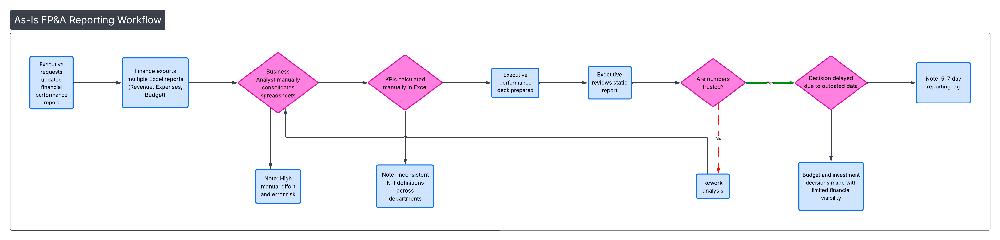
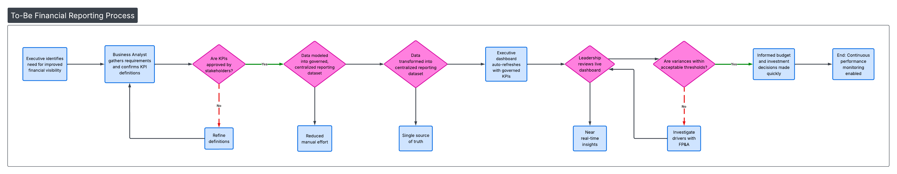

# FP&A Executive Analytics Project (Dashboard-aligned)

Job-ready Business Analyst / Financial Analyst case study demonstrating executive reporting, performance management, stakeholder alignment, and data-driven financial decision support.

This project simulates how FP&A teams support leadership with structured metrics, forecasting visibility, and executive-level storytelling.

---

## 📌 Business Scenario

Executive leadership needed improved visibility into:
- Revenue performance vs targets  
- Expense control and margin trends  
- Department-level performance  
- Financial drivers behind variance  
- Faster access to reliable performance insights  

The prior reporting approach lacked structure and made it difficult to confidently explain performance. This project demonstrates how an FP&A-focused analyst delivers clarity through dashboards, documentation, and process design.

---

## 📊 Dashboard Overview

The executive dashboard supports:
- Revenue vs target tracking  
- Profit and margin analysis  
- Department expense performance  
- Monthly trend analysis  
- High-level KPI monitoring  
- Executive-ready storytelling  

> Dashboard screenshots are available inside the `/Dashboard` folder.

---

## 📐 Process Diagrams

### As-Is Workflow (Current State)
Represents fragmented reporting, manual compilation, and delayed financial insights.

---

### To-Be Workflow (Future State)
Demonstrates a structured, repeatable reporting process with aligned metrics and executive-ready outputs.

---

### Swimlane Diagram (Cross-Functional Collaboration)
Illustrates interactions between:
- Executive Leadership  
- FP&A / Business Analyst  
- Department Managers  
- Finance Systems  
- Reporting Outputs  

---

## 📂 Project Deliverables

This project includes realistic professional artifacts:

| Folder | Contents |
|------|----------|
| `/Dashboard` | Dashboard files and visuals |
| `/Data` | Financial datasets aligned to reporting logic |
| `/Excel` | Analysis models, pivots, financial calculations |
| `/SQL` | Queries supporting KPI and reporting logic |
| `/Docs` | BRD, FRD, stakeholder documents |
| `/Deck` | Executive presentation for leadership |
| `/Diagrams` | As-Is, To-Be, and Swimlane diagrams |

---

## 🧠 Skills Demonstrated

- Executive KPI definition  
- Financial performance analysis  
- Budget vs actual reasoning  
- Stakeholder requirements gathering  
- Process improvement (As-Is → To-Be)  
- Dashboard storytelling  
- Executive communication  
- Structured documentation  
- Business impact framing  

---

## 🎯 Outcome

This project demonstrates how an FP&A / Business Analyst:
- Translates leadership questions into measurable metrics  
- Creates executive-ready reporting  
- Supports faster and more confident decisions  
- Improves organizational clarity around performance  

---

## 👤 Author
Jamie Christian  
LinkedIn: https://www.linkedin.com/in/jamiechristian2/
