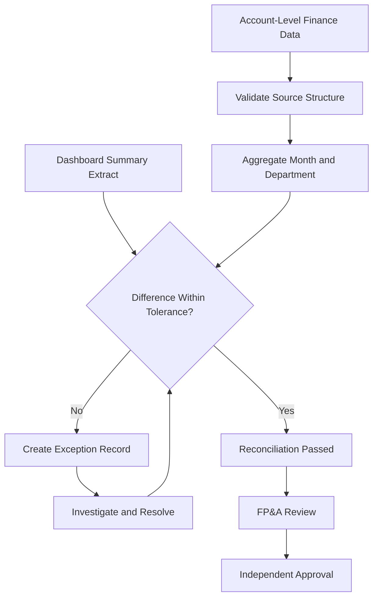
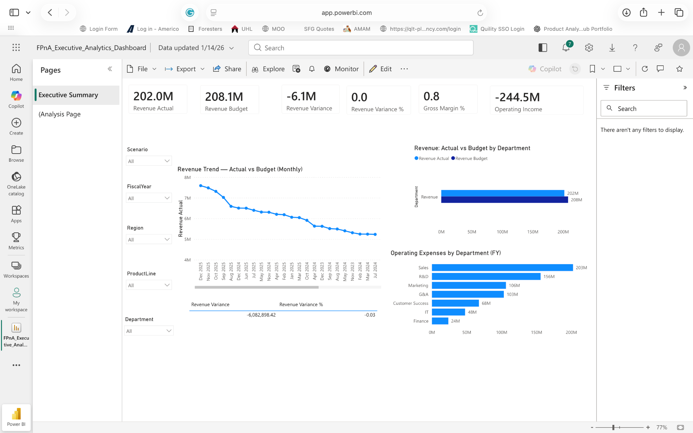
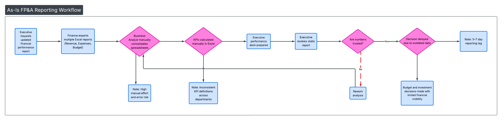
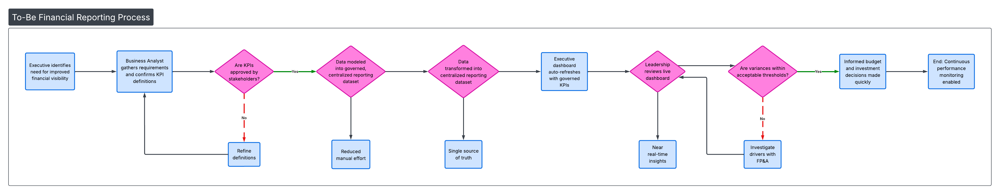
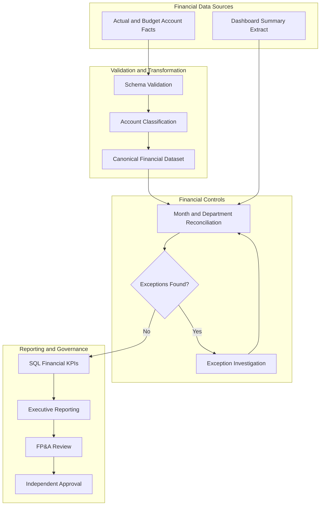
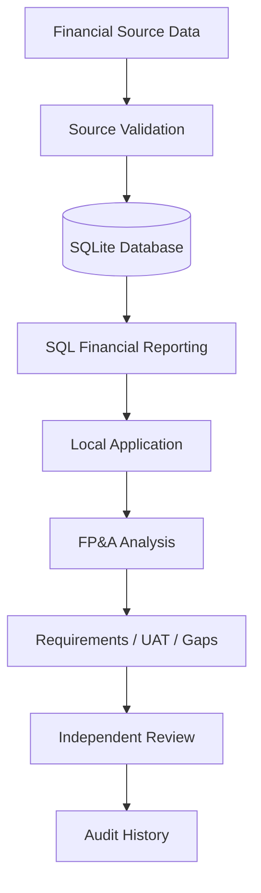

# 💼 FP&A Executive Analytics
### Business Analysis | Financial Performance | Budget Variance | Executive Decision Support

<div align="center">


**Jamie Christian | Business Analyst & Business Systems Analyst Portfolio**

[🏠 Main Portfolio](../README.md) · [📊 Financial Results](Analysis/RESULTS.md) · [📋 Requirements](Docs/01_Business_Requirements.md) · [📑 Executive Brief](Docs/08_Executive_Decision_Brief.md) · [💻 Working System](../Local_System/README.md)

</div>

---

## 🎯 Executive Summary

**Business question:** Can account-level financial data support accurate budget-versus-actual reporting, and can those results be reconciled against a separate executive dashboard extract?

This independent FP&A project demonstrates how a Business Analyst can transform financial datasets into **reliable executive reporting, actionable variance analysis, documented business requirements, and controlled financial decisions**.

The project follows an end-to-end business analysis lifecycle:

**Business Problem → Data Discovery → Requirements → SQL Analysis → Financial Reconciliation → Process Modeling → Gap Analysis → Solution Design → UAT → Executive Recommendations**

### Project Scope

| Component | Scope |
|---|---:|
| Financial Account Records | **420** |
| Reporting Period | **July–December 2025** |
| Departments | **5** |
| Reproducible SQL Analyses | **5** |
| Business Requirements | **8** |
| Linked User Stories | **8** |
| Planned FP&A UAT Cases | **24** |
| Detailed Gap Assessments | **8** |
| Shared Local Business System | **Implemented** |

> **Project context:** This is an independent portfolio simulation using supplied financial datasets. It does not represent an external client engagement, approved corporate financial close, or production deployment.

---

## 📊 Executive Financial Scorecard

The following results are derived from the project's executed SQL analyses.

| Financial KPI | Verified Result |
|---|---:|
| 💰 Actual Revenue | **$13,328,601** |
| 🎯 Budget Revenue | **$13,330,369** |
| 📉 Revenue Variance | **−$1,768** |
| 📊 Revenue Variance % | **−0.01%** |
| 🏭 Actual COGS | **$5,399,711** |
| 🏢 Actual Operating Expenses | **$6,480,942** |
| 💵 Actual Gross Profit | **$7,928,890** |
| 📈 Actual Operating Income | **$1,447,948** |
| ⚖️ Gross Margin | **59.49%** |
| ✅ Revenue Reconciliation | **30/30 matches** |

**[View Executed Financial Results →](Analysis/RESULTS.md)**

### Key Executive Finding

Actual revenue finished slightly below budget, but operating income exceeded its calculated budget amount by **$13,582**.

This demonstrates why financial performance must be evaluated across revenue, direct costs, and operating expenses rather than revenue alone.

---

## 🏢 Business Problem & Objectives

Financial leadership needs reliable reporting to monitor performance, identify variances, and make informed resource-allocation decisions.

The project evaluates two supplied sources:

1. An account-level finance fact dataset containing Actual and Budget records.
2. A dashboard-aligned financial summary used for reconciliation.

### Business Risks

- Inconsistent financial definitions.
- Incorrect budget variance calculations.
- Unexplained departmental differences.
- Missing reconciliation controls.
- Unapproved reporting versions.
- Limited source traceability.

### Project Objectives

1. Establish accurate financial baselines.
2. Analyze revenue, COGS, OpEx, gross profit, and operating income.
3. Identify monthly and departmental variances.
4. Reconcile financial totals across sources.
5. Define business and functional requirements.
6. Model current-state and future-state workflows.
7. Assess reporting and governance gaps.
8. Recommend an improved financial reporting process.

**[Business Requirements →](Docs/01_Business_Requirements.md)**

---

## 💰 Budget vs. Actual Analysis

| Financial Category | Actual | Budget | Variance |
|---|---:|---:|---:|
| Revenue | $13,328,601 | $13,330,369 | **−$1,768** |
| COGS | $5,399,711 | $5,382,121 | **+$17,590** |
| Operating Expenses | $6,480,942 | $6,513,882 | **−$32,940** |
| Operating Income | $1,447,948 | $1,434,366 | **+$13,582** |

### Financial Calculation Logic

| Metric | Formula |
|---|---|
| Revenue Variance | Actual Revenue − Budget Revenue |
| Variance % | (Actual − Budget) / Budget × 100 |
| Gross Profit | Revenue − COGS |
| Gross Margin | Gross Profit / Revenue × 100 |
| Operating Income | Revenue − COGS − Operating Expenses |

**Business interpretation:** Lower operating expenses offset the combined effect of below-budget revenue and above-budget COGS.

The calculations use the supplied financial classifications and sign conventions. Production use requires approved accounting definitions.

**[SQL Analysis →](SQL/Q02.sql)** · **[Executed Results →](Analysis/Q02.csv)**

---

## 📅 Monthly Financial Performance

### Revenue Variance

| Month | Actual Revenue | Budget Revenue | Variance |
|---|---:|---:|---:|
| July 2025 | $2,197,675 | $2,187,801 | +$9,874 |
| August 2025 | $2,121,690 | $2,121,022 | +$668 |
| September 2025 | $2,174,210 | $2,155,376 | **+$18,834** |
| October 2025 | $1,976,318 | $1,976,360 | −$42 |
| November 2025 | $2,524,320 | $2,538,970 | −$14,650 |
| December 2025 | $2,334,388 | $2,350,840 | **−$16,452** |

### Operating Income

| Month | Operating Income |
|---|---:|
| July | $313,784 |
| August | $278,056 |
| September | $207,002 |
| October | **−$144,218** |
| November | $645,301 |
| December | $148,023 |

### ⚠️ Financial Exception: October

October recorded an operating loss of **$144,218**, despite revenue being only $42 below budget.

**Recommended action:** Investigate account-level cost and expense drivers, timing differences, and account classifications before determining the underlying cause.

---

## 🏢 Department-Level Variance Analysis

| Department | Actual Revenue | Budget Revenue | Variance |
|---|---:|---:|---:|
| Customer Success | $2,480,778 | $2,500,768 | **−$19,990** |
| G&A | $2,548,647 | $2,555,564 | −$6,917 |
| Sales | $2,757,144 | $2,763,237 | −$6,093 |
| Marketing | $2,729,841 | $2,722,188 | +$7,653 |
| Product | $2,812,191 | $2,788,612 | **+$23,579** |

**Largest positive variance:** Product, +$23,579.

**Largest negative variance:** Customer Success, −$19,990.

The recommended next step is to obtain supporting explanations from department owners and reconcile department-level results to company totals.

**[Department Variance SQL →](SQL/Q03.sql)** · **[Results →](Analysis/Q03.csv)**

---

## ✅ Financial Reconciliation & Data Integrity

One of the project's strongest deliverables is its source-to-dashboard reconciliation.

| Control | Verified Result |
|---|---:|
| Month-Department Comparisons | **30** |
| Matching Revenue Comparisons | **30** |
| Unresolved Differences | **0** |
| Reconciliation Tolerance | **$0.01** |

### Proposed Reconciliation Workflow


```mermaid
flowchart TD
    A["Account-Level Finance Data"] --> C["Validate Source Structure"]
    C --> D["Aggregate Month and Department"]
    B["Dashboard Summary Extract"] --> E{"Difference Within Tolerance?"}
    D --> E
    E -->|Yes| F["Reconciliation Passed"]
    E -->|No| G["Create Exception Record"]
    G --> H["Investigate and Resolve"]
    H --> E
    F --> I["FP&A Review"]
    I --> J["Independent Approval"]
```

**Verified:** All 30 tested revenue comparisons reconcile.

**Limitation:** Matching extracts do not independently establish general-ledger approval, complete financial-close certification, or validation of every reporting field.

**[Reconciliation SQL →](SQL/Q04.sql)** · **[Reconciliation Evidence →](Analysis/Q04.csv)**

---

## 📈 Executive Dashboard

### FP&A Executive Analytics Dashboard



**[Open Power BI Dashboard →](Dashboard/FPnA_Executive_Analytics_Dashboard.pbix)**

The dashboard artifact supports executive financial reporting and visual performance analysis.

| Reporting Area | Business Purpose |
|---|---|
| Revenue | Monitor financial performance |
| Budget vs. Actual | Identify deviations from plan |
| COGS and OpEx | Analyze cost performance |
| Gross Margin | Evaluate profitability |
| Operating Income | Assess operating results |
| Department Performance | Identify variance contributions |

The PBIX is provided as a portfolio artifact. Native measures and filter behavior require independent certification against canonical SQL results before production use.

---

## 📐 Process Modeling & System Architecture

### Current-State Process — As-Is



Models financial reporting handoffs and potential validation or reconciliation weaknesses.

### Future-State Process — To-Be



Models a proposed reporting workflow with standardized financial definitions, reconciliation controls, exception handling, and independent review.

### Cross-Functional Swimlane


Illustrates proposed responsibilities across Finance, FP&A, Engineering, and reviewers.

### Proposed Financial Reporting Architecture


```mermaid
flowchart TD
    subgraph Sources["Financial Data Sources"]
        A["Actual and Budget Account Facts"]
        B["Dashboard Summary Extract"]
    end

    subgraph Processing["Validation and Transformation"]
        C["Schema Validation"]
        D["Account Classification"]
        E["Canonical Financial Dataset"]
    end

    subgraph Controls["Financial Controls"]
        F["Month and Department Reconciliation"]
        G{"Exceptions Found?"}
        H["Exception Investigation"]
    end

    subgraph Reporting["Reporting and Governance"]
        I["SQL Financial KPIs"]
        J["Executive Reporting"]
        K["FP&A Review"]
        L["Independent Approval"]
    end

    A --> C --> D --> E --> F
    B --> F
    F --> G
    G -->|Yes| H --> F
    G -->|No| I --> J --> K --> L
```

**Architecture principles:** Data validation, financial consistency, source lineage, reconciliation, exception management, and separation of duties.

**[Process Diagrams →](Diagrams/)** · **[System Design →](Docs/07_BI_and_System_Design.md)**

---

## 💡 Executive Recommendations

| Finding | Recommended Action | Required Evidence |
|---|---|---|
| Revenue $1,768 below budget | Review department contributions | Reconciled variance analysis |
| COGS $17,590 above budget | Investigate cost drivers | Finance-reviewed account detail |
| OpEx $32,940 below budget | Validate timing and completeness | Expense review |
| October operating income −$144,218 | Investigate October cost drivers | Documented variance narrative |
| Customer Success variance −$19,990 | Request department explanation | Supporting operational evidence |
| 30/30 revenue matches | Maintain recurring reconciliation | Reconciliation control log |
| Forecast history unavailable | Preserve historical forecast versions | Defined forecast dataset |

### Recommended Implementation Sequence

**Phase 1:** Approve financial definitions and source contracts.

**Phase 2:** Investigate October's operating loss and material departmental variances.

**Phase 3:** Validate financial reconciliation and reporting controls.

**Phase 4:** Execute business UAT and obtain independent review.

**Phase 5:** Pilot the reporting process and measure operational benefits.

No realized cost savings, forecasting improvements, or reporting-time reductions are claimed.

**[Executive Decision Brief →](Docs/08_Executive_Decision_Brief.md)**

---

## 🔍 Detailed Gap Analysis

| Gap ID | Current Limitation | Target State | Priority |
|---|---|---|---|
| FIN-GAP-01 | Approved ledger provenance missing | Verified ledger totals and close versions | P1 |
| FIN-GAP-02 | FX and fiscal policies undefined | Approved currency and fiscal rules | P2 |
| FIN-GAP-03 | Forecast history unavailable | Versioned forecasts and accuracy reporting | P2 |
| FIN-GAP-04 | Native BI model not certified | Validated semantic model | P2 |
| FIN-GAP-05 | Enterprise SSO and scoped RLS absent | Approved access governance | P1 |
| FIN-GAP-06 | External business UAT not executed | Documented acceptance | P1 |
| FIN-GAP-07 | Unattended monitoring absent | Scheduled refresh and recovery | P2 |
| FIN-GAP-08 | Benefits baseline missing | Comparable pilot measurement | P2 |

### Gap Resolution Lifecycle


```mermaid
flowchart LR
    A["Identify Gap"] --> B["Assess Impact"]
    B --> C["Prioritize"]
    C --> D["Assign Owner"]
    D --> E["Remediate"]
    E --> F["Validate"]
    F --> G["Independent Review"]
```

**P1:** Production release controls.

**P2:** Capability improvements or benefits measurement.

Each gap has documented remediation considerations and closure criteria.

**[Detailed Gap Analysis →](Docs/10_Detailed_Gap_Analysis.md)** · **[Gap Register →](Delivery/gap_register.csv)**

---

## 📋 Requirements Engineering & Traceability

| Requirement | Capability | Priority |
|---|---|---|
| FIN-REQ-01 | Validate finance dimensions | Must |
| FIN-REQ-02 | Calculate Actual vs. Budget revenue | Must |
| FIN-REQ-03 | Calculate operating income and gross margin | Must |
| FIN-REQ-04 | Explain department variance contribution | Must |
| FIN-REQ-05 | Reconcile dashboard summary data | Must |
| FIN-REQ-06 | Preserve financial close versions | Must |
| FIN-REQ-07 | Design independent approval workflow | Must |
| FIN-REQ-08 | Document forecast limitations | Should |

### Requirements Traceability


```mermaid
flowchart LR
    A["Business Objective"] --> B["Requirement"]
    B --> C["User Story"]
    C --> D["Acceptance Criteria"]
    D --> E["SQL or System Evidence"]
    E --> F["UAT"]
    F --> G["Business Decision"]
```

### Example Acceptance Criteria: FIN-REQ-05

The solution must reconcile account-level revenue against the dashboard summary.

- Compare matching reporting months and departments.
- Flag differences exceeding $0.01.
- Preserve evidence for exceptions.
- Require review before unresolved differences are treated as approved results.

**[Business Requirements →](Docs/01_Business_Requirements.md)** · **[Functional Specification →](Docs/02_Functional_and_Data_Specification.md)** · **[Traceability Matrix →](Delivery/requirements_traceability.csv)**

---

## 🧪 UAT & Delivery Governance

The project includes **24 planned FP&A-specific UAT cases** linked to eight requirements.

### Testing Coverage

| Testing Area | Validation Objective |
|---|---|
| Financial Dimensions | Validate account and scenario classifications |
| Budget Variances | Confirm financial calculations |
| Operating Income | Validate formulas |
| Department Reporting | Reconcile department totals |
| Dashboard Reconciliation | Detect source differences |
| Close Versioning | Support repeatability |
| Approval Workflow | Enforce review responsibilities |
| Forecast Limitations | Prevent unsupported conclusions |

### Governance Artifacts

| Artifact | Evidence |
|---|---|
| Requirements Traceability | [RTM](Delivery/requirements_traceability.csv) |
| User Stories | [Backlog](Delivery/user_story_backlog.csv) |
| UAT Cases | [UAT Register](Delivery/uat_cases.csv) |
| Defect Management | [Defect Log](Delivery/defect_log.csv) |
| Risk Management | [RAID Log](Delivery/raid_log.csv) |
| Change Control | [Change Requests](Delivery/change_request.csv) |
| Decision Tracking | [Decision Log](Delivery/decision_log.csv) |

**Testing status:** External business UAT remains unexecuted. Technical validation does not constitute business approval.

**[Delivery & UAT Documentation →](Docs/06_Delivery_UAT_and_Change_Control.md)**

---

## 📗 Excel Financial Modeling & Delivery Artifacts

| Workbook | Business Application |
|---|---|
| [FP&A Executive Performance Model](Excel/FPnA_Executive_Performance_Model.xlsx) | Financial performance and variance analysis |
| [Project Delivery Workbook](Excel/FPnA_Executive_Analytics_Project_Project_Workbook.xlsx) | Project delivery controls |
| [Requirements Traceability Matrix](Excel/Requirements_Traceability_Matrix_.xlsx) | Requirements tracking |
| [Agile User Story Backlog](Excel/Agile_User_Story_Backlog.xlsx) | Agile planning |
| [UAT Template](Excel/UAT_Template.xlsx) | Acceptance testing |

### Financial Model Review

The Excel artifacts support portfolio review of financial modeling and business analysis documentation.

Key verification areas include formula accuracy, variance calculations, reporting totals, data validation, and scenario behavior where implemented.

**Workbook functionality should be evaluated directly.** Specific advanced features are not claimed without inspection.

### Executive Presentation

[Executive Deck — PDF](Deck/Executive_Deck.pdf) · [Executive Deck — PowerPoint](Deck/Executive_Deck.pptx)

---

## 💻 Working Business Systems Implementation

The parent portfolio includes a working Python/SQLite business analysis application supporting the FP&A case study.

### Implemented Local Capabilities

| Capability | Business Application |
|---|---|
| Filtered SQL Reporting | Analyze financial KPIs |
| Source Drilldown | Inspect account-level records |
| CSV Export | Export analytical results |
| Requirements Management | Track requirements |
| UAT Management | Record testing evidence |
| Gap Management | Review remediation |
| Local Application Roles | Separate responsibilities |
| Audit History | Retain workflow activity |
| Transactional Refresh | Validate source updates |
| Version Checks | Protect concurrent changes |

### Local System Architecture


```mermaid
flowchart TD
    A["Financial Source Data"] --> B["Source Validation"]
    B --> C[("SQLite Database")]
    C --> D["SQL Financial Reporting"]
    D --> E["Local Application"]
    E --> F["FP&A Analysis"]
    F --> G["Requirements / UAT / Gaps"]
    G --> H["Independent Review"]
    H --> I["Audit History"]
```

### Run the Application

From the repository root:

```bash
python3 Local_System/server.py
```

Open **http://127.0.0.1:8765**.

### Run Integration Tests

```bash
python3 Local_System/test_system.py
```

The repository includes 16 integration tests for the shared local application.

**Implementation boundary:** This is a local analytical application, not a production financial system. Enterprise SSO, approved ledger integrations, external business UAT, and corporate signoff remain outside its delivered scope.

**[Working System Guide →](../Local_System/README.md)**

---

## 🗃️ Reproducible SQL Evidence

| Query | Analysis | Evidence |
|---|---|---|
| Q01 | Financial account and scenario controls | [SQL](SQL/Q01.sql) · [CSV](Analysis/Q01.csv) |
| Q02 | Monthly Actual vs. Budget | [SQL](SQL/Q02.sql) · [CSV](Analysis/Q02.csv) |
| Q03 | Department revenue variance | [SQL](SQL/Q03.sql) · [CSV](Analysis/Q03.csv) |
| Q04 | Source-to-dashboard reconciliation | [SQL](SQL/Q04.sql) · [CSV](Analysis/Q04.csv) |
| Q05 | Budget completeness checks | [SQL](SQL/Q05.sql) · [CSV](Analysis/Q05.csv) |

**[Complete Results →](Analysis/RESULTS.md)** · **[Source Data →](Data/)**

---

## ⚠️ Financial Reporting Limitations

This case study does not establish:

- Independent general-ledger signoff.
- Approved corporate account mappings.
- Production FX and fiscal-calendar policies.
- Historical forecast accuracy.
- Complete balance-sheet or cash-flow reporting.
- Externally completed financial-close approval.
- Verified reporting-time reductions.
- Realized financial savings.

These boundaries distinguish a working analytical portfolio from an approved enterprise financial reporting environment.

---

## 📂 Project Artifacts & Reviewer Evidence

| Reviewer Objective | Start Here |
|---|---|
| Business Problem | [Business Requirements](Docs/01_Business_Requirements.md) |
| Financial Findings | [Executed Results](Analysis/RESULTS.md) |
| SQL Logic | [SQL Queries](SQL/) |
| Dashboard | [Power BI Artifact](Dashboard/FPnA_Executive_Analytics_Dashboard.pbix) |
| Process Modeling | [Process Diagrams](Diagrams/) |
| Gap Analysis | [Detailed Assessment](Docs/10_Detailed_Gap_Analysis.md) |
| Excel Modeling | [Workbooks](Excel/) |
| Delivery Governance | [Registers](Delivery/) |
| Executive Communication | [Decision Brief](Docs/08_Executive_Decision_Brief.md) |
| Business Systems | [Local Application](../Local_System/README.md) |

---

## 🎯 Professional Competencies Demonstrated

| Competency | Evidence |
|---|---|
| Business Analysis | Financial reporting problem definition |
| Requirements Engineering | BRD, FRD, stories, acceptance criteria |
| Financial Analysis | Budget variance and operating performance |
| SQL Analytics | Five reproducible financial analyses |
| Business Intelligence | Power BI reporting artifact |
| Excel Modeling | Financial and delivery workbooks |
| Gap Analysis | Eight documented assessments |
| Process Modeling | As-Is, To-Be, swimlane |
| Testing & Validation | UAT planning and technical tests |
| Governance | Reconciliation, risks, changes, approvals |
| Business Systems | Working Python/SQLite application |
| Executive Communication | Decision brief and recommendations |

---

## 👤 About the Author

**Jamie Christian**

**B.S. Entrepreneurial Management, Cum Laude**  
Virginia Union University

I develop business analysis projects combining financial analytics, requirements engineering, process improvement, business intelligence, and technical implementation.

**Career Focus:** Business Analyst | Business Systems Analyst | Technical Business Analyst | Financial Analyst | FP&A Analyst | BI Analyst | Implementation Analyst

<div align="center">

### 🤝 Connect With Me

[](../README.md)

[](https://www.linkedin.com/in/jamie-christian-74313217b/)

**Turning Financial Data Into Trusted Reporting, Better Processes & Executive Decisions**

⭐ Explore the supporting artifacts to follow the complete financial business analysis lifecycle.

</div>
