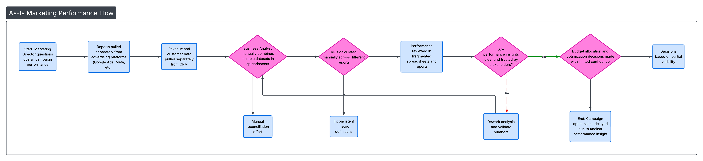
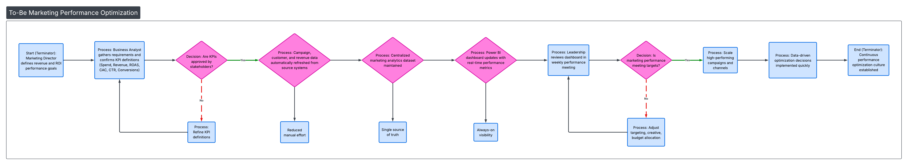
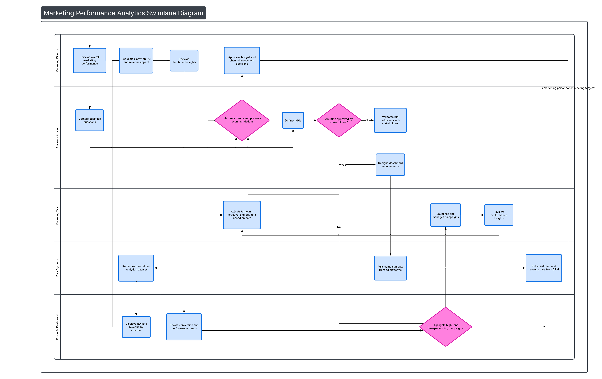

# Marketing Performance & ROI Analytics Project (Dashboard-aligned)

Job-ready Business Analyst / Marketing Analyst case study demonstrating marketing performance measurement, ROI evaluation, stakeholder alignment, and data-driven campaign optimization.

This project simulates how analysts support marketing leaders with clear performance insights and structured decision-making.

---

## 📌 Business Scenario

The marketing team needed stronger visibility into:
- Campaign effectiveness  
- Return on ad spend (ROAS)  
- Channel-level performance  
- Conversion trends  
- Which initiatives to scale or cut  
- Faster feedback loops between data and action  

Previously, insights were fragmented and difficult to trust. This project demonstrates how structured analytics improves marketing outcomes.

---

## 📊 Dashboard Overview

The marketing performance dashboard supports:
- Campaign-level ROI tracking  
- ROAS by channel (paid search, paid social, email, etc.)  
- Spend vs revenue analysis  
- Conversion rate trends  
- Top-performing and underperforming campaigns  
- Executive-friendly performance summaries  

> Dashboard visuals and screenshots are available inside the `/Dashboard` folder.

---

## 📐 Process Diagrams

### As-Is Workflow (Current State)
Shows disconnected reporting, manual analysis, delayed optimization, and unclear performance accountability.

---

### To-Be Workflow (Future State)
Illustrates a structured, insight-driven marketing optimization process supported by analytics.

---

### Swimlane Diagram (Cross-Functional Collaboration)
Demonstrates how collaboration occurs between:
- Marketing Leadership  
- Marketing Managers  
- Business Analyst  
- Data Systems  
- Dashboards & Reporting  

---

## 📂 Project Deliverables

This project mirrors real consulting-style deliverables:

| Folder | Contents |
|------|----------|
| `/Dashboard` | Marketing performance dashboard visuals |
| `/Data` | Campaign and performance datasets |
| `/Excel` | ROI calculations, pivots, analysis models |
| `/SQL` | Queries supporting KPI logic |
| `/Docs` | BRD, FRD, stakeholder artifacts |
| `/Deck` | Executive-ready presentation |
| `/Diagrams` | As-Is, To-Be, and Swimlane diagrams |

---

## 🧠 Skills Demonstrated

- Marketing KPI definition  
- ROI and ROAS analysis  
- Funnel performance analysis  
- Stakeholder requirements gathering  
- Process improvement (As-Is → To-Be)  
- Dashboard storytelling  
- Executive communication  
- Structured documentation  
- Insight-to-action framing  

---

## 🎯 Outcome

This project demonstrates how a Business Analyst / Marketing Analyst:
- Turns marketing data into strategic insights  
- Improves campaign decision-making  
- Supports leadership with trusted reporting  
- Creates continuous optimization loops  

---

## 👤 Author
Jamie Christian  
LinkedIn: https://www.linkedin.com/in/jamiechristian2/
