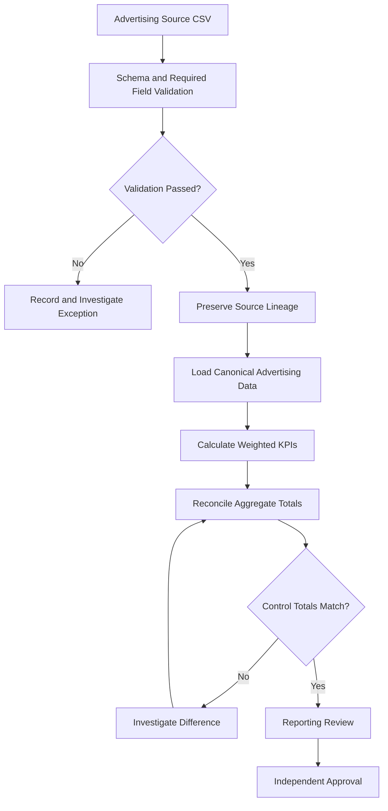
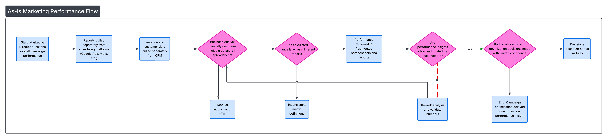
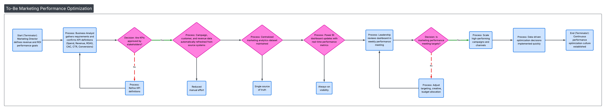
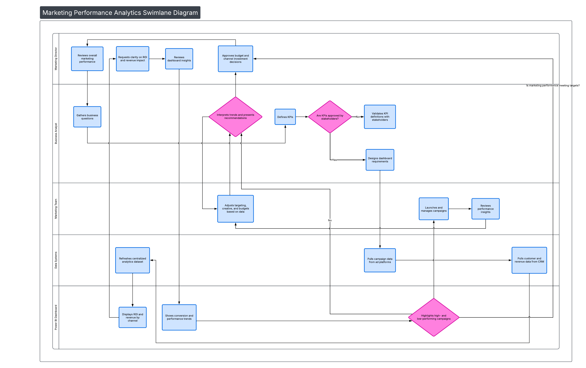
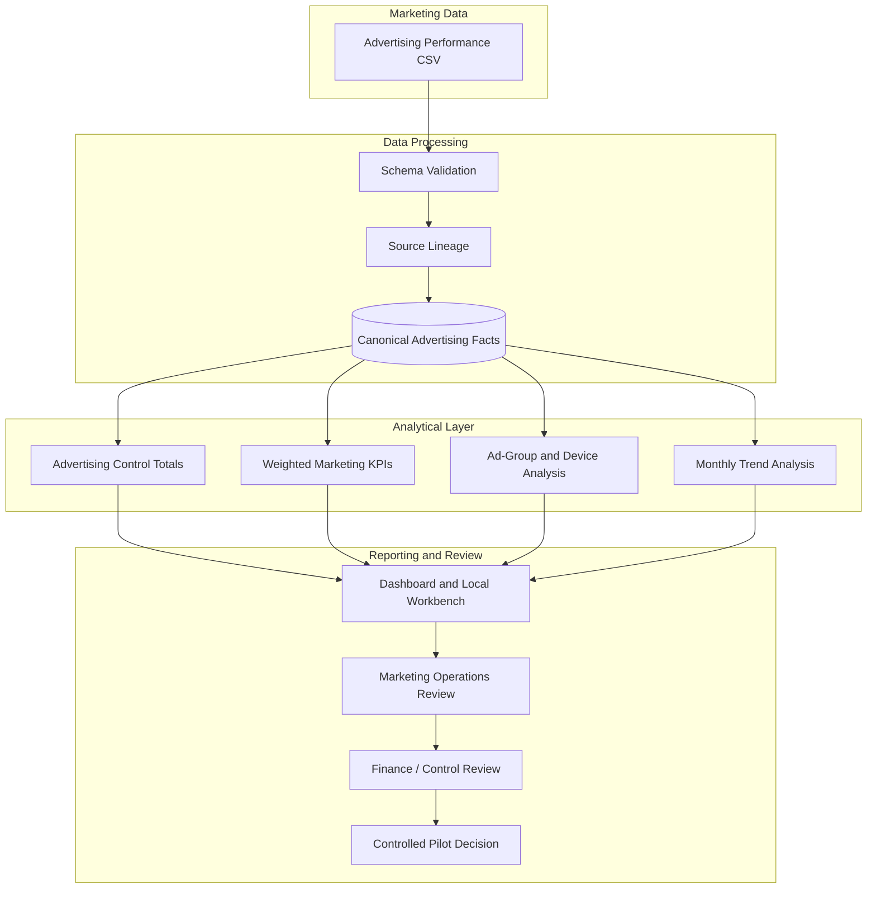
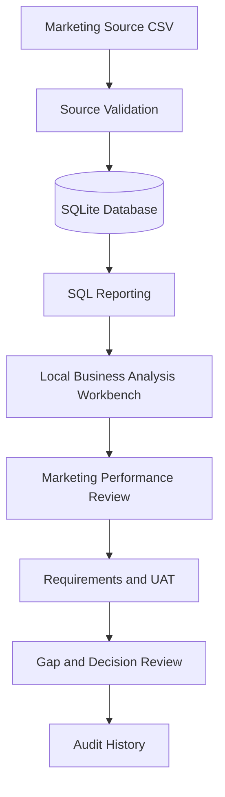

# 📈 Marketing Performance & ROI Analytics
### End-to-End Business Analysis | Marketing Intelligence | Financial Performance | Business Systems Implementation

<div align="center">


**Jamie Christian | Business Analyst & Business Systems Analyst Portfolio**

[🏠 Portfolio Home](../README.md) · [📊 Verified Results](Analysis/RESULTS.md) · [📋 Business Requirements](Docs/01_Business_Requirements.md) · [📑 Executive Decision Brief](Docs/08_Executive_Decision_Brief.md) · [💻 Working Application](../Local_System/README.md)

</div>

---

## 🎯 Executive Summary

**Business question:** Which advertising groups should be considered for controlled budget testing, and what analytical, financial, and operational controls are required before marketing leadership can make reliable investment decisions?

This independent portfolio project demonstrates how a Business Analyst can transform marketing performance data into **reproducible analytics, actionable executive recommendations, documented requirements, controlled business processes, and a working analytical application**.

The project analyzes 1,104 advertising observations from July through December 2025, comparing six advertising groups and two device categories.

It follows the complete business analysis lifecycle:

**Business Problem → Discovery → Requirements → Data Validation → SQL Analysis → Process Modeling → Gap Analysis → Solution Design → UAT Planning → Executive Decision Support**

### Project Scope

| Deliverable | Verified Scope |
|---|---:|
| Advertising Observations | **1,104** |
| Reporting Period | **July–December 2025** |
| Advertising Groups | **6** |
| Device Categories | **2** |
| SQL Analyses | **5** |
| Business Requirements | **8** |
| Linked User Stories | **8** |
| Planned Marketing UAT Cases | **24** |
| Detailed Gap Assessments | **8** |
| Local Business Analysis Application | **Implemented** |

> **Portfolio disclosure:** This project is an independent business analysis simulation. The data supports observed advertising performance, not verified incremental revenue, full business ROI, actual customer lifetime value, or realized cost savings. External stakeholder approvals and production deployment are not claimed.

---

## 📊 Executive Performance Scorecard

| Marketing KPI | Observed Result |
|---|---:|
| 💰 Attributed Revenue | **$1,675,567.96** |
| 💸 Advertising Spend | **$1,254,002.01** |
| 📈 Weighted Return on Ad Spend | **1.34×** |
| 💵 Ad-Only Contribution | **$421,565.95** |
| 👁️ Advertising Impressions | **43,298,004** |
| 🖱️ Clicks | **997,083** |
| 🎯 Attributed Conversions | **20,129** |
| 📊 Click-Through Rate | **2.30%** |
| 💳 Average Cost Per Click | **$1.26** |
| 🔄 Click-to-Conversion Rate | **2.02%** |

### Executive Finding

The dataset records approximately **$1.34 in attributed revenue for every $1.00 of advertising spend**.

However, the resulting $421,565.95 ad-only contribution excludes other business costs and does not establish net profit.

**Decision implication:** Use observed ROAS to prioritize investigation, but require attribution validation and controlled testing before making claims about incremental performance or changing budgets at scale.

**[Explore Executed SQL Results →](Analysis/RESULTS.md)**

---

## 🏢 Business Problem & Objectives

### The Business Challenge

Marketing and finance teams need reliable reporting to understand how advertising investment relates to revenue and conversions.

Inconsistent metric definitions, unclear attribution, and unvalidated data can lead to:

- Misleading ROAS comparisons.
- Incorrect budget allocation decisions.
- Confusion between revenue and profitability.
- Limited traceability to original observations.
- Unresolved reporting discrepancies.
- Weak approval and governance processes.

### Project Objectives

1. Establish a reproducible marketing performance baseline.
2. Define standardized KPI calculations and business rules.
3. Compare advertising groups and device performance.
4. Analyze monthly advertising trends.
5. Validate source data and reconcile aggregate metrics.
6. Identify potential budget-test candidates.
7. Define future-state reporting and approval workflows.
8. Connect business findings to requirements, UAT, risks, and executive decisions.

### Stakeholder Model

| Stakeholder | Proposed Responsibility |
|---|---|
| VP Growth | Sponsor and investment decision-maker |
| Marketing Operations Manager | KPI ownership and business acceptance |
| Campaign Analyst | Reporting interpretation and analysis |
| Finance Reviewer | Financial controls and profitability definitions |
| Data / BI Engineer | Data transformation and reporting |
| Source System Administrator | Source contracts and data integrity |
| Security Reviewer | Access and export governance |

Stakeholder roles are illustrative; no external interviews or approvals are represented as completed.

**[Business Requirements Document →](Docs/01_Business_Requirements.md)**

---

## 💰 Advertising Group Performance

| Advertising Group | Spend | Attributed Revenue | ROAS | Ad-Only Contribution |
|---|---:|---:|---:|---:|
| **Affiliates** | $82,332.05 | $180,981.46 | **2.20×** | $98,649.41 |
| Brand Search | $304,244.71 | $481,959.99 | 1.58× | **$177,715.28** |
| Retargeting | $169,700.36 | $268,277.25 | 1.58× | $98,576.89 |
| Prospecting | $261,635.45 | $282,855.11 | 1.08× | $21,219.66 |
| Creator/UGC | $272,076.98 | $291,874.91 | 1.07× | $19,797.93 |
| Non-Brand Search | $164,012.46 | $169,619.24 | **1.03×** | $5,606.78 |

### Findings & Business Interpretation

**Affiliates — highest observed ROAS**

Affiliates generated 2.20× attributed revenue relative to advertising spend. This makes it a candidate for a controlled budget test, but its relatively small spending base means the same efficiency cannot be assumed at higher investment levels.

**Brand Search — largest ad-only contribution**

Brand Search produced $177,715.28 in attributed revenue after recorded advertising costs. Its scale makes it an important reporting segment, but the result does not establish how many sales would have occurred without the advertising.

**Non-Brand Search — lowest observed ROAS**

Non-Brand Search recorded 1.03× ROAS. This warrants investigation of audience quality, conversion behavior, and attribution rather than an automatic budget reduction.

### Recommended Decision

Prioritize further investigation of Affiliates and lower-efficiency groups. Require controlled experimentation, approved spend limits, and marginal-return evidence before reallocation.

**[Ad-Group SQL →](SQL/Q02.sql)** · **[Results CSV →](Analysis/Q02.csv)**

---

## 📱 Device Performance Analysis

| KPI | Desktop | Mobile |
|---|---:|---:|
| Advertising Spend | $481,255.39 | $772,746.62 |
| Attributed Revenue | $642,837.41 | $1,032,730.55 |
| Clicks | 375,908 | 621,175 |
| Conversions | 7,663 | 12,466 |
| ROAS | 1.336× | 1.336× |
| Conversion Rate | 2.04% | 2.01% |

### Business Interpretation

Mobile generated more absolute activity and attributed revenue, while desktop and mobile achieved nearly identical observed ROAS.

Desktop had a slightly higher conversion rate. This is not sufficient evidence to conclude that desktop traffic is intrinsically more valuable.

**Recommended follow-up:** Compare device performance within individual ad groups and review landing-page behavior when appropriate session-level data becomes available.

**[Device Analysis →](SQL/Q03.sql)** · **[Results →](Analysis/Q03.csv)**

---

## 📅 Monthly Advertising Performance

| Month | Advertising Spend | Attributed Revenue | ROAS |
|---|---:|---:|---:|
| July 2025 | $213,270.88 | $287,265.57 | 1.35× |
| August 2025 | $214,126.96 | $274,338.00 | **1.28×** |
| September 2025 | $198,309.69 | $275,699.87 | **1.39×** |
| October 2025 | $209,320.21 | $277,161.13 | 1.32× |
| November 2025 | $204,270.59 | $271,128.75 | 1.33× |
| December 2025 | $214,703.68 | $289,974.64 | 1.35× |

### Key Observations

- **September:** Highest observed ROAS at 1.39×.
- **August:** Lowest observed ROAS at 1.28×.
- **December:** Highest attributed revenue at $289,974.64.

Monthly differences should be investigated using campaign composition, audience, attribution, and conversion data. The current extract cannot establish causal drivers or seasonal effects.

**[Monthly SQL →](SQL/Q04.sql)** · **[Executed Results →](Analysis/Q04.csv)**

---

## 🧮 Marketing KPI Definitions & Financial Controls

| KPI | Calculation | Interpretation |
|---|---|---|
| ROAS | SUM(Revenue) / SUM(Cost) | Attributed revenue per advertising dollar |
| CTR | SUM(Clicks) / SUM(Impressions) | Click engagement |
| CPC | SUM(Cost) / SUM(Clicks) | Average advertising cost per click |
| Conversion Rate | SUM(Conversions) / SUM(Clicks) | Attributed conversions per click |
| Ad-Only Contribution | SUM(Revenue) − SUM(Cost) | Revenue less recorded advertising cost |
| Full Business ROI | Requires an approved benefit and full-cost model | Not established by the supplied dataset |

### Calculation Standards

- Use ratios of sums rather than averages of row-level rates.
- Apply identical filters to numerators and denominators.
- Return undefined for zero-denominator metrics.
- Preserve original source fields for reconciliation.
- Reconcile monetary control totals within $0.01.
- Never label attributed revenue as proven incremental revenue.

### Financial Interpretation Control

**ROAS ≠ Net Profit ≠ Incremental ROI**

Full profitability analysis would require additional approved inputs such as product margins, returns, agency fees, operating expenses, and attribution or experimental evidence.

**[Functional & Data Specification →](Docs/02_Functional_and_Data_Specification.md)**

---

## ✅ Data Quality & Reconciliation

| Data Control | Observed Result |
|---|---:|
| Source Records | **1,104** |
| Reporting Months | **6** |
| Advertising Groups | **6** |
| Device Categories | **2** |
| Full-Row Repetitions | **0** |
| Loader Domain Exceptions | **0** |

### Source Traceability

The analytical workflow retains source observations and a `source_row` lineage reference.

**Source SHA-256:**

`318e33a200b946d18701c20cfa715d0980c865b8353affcaaca86116d5ed4d83`

### Data Validation Workflow


```mermaid
flowchart TD
    A["Advertising Source CSV"] --> B["Schema and Required Field Validation"]
    B --> C{"Validation Passed?"}
    C -->|No| D["Record and Investigate Exception"]
    C -->|Yes| E["Preserve Source Lineage"]
    E --> F["Load Canonical Advertising Data"]
    F --> G["Calculate Weighted KPIs"]
    G --> H["Reconcile Aggregate Totals"]
    H --> I{"Control Totals Match?"}
    I -->|No| J["Investigate Difference"]
    J --> H
    I -->|Yes| K["Reporting Review"]
    K --> L["Independent Approval"]
```

**Validation boundary:** Passing source checks does not prove that attribution, campaign identity, revenue completeness, or external reporting approval has been independently established.

**[Data Profile →](Analysis/data_profile.json)** · **[Source CSV →](Data/marketing_ads_roi_dashboard_aligned.csv)**

---

## 📊 Tableau Executive Dashboard

### Marketing Performance Dashboard — Ads ROI & Revenue Impact

**[Open Tableau Packaged Workbook →](Dashboard/Marketing%20Performance%20Dashboard%20%E2%80%93%20Ads%20ROI%20%26%20Revenue%20Impact.twbx)**

The repository contains a packaged Tableau workbook for marketing performance reporting.

### Dashboard Evaluation Framework

| Reporting Area | Decision Supported |
|---|---|
| Executive Overview | Review marketing performance |
| Advertising Spend | Monitor investment |
| Attributed Revenue | Compare recorded revenue |
| ROAS | Evaluate observed advertising efficiency |
| Ad-Group Comparison | Identify investigation priorities |
| Device Performance | Review traffic and conversion mix |
| Monthly Trends | Monitor performance changes |

The Tableau workbook is a supporting artifact. Its native calculations, filter interactions, and presentation have not been independently certified against the SQL evidence.

The canonical SQL results remain the source of the verified figures in this README.

---

## 📐 Business Process Modeling

### Current-State Process — As-Is



The current-state model provides a baseline for identifying opportunities to improve data validation, metric consistency, and reporting handoffs.

### Future-State Process — To-Be



The future-state model proposes standardized metrics, source controls, exception handling, and independent business review.

### Cross-Functional Swimlane



The swimlane model documents proposed responsibilities across marketing, analytics, engineering, and governance functions.

### Proposed Reporting Architecture


```mermaid
flowchart TD
    subgraph Source["Marketing Data"]
        A["Advertising Performance CSV"]
    end

    subgraph Validation["Data Processing"]
        B["Schema Validation"]
        C["Source Lineage"]
        D[("Canonical Advertising Facts")]
    end

    subgraph Analytics["Analytical Layer"]
        E["Advertising Control Totals"]
        F["Weighted Marketing KPIs"]
        G["Ad-Group and Device Analysis"]
        H["Monthly Trend Analysis"]
    end

    subgraph Governance["Reporting and Review"]
        I["Dashboard and Local Workbench"]
        J["Marketing Operations Review"]
        K["Finance / Control Review"]
        L["Controlled Pilot Decision"]
    end

    A --> B --> C --> D
    D --> E
    D --> F
    D --> G
    D --> H
    E --> I
    F --> I
    G --> I
    H --> I
    I --> J --> K --> L
```

**Design principles:** Reproducibility, traceability, financial accuracy, controlled access, clear ownership, and independent review.

**[Process Diagrams →](Diagrams/)** · **[System Design →](Docs/07_BI_and_System_Design.md)**

---

## 🔍 Detailed Gap Analysis

The gap assessment distinguishes capabilities already delivered in the local application from controls required for production use.

| Gap ID | Current Limitation | Target State | Priority |
|---|---|---|---|
| ADS-GAP-01 | Attribution window and campaign keys unknown | Approved attribution contract | P1 |
| ADS-GAP-02 | Full business costs unavailable | Approved profitability model | P2 |
| ADS-GAP-03 | Incremental-spend evidence missing | Controlled budget experiment | P2 |
| ADS-GAP-04 | Native BI model not certified | Reconciled Tableau semantic model | P2 |
| ADS-GAP-05 | Enterprise SSO and scoped RLS absent | Approved enterprise access controls | P1 |
| ADS-GAP-06 | External business UAT not executed | Recorded business acceptance | P1 |
| ADS-GAP-07 | Unattended monitoring absent | Scheduled refresh and alerting | P2 |
| ADS-GAP-08 | Benefits baseline unavailable | Comparable pilot measurement | P2 |

### Gap Resolution Lifecycle


```mermaid
flowchart LR
    A["Identify"] --> B["Assess Impact"]
    B --> C["Prioritize"]
    C --> D["Assign Owner"]
    D --> E["Remediate"]
    E --> F["Validate"]
    F --> G["Independent Review"]
```

### Priority Definitions

**P1 — Release Control:** Required to support reliable data, authorized access, or business acceptance before production release.

**P2 — Capability Improvement:** Additional functionality, evidence, or measurement needed to extend the solution.

Gap closure requires remediation evidence and an accountable review decision. Completing a related requirement does not automatically close a production gap.

**[Detailed Gap Analysis →](Docs/10_Detailed_Gap_Analysis.md)** · **[Gap Register →](Delivery/gap_register.csv)**

---

## 📋 Business Requirements & Traceability

| Requirement | Capability | Priority |
|---|---|---|
| ADS-REQ-01 | Load and reconcile advertising records | Must |
| ADS-REQ-02 | Calculate weighted efficiency KPIs | Must |
| ADS-REQ-03 | Compare advertising groups | Must |
| ADS-REQ-04 | Analyze device differences | Should |
| ADS-REQ-05 | Track monthly efficiency | Should |
| ADS-REQ-06 | Establish budget-test guardrails | Must |
| ADS-REQ-07 | Govern profitability labels | Must |
| ADS-REQ-08 | Govern exports and access | Must |

### Requirements Traceability Workflow


```mermaid
flowchart LR
    A["Business Objective"] --> B["Requirement"]
    B --> C["User Story"]
    C --> D["Acceptance Criteria"]
    D --> E["SQL / System Evidence"]
    E --> F["UAT Case"]
    F --> G["Review Decision"]
```

### Example: ADS-REQ-02 — Weighted Marketing Efficiency

**Requirement:** Calculate ROAS, CTR, CPC, and conversion rate using consistent aggregated values.

**Acceptance criteria:**

- ROAS equals total attributed revenue divided by total advertising cost.
- CTR equals total clicks divided by total impressions.
- CPC equals total advertising cost divided by total clicks.
- Conversion rate equals total conversions divided by total clicks.
- Zero denominators return undefined.
- Results reconcile to independent test fixtures.
- Filters apply consistently to both sides of every ratio.

**[Business Requirements →](Docs/01_Business_Requirements.md)** · **[Functional Specification →](Docs/02_Functional_and_Data_Specification.md)** · **[Traceability Register →](Delivery/requirements_traceability.csv)**

---

## 🧪 UAT, Agile Delivery & Governance

The project includes **24 planned marketing UAT cases** linked to eight business requirements.

| Testing Area | Acceptance Focus |
|---|---|
| Data Loading | Source and monetary controls |
| KPI Calculations | Weighted arithmetic and edge cases |
| Ad-Group Analysis | Reconciled group comparisons |
| Device Reporting | Consistent reporting populations |
| Monthly Trends | Correct chronological calculations |
| Budget-Test Controls | Guardrails and review requirements |
| Financial Labeling | No unsupported profit or ROI claims |
| Access and Exports | Appropriate authorization behavior |

### Delivery Evidence

| Artifact | Repository Evidence |
|---|---|
| User Stories | [Backlog](Delivery/user_story_backlog.csv) |
| Requirements Traceability | [RTM](Delivery/requirements_traceability.csv) |
| UAT Cases | [UAT Register](Delivery/uat_cases.csv) |
| Risks and Dependencies | [RAID Log](Delivery/raid_log.csv) |
| Defects | [Defect Log](Delivery/defect_log.csv) |
| Change Requests | [Change Register](Delivery/change_request.csv) |
| Decisions | [Decision Log](Delivery/decision_log.csv) |
| Stakeholders | [Stakeholder Register](Delivery/stakeholder_register.csv) |

### Agile Evidence

The project uses its marketing-specific backlog and requirements traceability files as the primary Agile delivery evidence.

The repository also contains a [Jira artifact directory](Jira/). Some screenshots refer to marketplace and product-listing examples rather than this marketing case study; they are supplemental Agile examples, not proof of completed marketing-specific sprints.

**Delivery status:** Analytical work and the local workbench are delivered. External business UAT, sponsor approval, and production release remain pending.

**[Delivery & UAT Documentation →](Docs/06_Delivery_UAT_and_Change_Control.md)**

---

## 📗 Excel Marketing Decision Models

| Workbook | Purpose |
|---|---|
| [Marketing Performance ROI Decision Model](Excel/Marketing_Performance_ROI_Decision_Model.xlsx) | Marketing performance and decision modeling |
| [Marketing Project Workbook](Excel/Marketing_Performance_ROI_Project_Project_Workbook.xlsx) | Business analysis and project delivery |

### Workbook Validation Standards

The Excel models should be reviewed for:

- Accurate ROAS and ad-only contribution formulas.
- Weighted KPI calculations.
- Correct totals and reporting populations.
- Defined treatment of zero denominators.
- Clear distinction between actuals and assumptions.
- Consistent references and reporting periods.
- Reconciliation to SQL results.

The workbooks are available for direct inspection. Advanced spreadsheet features are not claimed without functional verification.

**[Executive Presentation — PDF →](Deck/Executive_Deck.pdf)**

---

## 💻 Working Business Systems Implementation

The parent portfolio includes a shared Python/SQLite business analysis application supporting the marketing case study.

### Implemented Capabilities

| Capability | Business Application |
|---|---|
| Filtered SQL Reporting | Analyze marketing KPIs |
| Source-Row Drilldown | Inspect original observations |
| CSV Export | Export permitted reporting data |
| Requirements Tracking | Maintain business requirements |
| UAT Management | Record execution evidence |
| Gap Management | Track remediation decisions |
| Local Role Authentication | Separate user responsibilities |
| Independent Review | Approve or reject workflow submissions |
| Transactional Refresh | Validate source updates |
| Version Conflict Checks | Protect concurrent changes |
| Audit History | Preserve review activity |

### Local Application Architecture


```mermaid
flowchart TD
    A["Marketing Source CSV"] --> B["Source Validation"]
    B --> C[("SQLite Database")]
    C --> D["SQL Reporting"]
    D --> E["Local Business Analysis Workbench"]
    E --> F["Marketing Performance Review"]
    F --> G["Requirements and UAT"]
    G --> H["Gap and Decision Review"]
    H --> I["Audit History"]
```

### Run Locally

From the repository root:

```bash
python3 Local_System/server.py
```

Open **http://127.0.0.1:8765**.

### Run Integration Tests

```bash
python3 Local_System/test_system.py
```

The shared application includes 16 integration tests.

**Implementation boundary:** The application is a local analytical prototype, not a production marketing platform. Enterprise SSO, business-scope row-level security, live advertising connectors, external acceptance, and hosted deployment are outside its delivered scope.

**[Local System Guide →](../Local_System/README.md)**

---

## 🗃️ Reproducible SQL Evidence

| Query | Analysis | SQL | Executed Output |
|---|---|---|---|
| Q01 | Advertising control totals | [SQL](SQL/Q01.sql) | [CSV](Analysis/Q01.csv) |
| Q02 | Ad-group efficiency | [SQL](SQL/Q02.sql) | [CSV](Analysis/Q02.csv) |
| Q03 | Device performance | [SQL](SQL/Q03.sql) | [CSV](Analysis/Q03.csv) |
| Q04 | Monthly advertising trends | [SQL](SQL/Q04.sql) | [CSV](Analysis/Q04.csv) |
| Q05 | Contribution exception checks | [SQL](SQL/Q05.sql) | [CSV](Analysis/Q05.csv) |

**[Complete Analysis Results →](Analysis/RESULTS.md)** · **[Source Dataset →](Data/marketing_ads_roi_dashboard_aligned.csv)**

### Analytical Reproducibility

- Original source observations are retained.
- Canonical field definitions are documented.
- SQL calculations use consistent reporting populations.
- Source-row lineage is preserved.
- Reconciliation and exception outputs are available.
- Findings are separated from unverified business assumptions.

---

## 💡 Executive Recommendations & Implementation Roadmap

| Phase | Recommended Action | Evidence Required |
|---|---|---|
| 1 — Definition | Approve KPI and attribution definitions | Metric dictionary and source contract |
| 2 — Validation | Reconcile source data and reporting outputs | Financial control evidence |
| 3 — Prioritization | Identify controlled budget-test candidates | Reviewed group analysis |
| 4 — Experiment | Define holdout, spending limits, and stop rules | Approved experiment design |
| 5 — Acceptance | Execute representative business UAT | Test results and defect disposition |
| 6 — Pilot | Evaluate incremental performance | Experimental and financial evidence |
| 7 — Benefits | Measure reporting efficiency and adoption | Comparable baseline and pilot results |

### Proposed Pilot Success Measures

- Accurate and reproducible KPI calculations.
- No unresolved material source reconciliation issues.
- Completed business UAT with documented decisions.
- Approved advertising experiment design.
- Incremental performance measured against a valid comparison.
- Reporting preparation time measured against a real baseline.

No commercial uplift or time savings are represented as achieved.

**[Executive Decision Brief →](Docs/08_Executive_Decision_Brief.md)**

---

## ⚠️ Scope & Analytical Limitations

This portfolio does not establish:

- Verified incremental advertising revenue.
- Full business ROI or net profit.
- Customer acquisition cost based on unique new customers.
- Customer lifetime value or retention performance.
- Actual marketing budget savings.
- Causal device or ad-group effectiveness.
- Production advertising platform integrations.
- Completed external stakeholder acceptance.
- Certified Tableau measures or Excel formulas.
- Enterprise production deployment.

These limitations are intentionally disclosed to maintain financial accuracy and professional credibility.

---

## 📂 Reviewer Evidence Index

| What to Review | Direct Evidence |
|---|---|
| Business Problem | [Business Requirements](Docs/01_Business_Requirements.md) |
| Verified Marketing Findings | [Executed Results](Analysis/RESULTS.md) |
| SQL Logic | [SQL Scripts](SQL/) |
| Tableau Reporting | [Packaged Workbook](Dashboard/Marketing%20Performance%20Dashboard%20%E2%80%93%20Ads%20ROI%20%26%20Revenue%20Impact.twbx) |
| Excel Modeling | [Excel Workbooks](Excel/) |
| Process Models | [Diagrams](Diagrams/) |
| Detailed Gap Analysis | [Gap Assessment](Docs/10_Detailed_Gap_Analysis.md) |
| Requirements Traceability | [RTM](Delivery/requirements_traceability.csv) |
| UAT & Governance | [Delivery Registers](Delivery/) |
| Executive Communication | [Decision Brief](Docs/08_Executive_Decision_Brief.md) |
| Business Systems | [Working Application](../Local_System/README.md) |

---

## 🎯 Professional Competencies Demonstrated

| Competency | Supporting Evidence |
|---|---|
| Business Analysis | Business problem definition and decision framing |
| Requirements Engineering | BRD, FRD, acceptance criteria, traceability |
| Marketing Analytics | ROAS, CTR, CPC, conversion rates |
| Financial Analysis | Ad-only contribution and ROI limitations |
| SQL | Five executed analyses |
| Business Intelligence | Tableau reporting artifact |
| Excel | Marketing decision and project workbooks |
| Process Improvement | As-Is, To-Be, and swimlane modeling |
| Gap Analysis | Eight current-to-target assessments |
| Agile Delivery | User stories, backlog, UAT planning |
| Testing & Governance | Data controls, UAT, RAID, change management |
| Business Systems | Python/SQLite analytical application |
| Executive Communication | Decision brief and implementation roadmap |

---

## 👤 About the Author

**Jamie Christian**

**B.S. Entrepreneurial Management, Cum Laude**  
Virginia Union University

I build business analysis and business intelligence portfolio projects combining analytical problem-solving, requirements engineering, process modeling, financial interpretation, and working technical implementations.

**Career Focus:** Business Analyst | Business Systems Analyst | Technical Business Analyst | Marketing Analyst | BI Analyst | Product Analyst | Implementation Analyst

<div align="center">

### 🤝 Connect With Me

[](../README.md)

[](https://www.linkedin.com/in/jamie-christian-74313217b/)

**Turning Marketing Data Into Trusted Reporting, Better Business Processes & Defensible Investment Decisions**

⭐ Explore the linked evidence to review the complete business analysis lifecycle.

</div>
