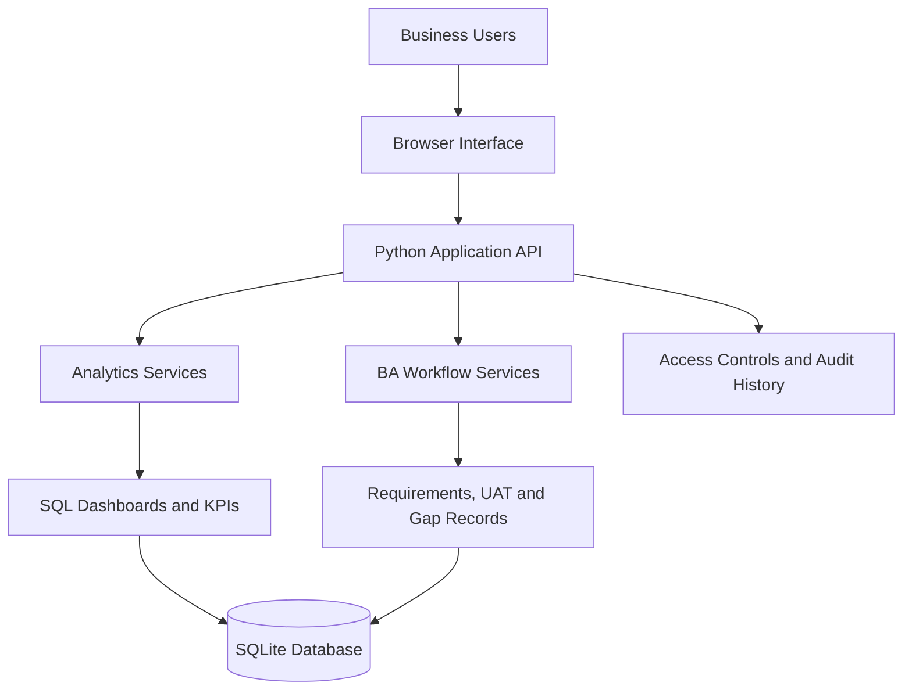
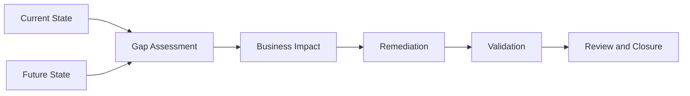
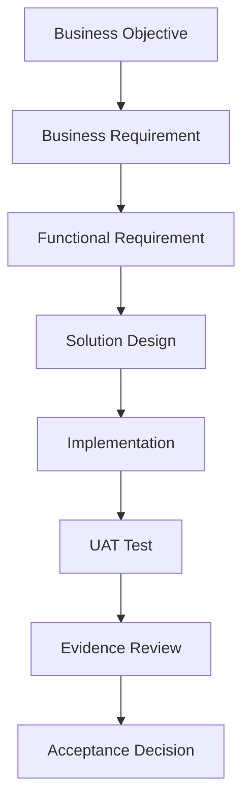
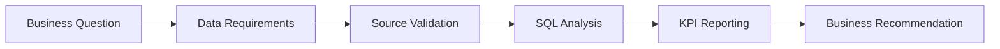

# 📊 Business Analyst & Business Systems Analyst Portfolio

<div align="center">

### 🚀 From Business Problems to Requirements, Analytics & Working Systems

**Jamie Christian**


[](https://www.linkedin.com/in/jamiechristian2/)
[](https://github.com/JamieChristian22)

</div>

---

## 👋 Executive Portfolio Overview

Welcome to my Business Analyst and Business Systems Analyst portfolio.

This repository showcases an end-to-end approach to business problem-solving, combining **requirements engineering, process analysis, gap assessment, SQL, advanced Excel, dashboard reporting, user acceptance testing, and working software implementation**.

The goal is to demonstrate how business needs can be translated into clearly defined requirements, measurable performance indicators, improved workflows, and functional technical solutions.

### 🏆 Portfolio at a Glance

| 📌 Portfolio Component | Coverage |
|---|---:|
| 📁 Cross-Industry Business Case Studies | **6** |
| 📋 Tracked Requirements | **48** |
| 🧪 Planned UAT Cases | **144** |
| 🔍 Detailed Gap Records | **48** |
| 💻 Working Local Business Analysis Application | **1** |
| 📊 SQL-Backed Dashboard Views | **6** |
| 👥 Application Access Roles | **4** |
| 📑 Centralized Corporate Delivery Workbook | **1** |

> **Portfolio transparency:** These are analytical case studies and locally implemented technical solutions. Simulated data, proposed business recommendations, completed software functionality, and formal business acceptance are distinguished throughout.

### 🧭 Quick Navigation

[💻 Working System](#-featured-working-business-analysis-system) · [📊 Dashboard Gallery](#-dashboard-gallery) · [📁 Projects](#-featured-business-analysis-projects) · [🎯 Business Impact](#-business-findings--impact-measurement) · [📐 Process Diagrams](#-professional-process-modeling--gap-analysis) · [📋 Corporate Excel](#-advanced-excel--corporate-delivery-management) · [🧪 Requirements & UAT](#-requirements-engineering--uat) · [🛠️ Technology](#-technology-stack)

---

# 💻 Featured: Working Business Analysis System


### 🏗️ From Business Requirements to Implemented Functionality

A central feature of this portfolio is a working Python/SQLite application that connects analytical reporting with structured business analysis workflows.

The application demonstrates how documented requirements can become operational software features rather than remaining conceptual recommendations.

### ⚙️ Implemented Capabilities

| Capability | Business Application |
|---|---|
| 📊 Six SQL-Backed Dashboards | Analyze the six case-study datasets |
| 🔎 Interactive Filtering | Investigate KPI results by selected dimensions |
| 📂 Source Drilldown | Examine supporting analytical records |
| 📋 Requirements Management | Maintain and review requirement records |
| 🧪 UAT Tracking | Record testing outcomes and evidence |
| 🔍 Gap Management | Track identified gaps and remediation review |
| 👥 Role-Based Access | Viewer, Analyst, Reviewer, Administrator |
| 🛡️ Audit History | Preserve workflow change records |
| 🔄 Transactional Refresh | Validate staged source data before replacement |
| 💾 Persistent Data Storage | Store application records using SQLite |

### 🏛️ Technical Architecture



### ▶️ Run the Application

**Prerequisites:** Python 3.10+ and SQLite 3.25+.

```bash
git clone https://github.com/JamieChristian22/business-analyst-portfolio.git
cd business-analyst-portfolio
python3 Local_System/server.py
```

Open **http://127.0.0.1:8765**.

On Windows, use `py Local_System/server.py` where appropriate.

Demo account credentials are generated locally during initial setup.

### 🧪 Integration Testing

```bash
python3 Local_System/test_system.py
```

The repository includes 16 integration tests covering local application functionality.

**Deployment scope:** The application runs locally and is not represented as a hosted production enterprise system.

**[📂 Explore Working Application](./Local_System)** · **[📐 Technical Architecture](./Local_System/ARCHITECTURE.md)** · **[📘 Setup Guide](./Local_System/README.md)**

---

# 📊 Dashboard Gallery

The following screenshots are taken from analytical project artifacts included in this repository.

<table>
<tr>
<td width="50%">

**🛒 Amazon Marketplace**


</td>
<td width="50%">

**🛍️ Ecommerce Product Analytics**


</td>
</tr>
<tr>
<td width="50%">

**💰 FP&A Executive Analytics**


</td>
<td width="50%">

**📣 Marketing Performance & ROI**


</td>
</tr>
</table>

---

# 📁 Featured Business Analysis Projects

Six cross-industry case studies demonstrate how analytical findings can support requirements definition, process improvement, and management decisions.

| Project | Business Domain | Primary Analysis | Project |
|---|---|---|---|
| 📈 Regional Sales | Sales Operations | Revenue, targets, regional variance | [Explore](./Regional_Sales_Performance_Project) |
| 🛍️ Ecommerce Product | Digital Commerce | Conversion, customer behavior | [Explore](./Ecommerce_Product_Analytics_Project) |
| 🛒 Amazon Marketplace | Marketplace Operations | Seller performance, pricing, margins | [Explore](./Amazon_Marketplace_Analytics_Project) |
| 💰 FP&A Executive | Corporate Finance | Budget variance, forecasting | [Explore](./FPnA_Executive_Analytics_Project) |
| 📣 Marketing ROI | Marketing Operations | Acquisition cost, campaign ROI | [Explore](./Marketing_Performance_ROI_Project) |
| ☁️ Salesforce Pipeline | CRM / Sales Operations | Pipeline value, stages, forecasting | [Explore](./Salesforce_Project) |

## 📈 01. Regional Sales Performance

**Business challenge:** Sales leadership needs reliable reporting to identify regional underperformance, evaluate product profitability, and compare results against targets.

**Analysis and deliverables**
- Regional revenue and sales performance analysis
- KPI and reporting requirements
- SQL and Excel analytical models
- Current-state and future-state process models
- Dashboard reporting and delivery documentation

**Recommended business improvement:** Standardize KPI definitions and establish consistent regional performance reviews.

**Measurement:** Revenue variance, target attainment, gross margin, and reporting turnaround time.

**[🔗 View Regional Sales Project](./Regional_Sales_Performance_Project)**

## 🛍️ 02. Ecommerce Product Analytics

**Business challenge:** Ecommerce stakeholders need to identify conversion friction, understand product performance, and evaluate customer purchasing behavior.

**Analysis and deliverables**
- Conversion and customer journey analysis
- Product performance reporting
- SQL and Excel analytical artifacts
- Business requirements and process models
- Dashboard reporting

**Recommended business improvement:** Prioritize high-friction customer journey stages and standardize funnel reporting.

**Measurement:** Conversion rate, cart abandonment, revenue per visitor, and checkout completion.

**[🔗 View Ecommerce Project](./Ecommerce_Product_Analytics_Project)**

## 🛒 03. Amazon Marketplace Analytics

**Business challenge:** Marketplace decision-makers need greater visibility into seller performance, product revenue, and profitability.

**Analysis and deliverables**
- Seller and category performance analysis
- Revenue and margin evaluation
- Pricing-related business analysis
- SQL and Excel reporting
- Process diagrams and requirements documentation

**Recommended business improvement:** Establish category-level performance reviews supported by standardized margin calculations.

**Measurement:** Gross margin, seller contribution, category revenue, and pricing variance.

**[🔗 View Amazon Marketplace Project](./Amazon_Marketplace_Analytics_Project)**

## 💰 04. FP&A Executive Analytics

**Business challenge:** Finance leadership needs consistent reporting to explain financial variances and evaluate planning assumptions.

**Analysis and deliverables**
- Budget-versus-actual comparisons
- Revenue and expense analysis
- Forecasting and scenario evaluation
- Excel financial modeling
- Executive dashboard reporting

**Recommended business improvement:** Standardize variance explanations and introduce repeatable forecast review checkpoints.

**Measurement:** Forecast accuracy, budget variance, expense variance, and reporting cycle time.

**[🔗 View FP&A Project](./FPnA_Executive_Analytics_Project)**

## 📣 05. Marketing Performance & ROI

**Business challenge:** Marketing teams need to understand campaign efficiency, customer acquisition costs, and channel performance.

**Analysis and deliverables**
- Campaign and channel analysis
- Marketing ROI evaluation
- Customer acquisition cost analysis
- SQL and Excel reporting
- Business documentation and process diagrams

**Recommended business improvement:** Improve channel-level reporting and prioritize campaigns with stronger measured returns.

**Measurement:** Marketing ROI, acquisition cost, conversion rate, and campaign contribution.

**[🔗 View Marketing ROI Project](./Marketing_Performance_ROI_Project)**

## ☁️ 06. Salesforce Sales Pipeline Analytics

**Business challenge:** Sales operations teams need consistent CRM reporting to evaluate pipeline concentration and forecast opportunities.

### 📊 Sample Dataset Findings

| KPI | Value |
|---|---:|
| 💵 Total Pipeline | $164,000 |
| ⚖️ Weighted Pipeline | $83,550 |
| 📈 Average Deal Size | $16,400 |
| 📋 Proposal-Stage Pipeline | $67,000 |
| ❌ Closed-Lost Value | $15,000 |

**Business interpretation:** Weighted pipeline analysis provides a probability-adjusted perspective on opportunity value. Stage-level reporting helps identify where revenue is concentrated and where forecast assumptions deserve review.

**Recommended business improvement:** Standardize opportunity-stage definitions, monitor aging deals, and compare weighted forecasts with actual closed revenue.

**Measurement:** Forecast error, stage conversion, opportunity aging, and pipeline coverage.

*These figures are from the portfolio dataset, not production customer results.*

**[🔗 View Salesforce Project](./Salesforce_Project)**

---

# 🎯 Business Findings & Impact Measurement


The purpose of business analysis is not simply to produce reports. It is to help stakeholders make informed decisions and evaluate whether proposed changes create measurable improvements.

## 💡 Cross-Project Business Recommendations

| Project | Business Opportunity | Recommended Action | Success Indicator |
|---|---|---|---|
| 📈 Regional Sales | Inconsistent performance visibility | Standardize regional reporting | Target attainment and reporting time |
| 🛍️ Ecommerce | Customer conversion friction | Improve funnel measurement | Conversion and abandonment rates |
| 🛒 Amazon Marketplace | Product profitability visibility | Strengthen category-level margin reporting | Gross margin and seller contribution |
| 💰 FP&A | Financial variance investigation | Standardize forecast and variance reviews | Forecast accuracy and budget variance |
| 📣 Marketing ROI | Uneven campaign efficiency | Improve channel-level investment analysis | ROI and acquisition cost |
| ☁️ Salesforce | Pipeline forecasting uncertainty | Improve opportunity-stage governance | Forecast error and stage conversion |

These are business recommendations derived from the case-study objectives and analytical scope, not verified completed organizational interventions.

## 📏 Proposed Benefits Measurement Framework

| Improvement Area | Baseline Required | Measurement Method |
|---|---|---|
| ⏱️ Reporting Efficiency | Existing reporting cycle time | Before-and-after duration comparison |
| 🧹 Data Quality | Current validation exception rate | Reconciliation and exception tracking |
| 📊 KPI Consistency | Existing KPI definition discrepancies | Definition audit and calculation validation |
| 🧪 Test Coverage | Requirement-to-test linkage | Traceability review |
| 🔍 Gap Resolution | Open gaps and review status | Evidence-based closure tracking |
| 📈 Forecasting | Historical forecast error | Actual-versus-forecast comparison |

### 🛡️ Evidence Standard

A proposed benefit becomes a demonstrated outcome only when:

1. A baseline has been established.
2. The improvement has been implemented.
3. Results have been measured.
4. Supporting evidence has been retained.
5. Appropriate stakeholders have validated the outcome.

No unverified percentage improvements, cost savings, or productivity gains are claimed.

---

# 📐 Professional Process Modeling & Gap Analysis


Process analysis documents how work is performed, where breakdowns occur, and how proposed improvements change responsibilities, controls, and handoffs.

## 🖼️ Real Process Diagram Previews

### 🔴 Regional Sales — Current-State Process


**Analysis focus:** Existing sales reporting activities, workflow handoffs, and opportunities to improve reporting consistency.

### 🟢 Regional Sales — Future-State Process


**Design focus:** A proposed improved workflow with clearer validation and reporting responsibilities.

### 🏊 Regional Sales — Cross-Functional Swimlane


**Modeling focus:** Roles, handoffs, decisions, and responsibilities across the reporting process.

### 🛍️ Ecommerce — Cross-Functional Swimlane


**Modeling focus:** Customer and business process interactions, decision points, and operational handoffs.

### 🛒 Amazon Marketplace — Data Architecture


**Architecture focus:** Data relationships and analytical reporting structure for the marketplace case study.

## 📂 Explore Additional Diagrams

| Project | Diagram Collection |
|---|---|
| 📈 Regional Sales | [View Diagrams](./Regional_Sales_Performance_Project/Diagrams) |
| 🛍️ Ecommerce | [View Diagrams](./Ecommerce_Product_Analytics_Project/Diagrams) |
| 🛒 Amazon Marketplace | [View Diagrams](./Amazon_Marketplace_Analytics_Project/Diagrams) |
| 💰 FP&A | [View Diagrams](./FPnA_Executive_Analytics_Project/Diagrams) |
| 📣 Marketing ROI | [View Diagrams](./Marketing_Performance_ROI_Project/Diagrams) |

The portfolio provides process diagram image exports and associated editable source artifacts. These are diagrams.net-style artifacts, not native Microsoft Visio files.

## 🔍 Structured Gap Analysis

The gap analysis approach compares current-state operations against desired future-state capabilities.



### 📋 Gap Register Structure

| Field | Purpose |
|---|---|
| Gap ID | Unique reference |
| Current State | Existing process or system condition |
| Future State | Target capability |
| Gap Description | Difference requiring action |
| Business Impact | Operational consequence |
| Priority | Remediation urgency |
| Requirement Link | Requirements traceability |
| Closure Evidence | Validation artifacts |
| Review Status | Independent review outcome |

The centralized register contains **48 detailed gap records** across the six projects.

**[🔍 View Portfolio Gap Register](./Delivery/Portfolio_Gap_Register.csv)**

---

# 📊 Advanced Excel & Corporate Delivery Management


Excel supports financial analysis, KPI reporting, business modeling, and structured delivery governance.

## 🏢 Centralized Corporate Delivery Workbook

| Worksheet | Business Purpose |
|---|---|
| 📊 Dashboard | Portfolio reporting |
| 📋 Requirements | Requirement status and ownership |
| 🧪 UAT | Acceptance test planning and tracking |
| 🔍 Gap Analysis | Remediation and review |
| ⚠️ RAID | Risks, assumptions, issues, dependencies |
| 🔄 Change Control | Change requests and decisions |
| 🐛 Defects | Issue documentation |
| 📘 Operating Guidance | Workbook instructions |

### 📈 Analytical Applications

- Budget-versus-actual analysis
- Revenue and profitability calculations
- Forecast and scenario evaluation
- KPI monitoring
- Variance analysis
- Data validation and reconciliation
- Structured delivery reporting

The corporate workbook uses differentiated input and calculated fields. Workbook entries do not automatically synchronize with the local application or standalone CSV registers.

**[📥 Corporate Delivery Workbook](./Delivery/Portfolio_Delivery_Tracker.xlsx)** · **[📖 Workbook Guide](./Delivery/CORPORATE_WORKBOOK_GUIDE.md)**

---

# 📋 Requirements Engineering & UAT


Requirements engineering connects business objectives with defined functionality, implementation evidence, and acceptance decisions.

## 🔗 Requirements Traceability Lifecycle



## 📑 Core Business Analysis Artifacts

| Artifact | Purpose |
|---|---|
| 📘 BRD | Define business objectives and requirements |
| 📗 FRD | Specify functional behavior and business rules |
| 🔗 RTM | Connect requirements to implementation and testing |
| 📝 User Stories | Describe functionality from the user's perspective |
| 🎯 Acceptance Criteria | Define testable expectations |
| 🧪 UAT Cases | Document test conditions and expected outcomes |
| ⚠️ RAID Log | Track risks, assumptions, issues, and dependencies |
| 🔄 Change Log | Track proposed requirement changes |

### 🧪 UAT and Approval Governance

The portfolio's local system supports structured testing and review records, including evidence and role-based approval controls.

**144 UAT cases are planned in the delivery workbook.** Planned coverage is not presented as completed execution or passed acceptance.

---

# 🗃️ SQL & Analytical Problem-Solving

SQL supports data extraction, aggregation, reporting calculations, and analytical validation.

### 🔎 Demonstrated Analytical Activities

- Filtering and segmenting records
- Joining related datasets
- Calculating business KPIs
- Evaluating revenue and profitability
- Comparing actual and target performance
- Investigating trends and variances
- Reconciling source data
- Supporting dashboard calculations

### 🔄 Business Analytics Workflow



---

# 🛠️ Technology Stack

| Category | Technologies & Methods |
|---|---|
| 📊 Analytics | SQL, Microsoft Excel |
| 📈 Business Intelligence | Power BI, dashboard reporting |
| 💻 Development | Python, HTML, JavaScript |
| 🗃️ Database | SQLite |
| 📐 Process Modeling | Draw.io / diagrams.net, swimlanes |
| 📋 Business Analysis | BRD, FRD, RTM, gap analysis |
| 🧪 Testing | UAT, integration tests, validation |
| 🛡️ Governance | RAID, change control, audit history |
| ☁️ CRM | Salesforce pipeline case study |
| 🔧 Version Control | Git, GitHub |

---

# 📂 Repository Structure

```text
business-analyst-portfolio/
│
├── Amazon_Marketplace_Analytics_Project/
├── Ecommerce_Product_Analytics_Project/
├── FPnA_Executive_Analytics_Project/
├── Marketing_Performance_ROI_Project/
├── Regional_Sales_Performance_Project/
├── Salesforce_Project/
│
├── Delivery/
│   ├── CORPORATE_WORKBOOK_GUIDE.md
│   ├── Portfolio_Delivery_Tracker.xlsx
│   └── Portfolio_Gap_Register.csv
│
├── Local_System/
│   ├── ARCHITECTURE.md
│   ├── README.md
│   ├── index.html
│   ├── server.py
│   └── test_system.py
│
├── Images/
├── Legacy/
├── scripts/
└── README.md
```

---

# 🎯 Professional Competencies Demonstrated

| Competency | Portfolio Evidence |
|---|---|
| 🧠 Business Problem-Solving | Six industry-focused case studies |
| 📋 Requirements Engineering | 48 tracked requirements |
| 🔍 Gap Analysis | 48 detailed gap records |
| 📐 Process Improvement | As-Is, To-Be, and swimlane diagrams |
| 💻 Systems Implementation | Working Python/SQLite application |
| 📊 Data Analysis | SQL, Excel, dashboard reporting |
| 🧪 Testing & Validation | Planned UAT and local integration tests |
| 🛡️ Governance | Audit history, change control, review workflows |
| 🤝 Business Communication | Executive reporting and recommendations |

---

# 🚀 Future Enhancements

Potential production-oriented enhancements include:

- 🔐 Enterprise SSO integration
- ☁️ Secure hosted deployment
- 🔗 Live CRM and external data integrations
- 🔄 Automated workbook-to-system synchronization
- 🧪 Expanded browser-based testing
- 📈 Application monitoring and alerting
- 🛡️ Additional organization-scoped access controls

These are roadmap opportunities, not currently implemented production capabilities.

---

# 👤 About Me

**Jamie Christian**

🎓 **B.S. Entrepreneurial Management, Cum Laude**  
Virginia Union University

I am a business and technology professional focused on **Business Analysis, Business Systems Analysis, Data Analytics, and Technology Implementation**.

My background combines business operations, client-facing experience, analytical problem-solving, and hands-on technical project development.

I am interested in helping organizations define clear requirements, improve business processes, strengthen reporting, and translate operational challenges into practical technology solutions.

### 🎯 Career Interests

**Business Analyst | Business Systems Analyst | Technical Business Analyst | Systems Analyst | Implementation Analyst | Operations Analyst**

---

<div align="center">

## 🤝 Connect With Me

[](https://www.linkedin.com/in/jamiechristian2/)

[](https://github.com/JamieChristian22)

### 💡 Turning Business Challenges Into Measurable, Technology-Enabled Solutions

**Business Analysis • Requirements Engineering • Process Improvement • SQL • Advanced Excel • Working Systems**

⭐ **Explore the projects to see how business requirements, analytics, process design, and implementation connect.**

</div>
