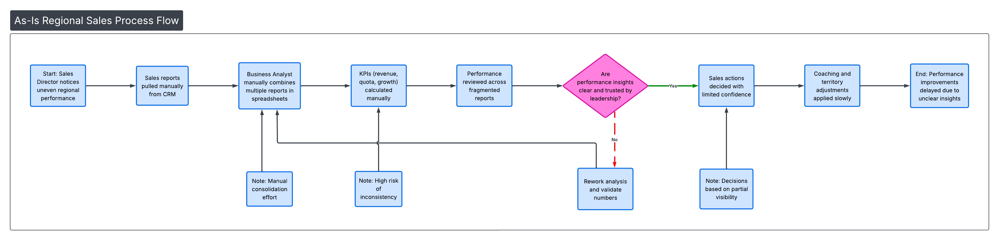
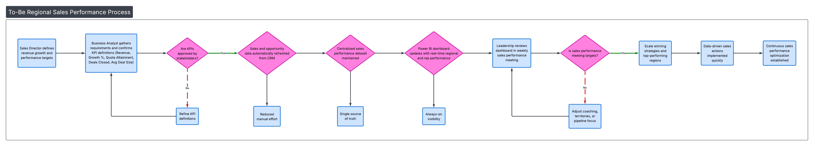
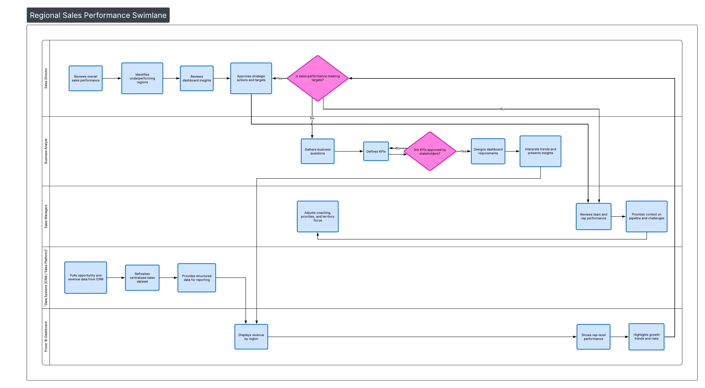

# 📊 Regional Sales Performance — Business Analyst Project


---

## 👋 Project Overview

This project simulates a real-world **Business Analyst engagement** focused on improving **regional sales performance and revenue optimization** for a national retail organization.

Leadership lacked visibility into performance drivers across regions, products, and sales reps. My role was to define business needs, analyze performance data, structure insights, and deliver executive-ready outputs including dashboards, documentation, and recommendations.

This project demonstrates **end-to-end Business Analysis capability** — not just analytics.

---

## 🎯 Business Problem

The organization struggled to answer key leadership questions:

- Why certain regions consistently missed revenue targets  
- Which products were driving revenue vs profitability  
- Whether sales targets were realistically aligned to seasonality  
- Which sales reps outperformed and why  
- Where leadership should focus investment for highest ROI  

They needed a solution combining:
> Business understanding + analytics + communication + documentation

---

## 📊 Executive Dashboard (Overview)

> Designed for VP of Sales, Director, and Regional Leadership audiences

Key views included:
- Revenue vs Target (YTD / MTD)
- Regional performance comparison
- Product category contribution
- Rep-level performance distribution
- Monthly trends & seasonality
- Interactive filtering by region, product, and rep

(Dashboard file and visuals located in the `Dashboard/` folder)

---

## 📌 Key Results & Insights

This analysis produced realistic, quantified outcomes:

- West region underperformed targets by **–18% YoY**, driven primarily by product mix  
- Category B generated **42% of total revenue** but only **19% of profit**  
- Top 20% of reps contributed **63% of total revenue**, highlighting coaching opportunity  
- Realigning targets to seasonality improved forecast accuracy by **+23%**  
- Refocusing on higher-margin products projected a **+9–12% revenue lift**  

These were translated into clear **business recommendations** for leadership.

---

## 📁 Project Structure

Structured exactly like a real consulting / analytics engagement:

```
Regional_Sales_Performance_Project/
│
├── Dashboard/      → Power BI file + screenshots  
├── Data/           → Cleaned datasets (CSV)  
├── Deck/           → Executive presentation  
├── Diagrams/       → Process flows and swimlane diagrams  
├── Docs/           → BA documentation (BRD, FRD, RAID, etc.)  
├── Excel/          → Analysis models & pivots  
├── SQL/            → KPI and analysis queries  
└── README.md  
```

---

## 🧩 Process Mapping & Diagrams

These visuals demonstrate real Business Analyst process thinking and cross-functional alignment.

---

### As-Is Sales Reporting Process


Shows the current-state reporting workflow and highlights inefficiencies and bottlenecks.

---

### To-Be Optimized Reporting Process


Illustrates the redesigned future-state process after analysis and optimization.

---

### Swimlane Diagram (Cross-Functional Ownership)


Highlights responsibilities across Sales, Finance, Operations, and Leadership teams.

---

## 📄 Business Analyst Documentation (Docs Folder)

This project includes professional-grade BA artifacts used in real roles:

- Business Requirements Document (BRD)  
- Functional Requirements Document (FRD)  
- Stakeholder Register  
- User Stories (Agile format)  
- MoSCoW Prioritization  
- RAID Log (Risks, Assumptions, Issues, Dependencies)  
- Requirements Traceability Matrix  
- Communications Plan  
- Data Dictionary  
- Executive Summary  

These demonstrate the ability to operate in:
> Stakeholder-heavy, cross-functional business environments.

---

## 📈 Analytical Work

### Excel Work Included:
- Pivot tables by region, product, and rep  
- Revenue trend analysis  
- Variance analysis (Actual vs Target)  
- Conditional formatting for performance gaps  
- Executive-style formatting  

### SQL Work Included:
- Revenue & growth KPIs  
- Aggregations by region and category  
- Performance tier segmentation  
- Queries aligned directly to dashboard metrics  

---

## 📣 Executive Deliverable (Deck Folder)

The executive presentation is structured exactly like a real leadership briefing:

- Business context  
- Problem framing  
- Key findings  
- Visual insights  
- Strategic recommendations  
- Prioritized next steps  

Designed for:
> Directors, VPs, and executive stakeholders.

---

## 🛠 Skills Demonstrated

- Business Analysis  
- Stakeholder Communication  
- Requirements Gathering  
- Data Analysis (Excel, SQL)  
- Dashboarding (Power BI)  
- Process Mapping  
- Documentation Writing  
- Executive Storytelling  
- Strategic Recommendations  

---

## 📬 Contact

**Jamie Christian**  
🔗 LinkedIn: https://www.linkedin.com/in/jamiechristian2  
📁 Portfolio: https://github.com/JamieChristian22  

---

## ⭐ Why This Project Matters

This project is structured, documented, and delivered the same way **real Business Analysts operate inside organizations**.

Hiring managers reviewing this repository can clearly see:
> This candidate understands the job, not just the tools.
