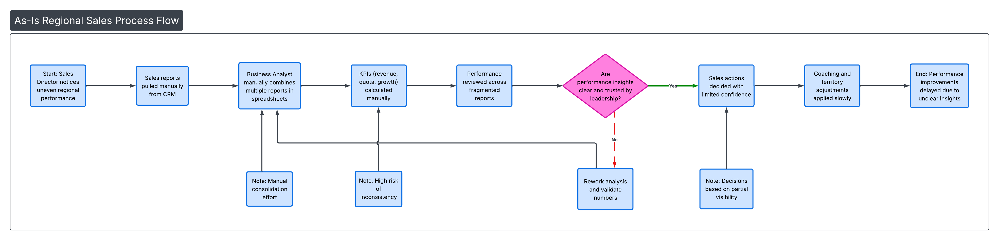
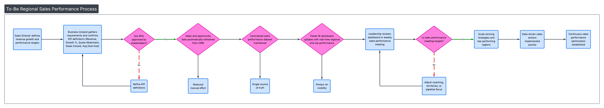
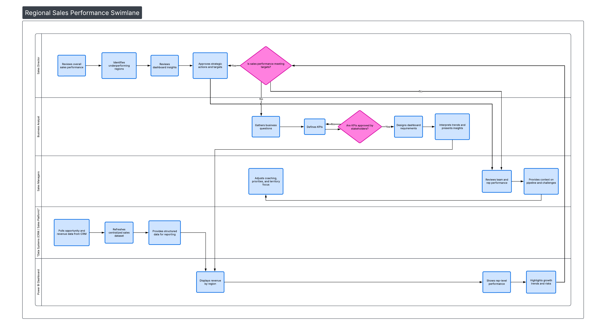

# 📊 Regional Sales Performance & Operations Intelligence

### End-to-End Business Analysis | SQL Analytics | Tableau | Excel | Process Improvement | Business Systems

**Author:** Jamie Christian  
**Industry Scenario:** Multi-location restaurant operations  
**Role:** Business Analyst / Business Systems Analyst  
**Analysis Period:** July–December 2025  
**Project Type:** Independent, evidence-based portfolio simulation

[🏠 Portfolio Home](../README.md) · [📊 Verified Analysis](Analysis/RESULTS.md) · [📋 Requirements](Docs/01_Business_Requirements.md) · [📑 Executive Brief](Docs/08_Executive_Decision_Brief.md) · [💻 Working System](../Local_System/README.md)

---

## 01 | Executive Summary

### Business Challenge

A multi-location restaurant organization requires a standardized, auditable reporting process to understand regional sales performance, compare restaurants, monitor monthly changes, and prioritize management investigations.

The central business question is:

> **Which restaurants, cities, and operational zones require management attention, and how can leadership distinguish meaningful sales changes from incomplete or noncomparable reporting data?**

### Solution Delivered

I developed an end-to-end business analysis case study combining data validation, executable SQL, requirements engineering, process modeling, gap analysis, solution design, testing artifacts, and executive decision support.

The project includes a shared working Python/SQLite analytical workbench with local authentication, reporting filters, source-data drilldown, workflow management, and review controls.

### Executive KPI Scorecard

| Performance Metric | Verified Result |
|---|---:|
| **Total Recorded Sales** | **$74,146,771.54** |
| Restaurants | **220** |
| Restaurant-Month Observations | **1,320** |
| Cities | **9** |
| Operational Zones | **5** |
| Reporting Period | **6 months** |
| July Sales | **$11,650,527.87** |
| December Sales | **$13,385,195.37** |
| December Month-over-Month Change | **+4.01%** |
| Restaurants Reporting All Six Months | **220 of 220** |
| Duplicate Restaurant-Month Keys in Source | **0 identified** |

### Executive Findings

- Recorded monthly sales increased across the six-month extract.
- December generated the highest monthly sales at **$13.39 million**.
- October recorded the largest adjacent-month percentage increase at approximately **4.46%**.
- Durham, Zone 3 generated the highest sales among individual city-zone combinations.
- Restaurant R-0187 in Greensboro recorded the highest six-month restaurant sales at **$615,248.51**.
- All 220 restaurants have records for every month in the reporting window.

### Recommended Business Decision

**Establish a governed regional reporting process and conduct a controlled management-review pilot before making operational changes based on restaurant sales comparisons.**

High sales volume does not necessarily mean high profitability, superior management, or above-target performance.

Additional information is required to assess operating days, profitability, target attainment, and comparable-store performance.

**[Review the Executed SQL Results →](Analysis/RESULTS.md)**

> **Evidence disclosure:** The project uses a portfolio dataset and assumed USD currency convention. The findings describe observed sales, not verified commercial improvements. Stakeholder roles and proposed business actions are simulated; external approvals and production deployment are not claimed.

---

## 02 | Business Problem, Objectives & Scope

### Business Objectives

| Business Objective | Required Capability | Success Evidence |
|---|---|---|
| Establish consistent reporting | Approved sales definitions | Reconciled totals |
| Compare geographic performance | City and zone aggregations | SQL validation |
| Monitor monthly changes | Adjacent-month logic | Trend results |
| Review restaurant performance | Deterministic rankings | Restaurant analysis |
| Identify reporting gaps | Restaurant-month completeness | Coverage checks |
| Improve reporting governance | Accountable review process | Process design |
| Support reliable delivery | Requirements and test linkage | RTM and UAT |
| Prepare for production | Access and operational controls | Gap closure evidence |

### Analytical Scope

**In scope:** Restaurant sales, city, zone, month, source validation, financial reconciliation, monthly trends, restaurant rankings, coverage analysis, requirements, process models, governance, and local system implementation.

**Out of scope:** Sales representatives, product categories, cost of goods, profit margins, sales targets, prior-year comparisons, transaction-level analysis, and live enterprise data integration.

### Proposed Stakeholders

| Stakeholder | Responsibilities |
|---|---|
| Regional Operations Director | Sponsor, strategic priorities, release decision |
| Sales Operations Manager | Business ownership and metric approval |
| Regional Analyst | Data analysis and management recommendations |
| Restaurant Manager | Local business context and operational follow-up |
| Data / BI Engineer | Data model and reporting implementation |
| Source System Administrator | Source contract and data completeness |
| Finance / Security Reviewer | Financial integrity and access governance |

**[Business Requirements Document →](Docs/01_Business_Requirements.md)**  
**[Discovery and Stakeholder Plan →](Docs/03_Discovery_and_Stakeholder_Plan.md)**

---

## 03 | Regional Sales Analysis

### Highest-Selling City–Zone Combinations

| Rank | City | Zone | Six-Month Sales | Restaurants |
|---|---|---|---:|---:|
| 1 | Durham | 3 | **$3,437,178.21** | 10 |
| 2 | Fayetteville | 4 | $2,929,919.45 | 8 |
| 3 | Wilmington | 4 | $2,751,329.42 | 8 |
| 4 | Wilmington | 2 | $2,745,960.94 | 8 |
| 5 | Greenville | 5 | $2,644,662.42 | 7 |

These values are verified city-zone combinations, not whole-city or whole-zone rankings.

### Business Insight

Durham in Zone 3 recorded approximately $3.44 million in sales from ten restaurants.

While it leads the city-zone comparison by total recorded sales, the segment's size affects that result.

A fairer operational comparison requires consistent treatment of restaurant counts, operating days, temporary closures, and comparable-store definitions.

### Proposed Management Action

Review total sales and restaurant counts together. Request operating-calendar information before interpreting differences as operational efficiency or management performance.

**SQL:** [Q02.sql](SQL/Q02.sql)  
**Executed Output:** [Q02.csv](Analysis/Q02.csv)

---

## 04 | Monthly Sales Trends

| Month | Recorded Sales | Month-over-Month Change |
|---|---:|---:|
| July 2025 | $11,650,527.87 | N/A |
| August 2025 | $11,826,132.28 | +1.51% |
| September 2025 | $11,941,894.77 | +0.98% |
| October 2025 | $12,474,314.59 | **+4.46%** |
| November 2025 | $12,868,706.66 | +3.16% |
| December 2025 | **$13,385,195.37** | +4.01% |

### Observations

**Highest Monthly Sales:** December 2025.

**Largest Month-over-Month Percentage Increase:** October 2025.

**Reporting Pattern:** Every reported month generated more total sales than the previous month.

### KPI Definition

**Month-over-Month Sales Change**

(Current Month Sales − Prior Month Sales) / Prior Month Sales

### Business Rules

- First-month comparisons are undefined.
- Comparisons must use adjacent calendar months.
- Missing months must not be treated as zero sales.
- Zero denominators return an undefined percentage.
- All monthly totals must reconcile with the overall sales baseline.

### Interpretation

The extract establishes positive sequential monthly movement. It does not contain enough evidence to conclude why sales increased or whether those increases are seasonal.

**SQL:** [Q03.sql](SQL/Q03.sql)  
**Executed Output:** [Q03.csv](Analysis/Q03.csv)

---

## 05 | Restaurant-Level Performance

### Top 5 Restaurants by Six-Month Sales

| Rank | Restaurant | City | Zone | Sales |
|---|---|---|---|---:|
| 1 | R-0187 | Greensboro | 1 | **$615,248.51** |
| 2 | R-0186 | Fayetteville | 4 | $600,041.52 |
| 3 | R-0164 | Wilmington | 2 | $554,062.44 |
| 4 | R-0154 | Asheville | 1 | $546,988.95 |
| 5 | R-0053 | Greenville | 3 | $546,584.92 |

### Finding

Restaurant R-0187 produced the highest recorded sales over the six-month analysis period.

### Business Interpretation

Sales rankings can identify locations for review, but they cannot independently establish profitability, management quality, customer satisfaction, or labor productivity.

Before making operational decisions, management should investigate the restaurant's capacity, operating days, costs, customer demand, and local conditions.

### Proposed Management Review Process

~~~mermaid
flowchart TD
    A["Identify Sales Observation"] --> B["Assign Regional Review Owner"]
    B --> C["Gather Restaurant Context"]
    C --> D{"Evidence Sufficient?"}
    D -->|No| E["Request Additional Data"]
    E --> C
    D -->|Yes| F["Document Findings"]
    F --> G["Recommend Next Action"]
    G --> H["Manager Review"]
    H --> I["Record Decision and Follow-Up"]
~~~

**SQL:** [Q04.sql](SQL/Q04.sql)  
**Complete Rankings:** [Q04.csv](Analysis/Q04.csv)

---

## 06 | Data Architecture, Quality & Reconciliation

### Canonical Data Model

| Source Field | Canonical Field | Data Type | Business Meaning |
|---|---|---|---|
| Restaurant ID | `restaurant_id` | Text | Restaurant identifier |
| City | `city` | Text | Geographic classification |
| Zone | `zone` | Text | Operational zone |
| Month | `month` | YYYY-MM | Reporting period |
| Sales | `sales` | Decimal | Recorded sales, portfolio-assumed USD |

**Grain:** One restaurant-month observation.

**Candidate business key:** `restaurant_id + month`

### Data Validation Results

| Control | Result |
|---|---:|
| Source Records | 1,320 |
| Unique Restaurants | 220 |
| Reporting Months | 6 |
| Complete Repeated Rows | 0 |
| Source Domain Exceptions | 0 |
| Duplicate Restaurant-Month Results | 0 |
| Restaurants With All Six Months | 220 |

### Source Integrity

**SHA-256:**

`df348e86f66cca6a5e9c14a2fd638fe4d037e18f3fe0e2401475ea36250b12ef`

Source-row lineage is maintained to support auditability and investigation.

### Data Quality Rules

1. Required source fields cannot be silently omitted.
2. Restaurant-month keys must be validated.
3. Duplicate business keys must be investigated.
4. Monetary control totals must reconcile within $0.01.
5. Record counts must reconcile exactly.
6. City and zone aggregations must preserve total recorded sales.
7. Missing months must remain identifiable.
8. Reporting outputs must retain source-version traceability.

### Proposed Reporting Architecture

~~~mermaid
flowchart TD
    subgraph SOURCES["01. Source Data"]
        A["Restaurant Sales CSV"]
    end

    subgraph QUALITY["02. Data Quality"]
        B["Schema and Domain Validation"]
        C["Restaurant-Month Key Checks"]
        D["Source Hash and Row Lineage"]
    end

    subgraph DATA["03. Canonical Storage"]
        E[("SQLite Restaurant Sales Facts")]
    end

    subgraph ANALYTICS["04. Analytical Layer"]
        F["Control Totals"]
        G["City and Zone Performance"]
        H["Monthly Sales Change"]
        I["Restaurant Rankings"]
    end

    subgraph REVIEW["05. Business Governance"]
        J["Reporting Workbench"]
        K["Regional Analyst"]
        L["Business Owner Review"]
        M["Executive Decision"]
    end

    A --> B --> C --> D --> E
    E --> F
    E --> G
    E --> H
    E --> I
    F --> J
    G --> J
    H --> J
    I --> J
    J --> K --> L --> M
~~~

**[Data Profile →](Analysis/data_profile.json)**  
**[Source Dataset →](Data/regional_sales_tableau_aligned.csv)**  
**[Functional and Data Specification →](Docs/02_Functional_and_Data_Specification.md)**

---

## 07 | Business Process Modeling

### As-Is — Current-State Sales Reporting

The existing process artifact represents the modeled current-state reporting workflow.

### To-Be — Governed Regional Reporting

The proposed future state emphasizes validated data, standardized calculations, exception handling, and review accountability.

### Cross-Functional Swimlane

The swimlane artifact documents proposed responsibilities across reporting, regional operations, engineering, and governance.

### Process Improvement Framework

| Dimension | Current Analytical Limitation | Proposed Improvement |
|---|---|---|
| Metric definitions | Expanded business metrics lack source support | Approved KPI dictionary |
| Data completeness | Operating-day comparability unknown | Operating calendar and closure flags |
| Regional mappings | Future transfers not modeled | Effective-dated zone assignments |
| Exceptions | Requires formal ownership in production | Exception register and escalation |
| Business decisions | No live management acceptance | Documented independent review |
| Access | Enterprise region scope unavailable | Role- and region-based controls |
| Monitoring | No unattended production schedule | Agreed refresh and alerting |

**[Process and Gap Analysis →](Docs/04_Process_and_Gap_Analysis.md)**

---

## 08 | Detailed Gap Analysis

The gap assessment compares the delivered local prototype and dataset against capabilities required for a governed enterprise reporting solution.

| Gap ID | Current State | Target State | Priority |
|---|---|---|---|
| REG-GAP-01 | Targets, costs, and prior-year records unavailable | Approved additional business data | **P1** |
| REG-GAP-02 | Operating days and closures unknown | Comparable-store framework | P2 |
| REG-GAP-03 | Current zone mapping is static | Effective-dated region mapping | P2 |
| REG-GAP-04 | Native Tableau model not certified | Independently tested semantic model | P2 |
| REG-GAP-05 | Enterprise SSO and scoped RLS unavailable | Approved enterprise access controls | **P1** |
| REG-GAP-06 | External business UAT not completed | Recorded business acceptance | **P1** |
| REG-GAP-07 | Unattended refresh monitoring unavailable | Scheduled refresh and alerting | P2 |
| REG-GAP-08 | No measured operational benefits baseline | Baseline and pilot comparison | P2 |

### Prioritization Logic

**P1:** Controls necessary for production release correctness, authorized data access, or business acceptance.

**P2:** Improvements required for advanced analytical capabilities, operational resilience, and benefits measurement.

### Remediation Governance

~~~mermaid
flowchart LR
    A["Identify Gap"] --> B["Assess Impact"]
    B --> C["Prioritize"]
    C --> D["Assign Owner"]
    D --> E["Implement Change"]
    E --> F["Validate Evidence"]
    F --> G["Independent Review"]
~~~

### Gap Closure Criteria

Each gap requires a documented remediation, linked evidence, applicable testing, and a reviewer disposition.

A local requirement's approval does not automatically close a separate production gap.

**[Detailed Gap Analysis →](Docs/10_Detailed_Gap_Analysis.md)**  
**[Gap Register →](Delivery/gap_register.csv)**

---

## 09 | Business Requirements & Traceability

### Requirements Inventory

| ID | Business Requirement | Priority |
|---|---|---|
| REG-REQ-01 | Validate restaurant-month grain | Must |
| REG-REQ-02 | Aggregate city and zone sales | Must |
| REG-REQ-03 | Calculate adjacent-month changes | Must |
| REG-REQ-04 | Rank restaurants consistently | Should |
| REG-REQ-05 | Identify reporting coverage gaps | Must |
| REG-REQ-06 | Prevent unsupported profitability, target, and YoY claims | Must |
| REG-REQ-07 | Define management review workflow | Should |
| REG-REQ-08 | Define region-based access requirements | Must |

### End-to-End Traceability

~~~mermaid
flowchart LR
    A["Business Objective"] --> B["Requirement"]
    B --> C["User Story"]
    C --> D["Acceptance Criteria"]
    D --> E["Technical Evidence"]
    E --> F["UAT Case"]
    F --> G["Business Decision"]
~~~

### Detailed Requirement Example — REG-REQ-03

**Requirement:** The system must calculate adjacent-month sales changes using validated reporting periods.

**Business value:** Prevent misleading comparisons when monthly data is missing or incorrectly ordered.

**Acceptance criteria:**

- The first reporting month returns no previous-month value.
- Every valid comparison uses the immediately preceding calendar month.
- Missing months do not create false comparisons.
- Zero denominators do not produce misleading rates.
- The output reconciles against the documented SQL result.

**Evidence:** [Q03 SQL](SQL/Q03.sql) and [Q03 Results](Analysis/Q03.csv)

### Detailed Requirement Example — REG-REQ-08

**Requirement:** An enterprise implementation must enforce authorized regional reporting access.

**Acceptance criteria:**

- A manager can access only authorized regional data.
- Unauthorized zone requests are denied.
- Export permissions follow the same scope rules.
- Revoked access is tested.
- Access events and exception outcomes are appropriately recorded.

**Status:** Enterprise zone-scoped row-level security remains a proposed capability, not an implemented feature of the local prototype.

**[Requirements Traceability Matrix →](Delivery/requirements_traceability.csv)**  
**[Business Requirements →](Docs/01_Business_Requirements.md)**

---

## 10 | Agile Delivery, UAT & Governance

### Delivery Artifacts

| Artifact | Repository Evidence |
|---|---|
| User Stories | [Backlog](Delivery/user_story_backlog.csv) |
| Requirements Traceability | [RTM](Delivery/requirements_traceability.csv) |
| UAT Cases | [UAT Register](Delivery/uat_cases.csv) |
| RAID Log | [RAID](Delivery/raid_log.csv) |
| Defect Tracking | [Defects](Delivery/defect_log.csv) |
| Change Control | [Change Requests](Delivery/change_request.csv) |
| Decision Management | [Decision Log](Delivery/decision_log.csv) |
| Stakeholder Management | [Stakeholder Register](Delivery/stakeholder_register.csv) |

### UAT Coverage

The project contains **24 planned regional-sales UAT cases** associated with its eight business requirements.

The cases address normal functionality, boundary or exception behavior, and business review.

### Delivery Status

| Area | Status |
|---|---|
| SQL Analysis | Executed outputs available |
| Source Profiling | Completed for supplied extract |
| Requirements | Documented |
| Process Design | Documented |
| Gap Analysis | Documented |
| Local Analytical Workbench | Implemented |
| External Business UAT | Not executed |
| Real Stakeholder Sign-Off | Pending / simulated |
| Enterprise Production Release | Not deployed |

### Definition of Done for an Enterprise Release

A future production release requires approved business requirements, validated calculations, resolved release-blocking gaps, completed access testing, business UAT evidence, operational monitoring, and an accountable release decision.

**[Delivery, UAT and Change Control →](Docs/06_Delivery_UAT_and_Change_Control.md)**

---

## 11 | Tableau Reporting & Excel Decision Modeling

### Tableau Dashboard

**[Regional Sales Performance Dashboard — Last Six Months](Dashboard/Regional%20Sales%20Performance%20Dashboard%20%28Last%206%20Months%29.twbx)**

The Tableau packaged workbook supports the project's regional sales reporting case study.

Before certifying it against the canonical analysis, a reviewer should validate source totals, city-zone aggregations, monthly calculations, ranking logic, filter behavior, and accessibility.

### Excel Workbooks

| Artifact | Purpose |
|---|---|
| [Regional Sales Decision Model](Excel/Regional_Sales_Performance_Decision_Model.xlsx) | Regional performance and decision analysis |
| [Regional Sales Project Workbook](Excel/Regional_Sales_Performance_Project_Project_Workbook.xlsx) | Project analysis and supporting documentation |

### Workbook Acceptance Standards

- Formulas reconcile with independently executed SQL.
- Source inputs and calculated fields are distinguishable.
- Monthly comparisons use correct chronological references.
- Missing values are not silently converted into zero.
- Financial totals remain consistent across summaries.
- Any assumptions are explicitly identified.
- Model outputs are interpretable by business reviewers.

**Artifact verification note:** The Tableau and Excel files are present in the repository. Their native calculations, interactions, and spreadsheet functions require separate hands-on testing before certification.

---

## 12 | Working Business Systems Implementation

The parent portfolio includes a Python/SQLite application that provides an executable environment for the regional sales case study.

**[Local System Documentation →](../Local_System/README.md)**

### Implemented Functionality

| Capability | Delivered Behavior |
|---|---|
| SQL-Based Dashboards | Dynamic filtered reporting |
| Source Drilldown | Original row traceability |
| CSV Export | Role-controlled export behavior |
| Local Authentication | Admin, analyst, reviewer, viewer |
| Requirements Management | Persistent records and review workflows |
| UAT Management | Results and evidence capture |
| Gap Tracking | Proposed closure and independent review |
| Transactional Refresh | Validated source replacement |
| Concurrency Checks | Version conflict detection |
| Audit Records | Workflow and review history |

### Local Role Responsibilities

| Role | Primary Capability |
|---|---|
| Viewer | Access authorized aggregate reporting |
| Analyst | Perform analysis, record UAT, submit work |
| Reviewer | Independently review requirements and gaps |
| Administrator | Manage local refresh and operational controls |

### Run the Application

From the repository root:

~~~bash
python3 Local_System/server.py
~~~

Open:

`http://127.0.0.1:8765`

### Run the Integration Tests

~~~bash
python3 Local_System/test_system.py
~~~

The shared application's documented tests use temporary data and generated credentials.

**Implementation boundary:** Local role controls do not constitute enterprise SSO, region-scoped row-level security, or production authorization. The application has not been deployed as a hosted business system.

---

## 13 | SQL Analysis Evidence

| Query | Analytical Purpose | SQL | Results |
|---|---|---|---|
| Q01 | Restaurant sales controls | [SQL](SQL/Q01.sql) | [CSV](Analysis/Q01.csv) |
| Q02 | City and zone sales performance | [SQL](SQL/Q02.sql) | [CSV](Analysis/Q02.csv) |
| Q03 | Adjacent-month sales movement | [SQL](SQL/Q03.sql) | [CSV](Analysis/Q03.csv) |
| Q04 | Restaurant rankings and reporting coverage | [SQL](SQL/Q04.sql) | [CSV](Analysis/Q04.csv) |
| Q05 | Duplicate restaurant-month exceptions | [SQL](SQL/Q05.sql) | [CSV](Analysis/Q05.csv) |

**[Read the Complete Reproducible Analysis →](Analysis/RESULTS.md)**

---

## 14 | Executive Recommendations & Implementation Roadmap

### Decision Matrix

| Finding | Business Implication | Recommended Action |
|---|---|---|
| $74.15M in recorded sales | Provides a baseline | Maintain financial reconciliation |
| Six months of complete restaurant records | Supports coverage checks | Validate actual operating days |
| Monthly sales increased | Movement requires context | Obtain prior-year and store-level data |
| Durham Zone 3 leads city-zone totals | Segment size affects comparisons | Normalize with approved measures |
| R-0187 leads restaurant sales | Candidate for investigation | Review size, costs, and operations |
| No profitability or target inputs | Limits performance judgments | Extend the approved data model |
| Production controls incomplete | Release readiness not established | Resolve P1 gaps |

### Phased Roadmap

| Phase | Objective | Deliverable |
|---|---|---|
| 1 — Discovery | Confirm definitions and ownership | Approved requirements and data contract |
| 2 — Validation | Establish trustworthy reporting | Reconciled SQL evidence |
| 3 — Dashboard Certification | Validate native analytics | Tested Tableau measures |
| 4 — Security | Implement enterprise authorization | Positive and negative access tests |
| 5 — UAT | Validate business workflows | Executed acceptance evidence |
| 6 — Pilot | Introduce governed management review | Recorded review decisions |
| 7 — Benefits | Evaluate operational improvements | Baseline and pilot comparison |

### Proposed Success Measures

A future pilot should measure:

- Source reconciliation accuracy.
- Reporting-period coverage.
- Material exception resolution.
- UAT acceptance results.
- Management review completion.
- Reporting preparation time.
- User task success.
- Adoption by designated business users.

No cost reduction, forecast improvement, or financial uplift is presented as achieved.

**[Executive Decision Brief →](Docs/08_Executive_Decision_Brief.md)**  
**[Executive Presentation PDF →](Deck/Executive_Deck.pdf)**  
**[Executive Presentation PowerPoint →](Deck/Executive_Deck.pptx)**

---

## 15 | Project Limitations & Evidence Integrity

This case study deliberately distinguishes **observed analytical evidence** from future-state requirements and unverified business outcomes.

The supplied data does not establish:

- Revenue target attainment.
- Year-over-year sales growth.
- Restaurant-level profitability.
- Employee or sales representative productivity.
- Product mix or category performance.
- Comparable operating-day performance.
- Causes of observed monthly sales changes.
- Realized labor savings.
- Improvements resulting from business interventions.
- External business approval or production adoption.

These boundaries protect analytical accuracy and help ensure recommendations remain defensible.

---

## 16 | Skills Demonstrated

| Business Analyst Competency | Evidence |
|---|---|
| Business Problem Definition | Project scope and executive decision |
| Stakeholder Analysis | Stakeholder responsibilities and discovery plan |
| Requirements Engineering | BRD, FRD, acceptance criteria |
| Business Process Modeling | As-Is, To-Be, swimlane |
| SQL Analytics | Five executed analyses |
| Data Quality | Grain validation, reconciliation, source lineage |
| Business Intelligence | Tableau workbook |
| Excel Decision Modeling | Regional sales workbooks |
| Detailed Gap Analysis | Eight current-to-target gaps |
| Agile Delivery | User story backlog |
| Testing & Traceability | UAT register and RTM |
| Governance | RAID, change, defect and decision registers |
| Systems Analysis | Architecture and access requirements |
| Technical Implementation | Python/SQLite workbench |
| Executive Communication | Findings, roadmap, decision brief |

---

## 👤 About the Author

**Jamie Christian**  
**B.S. Entrepreneurial Management, Cum Laude**  
Virginia Union University

I develop business analysis and business intelligence projects that combine practical data analysis, requirements engineering, process improvement, systems thinking, and evidence-based recommendations.

**Career Focus:** Business Analyst · Business Systems Analyst · Technical Business Analyst · BI Analyst · Operations Analyst · Implementation Analyst

---

### Turning Regional Sales Data Into Trusted Reporting, Governed Processes & Defensible Business Decisions

**Business Analysis • SQL • Excel • Tableau • Process Improvement • Requirements Engineering • Systems Implementation**

⭐ [Explore the Complete Business Analyst Portfolio](../README.md)
