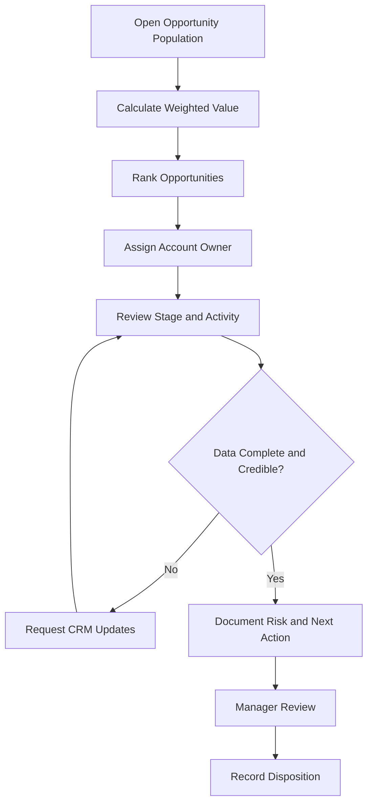
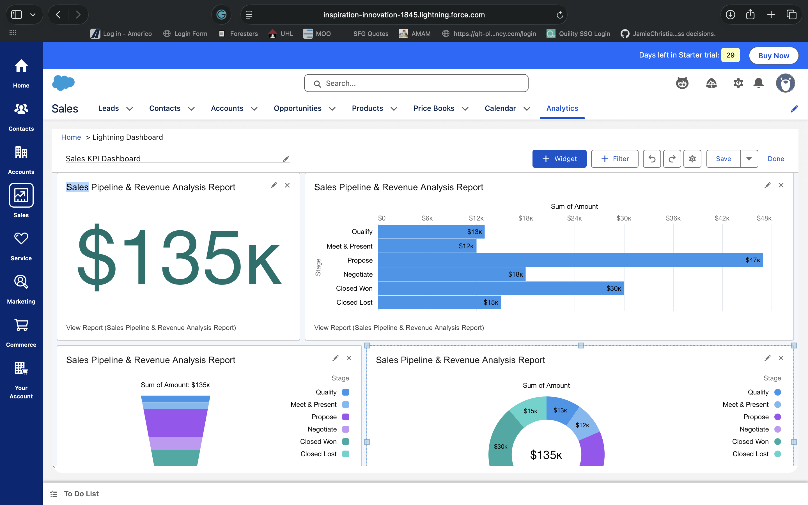
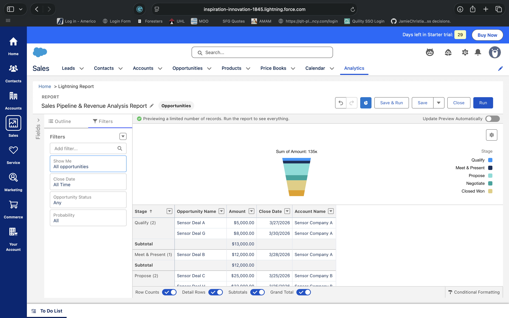
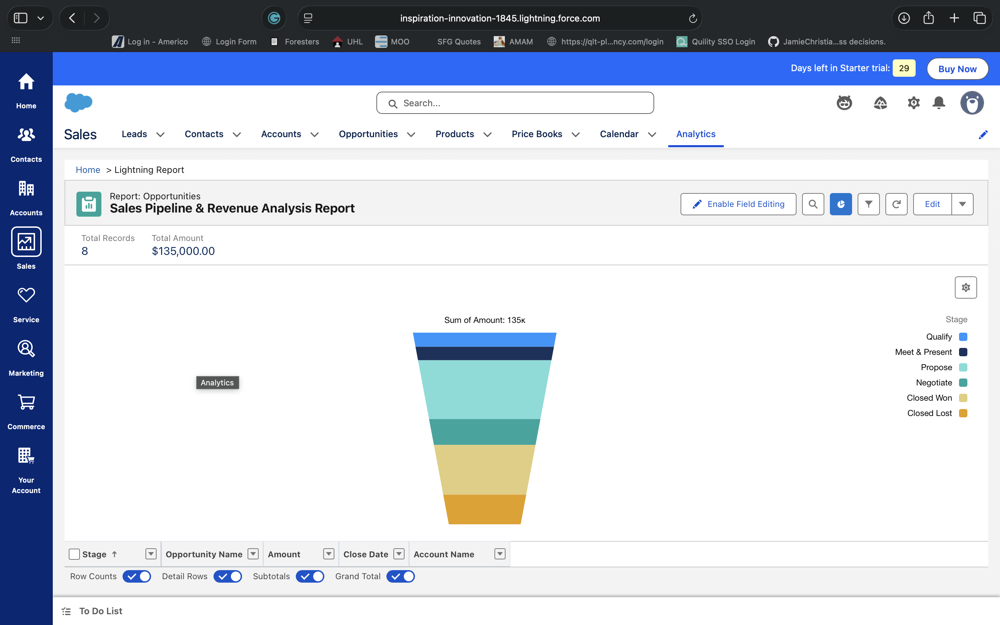
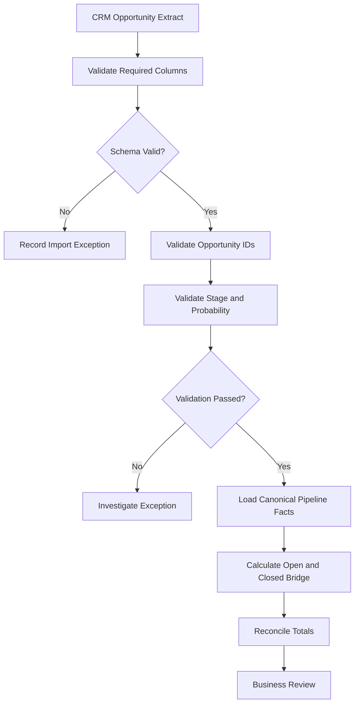
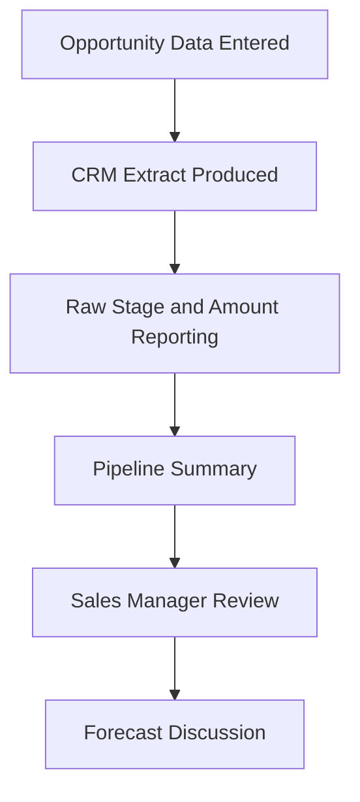
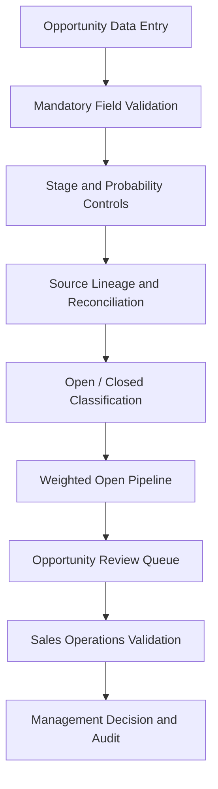
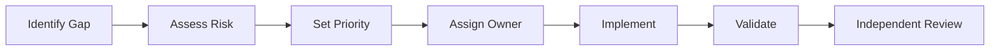
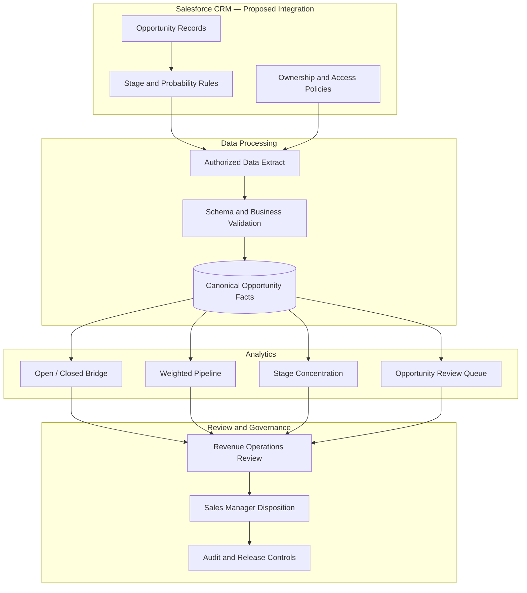
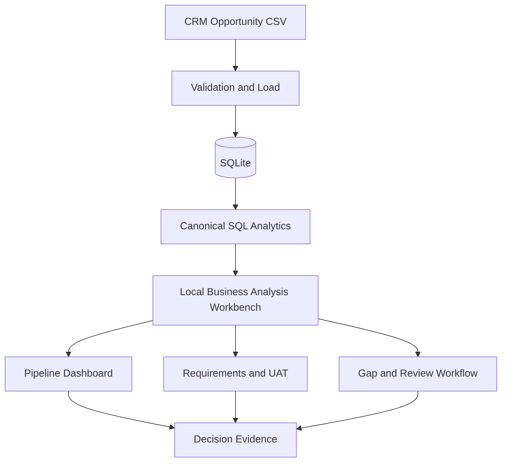

# ☁️ Salesforce CRM & Sales Pipeline Intelligence

### End-to-End Business Analysis | CRM Analytics | Revenue Operations | Salesforce Solution Design | Business Systems


**Author:** Jamie Christian  
**Project Type:** Independent Salesforce / CRM Business Analysis Simulation  
**Business Domain:** Sales Operations and Revenue Pipeline Management  
**Primary Roles:** Salesforce Business Analyst · Business Systems Analyst · CRM Analyst · Revenue Operations Analyst · Technical Business Analyst

[🏠 Main Portfolio](../README.md) · [📊 Verified SQL Results](Analysis/RESULTS.md) · [📋 Business Requirements](Docs/01_Business_Requirements.md) · [🔍 Detailed Gap Analysis](Docs/10_Detailed_Gap_Analysis.md) · [💻 Working Local System](../Local_System/README.md)

---

## 01 | Executive Summary

### The Business Challenge

Sales and revenue operations teams need accurate visibility into the value and status of opportunities throughout the sales lifecycle.

An effective CRM reporting solution must answer three fundamental questions:

1. **How much opportunity value is currently open?**
2. **How much of that open value is represented by probability-weighted estimates?**
3. **What additional CRM information and governance controls are needed before the business can produce defensible revenue forecasts?**

A common reporting problem occurs when open opportunities, Closed Won outcomes, and Closed Lost outcomes are combined into a single figure and described as the active pipeline.

This project addresses that distinction through reproducible SQL analysis, CRM requirements, data quality validation, process modeling, forecasting-readiness assessment, and business systems design.

### Solution Overview

I developed an evidence-based Salesforce-oriented Business Analyst case study that includes:

- CRM opportunity data profiling and reconciliation.
- Separation of open pipeline from closed outcomes.
- Opportunity-level probability-weighted calculations.
- Stage concentration and pipeline review analysis.
- SQL-based exception controls.
- Scenario modeling with explicit assumptions.
- CRM functional requirements and user stories.
- Salesforce configuration and access-control specifications.
- Requirements traceability and UAT planning.
- Current-to-target gap analysis.
- Supporting Salesforce screenshots and Jira examples.
- A shared Python/SQLite analytical workbench with persistent governance workflows.

### Executive KPI Scorecard

| Business KPI | Verified Result |
|---|---:|
| **All-Record Opportunity Amount** | **$164,000** |
| **Open Sales Pipeline** | **$119,000** |
| **Weighted Open Pipeline** | **$53,550** |
| Closed Won Amount | **$30,000** |
| Closed Lost Amount | **$15,000** |
| Total Opportunities | **10** |
| Open Opportunities | **8** |
| Closed Opportunities | **2** |
| Proposal-Stage Open Amount | **$67,000** |
| Largest Weighted Open Opportunity | **$13,500** |
| Stage-Probability Exceptions Returned | **0** |

### Executive Interpretation

The source contains $164,000 across all ten opportunity records, but only **$119,000 remains open**.

The open opportunities contribute **$53,550 of probability-weighted value** based on their assigned probabilities.

Closed Won and Closed Lost amounts are reported separately and must not be included in the current open pipeline.

**Recommended business decision:** Adopt open-only pipeline definitions, review high-value open opportunities, and strengthen Salesforce source fields and stage controls before using the data for time-bounded revenue forecasting.

**[View Verified SQL Results →](Analysis/RESULTS.md)**

> **Professional disclosure:** This is an independent portfolio simulation. The ten-record dataset has no snapshot date, expected close dates, ownership information, or historical conversion data. Weighted pipeline is a probability-based estimate, not earned revenue, a validated forecast, or proof of business improvement.

---

## 02 | Project Navigation

| Reviewer Objective | Supporting Evidence |
|---|---|
| Verify financial KPIs | [Executed SQL Results](Analysis/RESULTS.md) |
| Understand the business problem | [Business Requirements](Docs/01_Business_Requirements.md) |
| Review the case study | [Detailed Case Study](Docs/05_Case_Study_and_Findings.md) |
| Inspect source data | [Opportunity CSV](Data/pipeline.csv) |
| Review stage and forecast definitions | [Functional Specification](Docs/02_Functional_and_Data_Specification.md) |
| Review scenario analysis | [Scenario Model](Modeling/scenario_analysis.md) |
| Explore Salesforce screenshots | [Images](Images/) |
| Review Agile examples | [Jira Artifacts](Jira/) |
| Inspect requirements traceability | [Traceability Register](Delivery/requirements_traceability.csv) |
| Review UAT planning | [UAT Cases](Delivery/uat_cases.csv) |
| Evaluate gap analysis | [Detailed Gap Assessment](Docs/10_Detailed_Gap_Analysis.md) |
| Understand proposed architecture | [System Design](Docs/07_BI_and_System_Design.md) |
| Review the implementation | [Working Local System](../Local_System/README.md) |

---

## 03 | Business Problem, Objectives & Stakeholders

### Business Problem

A modeled sales operations organization requires accurate opportunity reporting to support pipeline reviews and future forecasting decisions.

Without consistent KPI definitions and CRM controls, leadership could:

- Overstate the current sales pipeline.
- Confuse closed revenue with potential future revenue.
- Treat estimated opportunity value as guaranteed sales.
- Apply inconsistent probability assumptions.
- Prioritize opportunities using misleading metrics.
- Make forecast claims without close dates or historical outcomes.
- Allow unauthorized changes to sales forecasts.

### Business Objectives

| Objective | Business Value | Success Criteria |
|---|---|---|
| Separate open and closed amounts | Accurate pipeline interpretation | Financial bridge reconciles |
| Standardize weighted pipeline | Consistent estimated opportunity value | Opportunity-level calculations reconcile |
| Understand stage concentration | Identify review priorities | Stage totals match source |
| Prioritize active opportunities | Focus management attention | Open-only queue |
| Strengthen data quality | Prevent invalid CRM records | Exception controls |
| Improve forecast readiness | Identify missing business inputs | Documented gap analysis |
| Define CRM governance | Clear roles and approvals | Testable access design |
| Support future deployment | Structured implementation handoff | Requirements and UAT evidence |

### Proposed Stakeholders

| Stakeholder | Responsibility |
|---|---|
| VP Sales | Executive sponsorship and decisions |
| Sales Operations Manager | KPI definitions, stage policy, and business acceptance |
| Revenue Operations Analyst | Pipeline analysis and forecast review |
| Account Executive | Opportunity status and deal context |
| Salesforce Administrator | CRM configuration and field validation |
| Data / BI Engineer | Analytical models and reporting |
| Finance Reviewer | Revenue definitions and reconciliation |
| Security Reviewer | Data access and permission controls |

These responsibilities are illustrative. No external interviews, signed approvals, or production configuration are claimed.

**[Discovery & Stakeholder Plan →](Docs/03_Discovery_and_Stakeholder_Plan.md)**

---

## 04 | Salesforce Opportunity Lifecycle & KPI Definitions

### Opportunity Stage Model

The supplied extract includes the following stages:

**Qualify → Meet → Proposal → Negotiate → Closed Won / Closed Lost**

These are the dataset's business stages, not a claim that a live Salesforce organization has been configured with precisely this lifecycle.

### Core KPI Dictionary

| Metric | Calculation | Interpretation |
|---|---|---|
| All-Record Amount | Sum of all opportunity amounts | Includes open and closed records |
| Open Pipeline | Sum of amounts for nonclosed opportunities | Current potential deal value |
| Weighted Open Pipeline | Sum of each open amount × its probability | Probability-weighted open value |
| Closed Won Amount | Sum where stage = Closed Won | Value of won records in the snapshot |
| Closed Lost Amount | Sum where stage = Closed Lost | Value of lost records in the snapshot |
| Open Opportunity Count | Count of nonclosed records | Number of currently open deals |
| Stage Concentration | Stage amount / selected comparison population | Value distribution |
| Opportunity Review Rank | Weighted open value descending | Review prioritization |

### Critical Reporting Control

**All-Record Amount ≠ Open Pipeline ≠ Weighted Open Pipeline**

The reconciliation is:

| Component | Value |
|---|---:|
| Open Pipeline | $119,000 |
| Closed Won | $30,000 |
| Closed Lost | $15,000 |
| **All-Record Total** | **$164,000** |

This bridge prevents closed outcomes from being counted as future open pipeline value.

### Weighted Pipeline Calculation

Each open opportunity is evaluated independently:

**Weighted Opportunity Amount = Amount × Probability**

Then:

**Weighted Open Pipeline = Sum of Weighted Amounts Across Open Opportunities**

The formula must not be replaced by total open amount multiplied by an unweighted average probability.

**[KPI Specification →](Docs/02_Functional_and_Data_Specification.md)**  
**[Open/Closed SQL →](SQL/Q02.sql)**

---

## 05 | Pipeline Stage Analysis

### Verified Stage Performance

| Stage | Opportunities | Total Amount | Weighted Amount |
|---|---:|---:|---:|
| **Proposal** | 3 | **$67,000** | **$33,500** |
| Closed Won | 1 | $30,000 | $30,000 |
| Meet | 2 | $21,000 | $5,250 |
| Negotiate | 1 | $18,000 | $13,500 |
| Closed Lost | 1 | $15,000 | $0 |
| Qualify | 2 | $13,000 | $1,300 |
| **All Records** | **10** | **$164,000** | **$83,550** |

**Important:** The last column includes the Closed Won weighted value. Therefore, $83,550 is the **all-record weighted amount**, not the weighted open pipeline.

### Finding 1 — Proposal Is the Largest Open Stage

Proposal contains:

- Three open opportunities.
- $67,000 in nominal open opportunity value.
- $33,500 in weighted open value.

Proposal represents approximately **56.3% of the open pipeline's nominal amount**.

### Business Interpretation

This concentration makes Proposal a useful stage for management review.

However, without stage history, activity data, or dates, it does not establish that deals are delayed, stalled, or likely to close in a particular quarter.

### Finding 2 — Negotiate Contains a High-Weighted Opportunity

The Negotiate stage contains one $18,000 opportunity assigned a 75% probability.

Its resulting weighted amount is $13,500.

This may warrant focused follow-up, but the probability is an input assumption, not an empirically verified chance of closing.

### Finding 3 — Closed Outcomes Require Separate Reporting

The dataset includes:

- $30,000 Closed Won.
- $15,000 Closed Lost.

These are status outcomes, not active opportunities.

The sample does not contain the historical cohort and observation period required to calculate a meaningful organizational win rate.

**[Stage Analysis SQL →](SQL/Q03.sql)**  
**[Executed Stage Results →](Analysis/Q03.csv)**

---

## 06 | Open Opportunity Review & Prioritization

### Open Opportunity Review Queue

| Rank | Opportunity | Stage | Amount | Probability | Weighted Amount |
|---|---|---|---:|---:|---:|
| 1 | D | Negotiate | $18,000 | 75% | **$13,500** |
| 2 | C | Proposal | $25,000 | 50% | $12,500 |
| 3 | H | Proposal | $22,000 | 50% | $11,000 |
| 4 | J | Proposal | $20,000 | 50% | $10,000 |
| 5 | B | Meet | $12,000 | 25% | $3,000 |
| 6 | I | Meet | $9,000 | 25% | $2,250 |
| 7 | G | Qualify | $8,000 | 10% | $800 |
| 8 | A | Qualify | $5,000 | 10% | $500 |

### Key Finding

Opportunity D has the highest probability-weighted open value at **$13,500**.

### Recommended Sales Manager Review

For priority opportunities, validate:

1. Current deal stage.
2. Customer engagement and latest activity.
3. Deal amount and commercial scope.
4. Next action and accountable owner.
5. Expected close date.
6. Evidence supporting the assigned probability.
7. Identified risks and dependencies.

### Proposed Opportunity Review Workflow



**[Open Review Queue SQL →](SQL/Q04.sql)**  
**[Executed Opportunity Queue →](Analysis/Q04.csv)**

---

## 07 | Forecast Readiness & Scenario Modeling

### Forecasting Limitations

The available source contains only four fields:

- Opportunity
- Stage
- Amount
- Probability

There are no expected close dates, snapshot dates, stage histories, activities, or customer-level records.

Consequently, the project can calculate a probability-weighted **snapshot value**, but cannot validate:

- Historical win rates.
- Sales cycle duration.
- Stage-to-stage conversion.
- Pipeline velocity.
- Quarterly forecast attainment.
- Close-date accuracy.
- Probability calibration.
- Forecast bias over time.

### Scenario 1 — Proposal Conversion Sensitivity

The original scenario model assumes:

| Scenario Input | Value |
|---|---:|
| Proposal Opportunity Amount | $67,000 |
| Assumed Baseline Conversion | 40% |
| Assumed Alternative Conversion | 55% |
| Difference | 15 percentage points |

**Illustrative Change**

$67,000 × (55% − 40%) = **$10,050**

### Interpretation

This is a hypothetical sensitivity calculation.

It does not demonstrate an observed improvement in win rate or realized incremental revenue.

The dataset cannot establish either assumed rate as an actual historical conversion rate.

### Scenario 2 — Open Opportunity Amount Sensitivity

Assume every open opportunity amount rises by 10%, with probabilities held constant.

| Measure | Current | Hypothetical +10% |
|---|---:|---:|
| Open Pipeline | $119,000 | **$130,900** |
| Weighted Open Pipeline | $53,550 | **$58,905** |

The original scenario file also shows **$180,400** as 110% of the $164,000 all-record total.

That figure includes Closed Won and Closed Lost records and therefore should not be labeled an expanded open pipeline.

### Modeling Principles

- Clearly separate observed amounts from assumptions.
- Apply scenario changes to an explicitly defined opportunity population.
- Use opportunity-specific probabilities.
- Preserve scenario input values.
- Avoid presenting hypothetical results as actual benefits.
- Validate assumptions against historical outcomes before operational use.

**[Scenario Analysis →](Modeling/scenario_analysis.md)**

---

## 08 | Salesforce CRM Evidence & Reporting Artifacts

The repository contains Salesforce-related screenshots and pipeline reporting visuals.

### Salesforce Sales KPI Dashboard



[Open Dashboard Image](Images/salesforce_sales_kpi_dashboard.png)

### Sales Pipeline & Funnel Analysis



[Open Funnel Analysis](Images/salesforce_pipeline_report_funnel_analysis.png)

### Sales Pipeline KPI Reporting



[Open KPI Report](Images/salesforce_sales_pipeline_kpi_report_final.png)

### Additional CRM Screenshots

| Artifact | Evidence |
|---|---|
| Opportunities Report Builder | [Screenshot](Images/Correct%20Opportunities%20Report%20Builder.png) |
| Opportunities List | [Screenshot](Images/Opportunities%20List%20with%208%2B%20Deals.png) |
| Opportunity Detail | [Screenshot](Images/Opportunity%20Detail%20Page%20%28Sensor%20Deal%20A%29.png) |

These are supporting visual artifacts. The screenshots have not been independently validated as a complete, live Salesforce application or reconciled against every canonical SQL metric.

### Recommended Dashboard Acceptance Criteria

A certified CRM reporting solution should:

- Distinguish open, won, and lost opportunities.
- Calculate weighted open pipeline correctly.
- Reconcile stage values to the all-record total.
- Support filtering by authorized user populations.
- Surface stale or incomplete data.
- Preserve links to opportunity-level records.
- Display source freshness and metric definitions.
- Respect CRM authorization and export controls.

---

## 09 | CRM Data Quality & Source Reconciliation

### Source Dataset

**[pipeline.csv](Data/pipeline.csv)**

### Canonical Schema

| Source Field | Canonical Field | Type | Validation |
|---|---|---|---|
| Opportunity | `opportunity_id` | Text | Required, unique |
| Stage | `stage` | Text | Approved stage |
| Amount | `amount` | Decimal | Finite numeric value |
| Probability | `probability` | Decimal 0–1 | Bounded and stage-consistent |

The file uses probabilities between 0 and 1. A future Salesforce integration must explicitly map any percentage-based native representation to this normalized analytical convention.

### Source Profile

| Control | Result |
|---|---:|
| Total Records | 10 |
| Distinct Opportunities | 10 |
| Full-Row Repetitions | 0 |
| Source Domain Exceptions | 0 |
| Stage-Probability Exception Rows | 0 |
| All-Record Amount | $164,000 |
| All-Record Weighted Amount | $83,550 |

### Source Integrity

**SHA-256**

`bbdd4b36ce5cbbe112022dc98642a881256a2f27fa2ce444d5eb912c685f2616`

### Data Validation Workflow



### Stage Validation Rules

The design requires:

- Probability between 0 and 1 in the canonical analytical model.
- Closed Won probability equal to 1.
- Closed Lost probability equal to 0.
- Approved opportunity stage values.
- Unique opportunity identifiers.
- Documented handling of missing or invalid values.

These checks are reflected in the SQL analysis and future CRM design. They are not proof that corresponding validation rules have been deployed in Salesforce.

**[Data Profile →](Analysis/data_profile.json)**  
**[Stage Exception SQL →](SQL/Q05.sql)**  
**[Exception Results →](Analysis/Q05.csv)**

---

## 10 | Salesforce Business Process Modeling

### As-Is — Modeled Reporting Process



The As-Is diagram is a conceptual model of the reporting scenario, not an observed process mapped through real stakeholder interviews.

### To-Be — Controlled CRM Reporting Process



### Proposed Functional Ownership

| Process Activity | Primary Owner | Reviewer |
|---|---|---|
| Maintain opportunity data | Account Executive | Sales Manager |
| Define stage policy | Sales Operations | VP Sales |
| Configure CRM validation | Salesforce Administrator | Sales Operations |
| Build reporting metrics | Revenue Operations / BI | Finance |
| Validate source reconciliation | Data / BI Engineer | Business Analyst |
| Review prioritized opportunities | Sales Manager | Revenue Operations |
| Approve release | VP Sales | Business / Control Owners |

### Process Design Objective

Reduce the risk of inconsistent opportunity stages, unsupported forecasting assumptions, duplicate reporting, and uncontrolled changes to pipeline values.

**[Process & Gap Documentation →](Docs/04_Process_and_Gap_Analysis.md)**

---

## 11 | Detailed Gap Analysis

The project documents eight gaps between the local analytical prototype and a production-capable CRM reporting environment.

| Gap ID | Current Limitation | Target State | Priority |
|---|---|---|---|
| CRM-GAP-01 | No close dates, snapshot dates, or stage history | Approved dated CRM records | **P1** |
| CRM-GAP-02 | Probabilities not historically calibrated | Validated probability policy | P2 |
| CRM-GAP-03 | Salesforce stage controls not configured | Tested sandbox validation rules | P2 |
| CRM-GAP-04 | Native reporting model not certified | Independently reconciled reporting | P2 |
| CRM-GAP-05 | Enterprise identity and scope controls absent | Approved access and export policy | **P1** |
| CRM-GAP-06 | External business UAT not executed | Recorded business acceptance | **P1** |
| CRM-GAP-07 | Unattended monitoring absent | Scheduled refresh and alerting | P2 |
| CRM-GAP-08 | Benefits baseline not measured | Comparable pilot measurement | P2 |

### Gap Classification

**P1 — Release Controls**

Required to support production reporting correctness, enterprise access, or actual business acceptance.

**P2 — Capability Improvements**

Additional implementation and measurement work that expands the system's functionality or maturity.

### Remediation Lifecycle



### Priority Recommendations

**First:** Obtain opportunity snapshot dates, close dates, and history.

**Second:** Establish an approved probability and stage policy.

**Third:** Configure CRM controls in a representative Salesforce sandbox.

**Fourth:** Validate access and reporting definitions.

**Fifth:** Execute external business UAT before production approval.

### Gap Closure Standard

A gap requires remediation evidence, applicable tests, and an explicit reviewer disposition.

Technical delivery does not automatically establish business acceptance.

**[Complete Gap Assessment →](Docs/10_Detailed_Gap_Analysis.md)**  
**[Gap Register →](Delivery/gap_register.csv)**

---

## 12 | Salesforce Requirements & Solution Design

### Requirements Inventory

| Requirement | Capability | Priority |
|---|---|---|
| CRM-REQ-01 | Validate opportunity records | Must |
| CRM-REQ-02 | Separate open and closed values | Must |
| CRM-REQ-03 | Calculate weighted open pipeline | Must |
| CRM-REQ-04 | Review stage concentration | Should |
| CRM-REQ-05 | Create an open opportunity review queue | Should |
| CRM-REQ-06 | Disclose forecasting limitations | Must |
| CRM-REQ-07 | Specify stage and probability controls | Must |
| CRM-REQ-08 | Define CRM access and audit controls | Must |

### Requirements Traceability


### Example — CRM-REQ-02: Open and Closed Separation

**As a** Sales Operations Manager,  
**I want** open, Closed Won, and Closed Lost opportunity amounts reported separately,  
**So that** the business can understand active opportunity value without mixing it with completed outcomes.

**Acceptance criteria:**

- Open opportunities exclude Closed Won and Closed Lost stages.
- Closed Won and Closed Lost are summarized separately.
- Open + Won + Lost equals the full-source amount.
- Monetary differences remain within $0.01.
- Filters apply consistently across related metrics.

### Example — CRM-REQ-03: Weighted Open Pipeline

**As a** Revenue Operations Analyst,  
**I want** each open opportunity weighted by its assigned probability,  
**So that** the business can review a consistent probability-weighted snapshot.

**Acceptance criteria:**

- Use amount multiplied by that opportunity's probability.
- Exclude closed opportunities.
- Reconcile to independent calculation fixtures.
- Preserve original opportunity values.
- Do not label the result as booked revenue.

### Example — CRM-REQ-07: Stage Controls

**As a** Salesforce Administrator,  
**I want** stage and probability validation rules,  
**So that** inconsistent opportunity records are identified or prevented.

**Acceptance criteria:**

- Closed Won uses an approved 100% probability.
- Closed Lost uses an approved 0% probability.
- Invalid stage/probability combinations are rejected in a configured sandbox.
- Mandatory close fields are validated where applicable.
- Positive and negative test evidence is retained.

**Status:** Salesforce-side configuration remains an implementation requirement, not a verified deployed capability.

**[Business Requirements →](Docs/01_Business_Requirements.md)**  
**[Functional Specification →](Docs/02_Functional_and_Data_Specification.md)**  
**[Requirements Traceability →](Delivery/requirements_traceability.csv)**

---

## 13 | Proposed Salesforce Configuration & Integration Blueprint

### Proposed Salesforce Opportunity Data Mapping

| Business Attribute | Current CSV | Proposed Salesforce Source |
|---|---|---|
| Opportunity Identifier | Opportunity | Stable Opportunity record ID |
| Sales Stage | Stage | Opportunity stage |
| Deal Amount | Amount | Opportunity amount |
| Probability | Probability | Approved probability field |
| Expected Close Date | Not supplied | Opportunity close date |
| Sales Owner | Not supplied | Opportunity owner |
| Customer Account | Not supplied | Account relationship |
| Creation Date | Not supplied | Record creation timestamp |
| Stage Changes | Not supplied | Approved history source |
| Loss Reason | Not supplied | Governed loss-reason field |

Salesforce field names, permissions, and data availability must be confirmed in the chosen organization before implementation.

### Proposed Integration Architecture



### Integration Principles

- Use approved Salesforce credentials and access scopes.
- Maintain stable opportunity identifiers.
- Normalize probability representations.
- Record extraction timestamps.
- Avoid duplicate rows from one-to-many relationships.
- Preserve access restrictions in reporting and exports.
- Use appropriate incremental-refresh and error-recovery procedures.
- Retain historical snapshots if historical forecasting analysis is required.

**Architecture status:** Proposed for future Salesforce integration. The repository does not demonstrate a functioning live Salesforce API integration.

**[System Design Documentation →](Docs/07_BI_and_System_Design.md)**

---

## 14 | Agile Delivery, Jira & UAT

### Delivery Scope

| Artifact | Repository Evidence |
|---|---|
| User Story Backlog | [CSV](Delivery/user_story_backlog.csv) |
| Requirements Traceability | [CSV](Delivery/requirements_traceability.csv) |
| UAT Register | [CSV](Delivery/uat_cases.csv) |
| RAID Log | [CSV](Delivery/raid_log.csv) |
| Defect Tracking | [CSV](Delivery/defect_log.csv) |
| Change Requests | [CSV](Delivery/change_request.csv) |
| Decision Log | [CSV](Delivery/decision_log.csv) |
| Stakeholder Register | [CSV](Delivery/stakeholder_register.csv) |

### UAT Coverage

The project has **24 planned CRM UAT cases**, three linked to each of eight CRM requirements.

| Testing Area | Acceptance Focus |
|---|---|
| Opportunity Validation | Unique identifiers and valid probabilities |
| Open / Closed Reporting | Correct classification and reconciliation |
| Weighted Pipeline | Accurate opportunity-level calculations |
| Stage Reporting | Correct counts and totals |
| Opportunity Review Queue | Open-only prioritization |
| Forecast Limitations | No unsupported time-based claims |
| Stage Controls | Valid stage and probability combinations |
| CRM Access | Approved edit and reporting permissions |

### Agile / Jira Evidence

The repository includes [Jira artifacts](Jira/) illustrating backlog and Agile practices.

The marketing/product-category screenshot in the Jira folder should be treated as a supplementary example rather than evidence of Salesforce-specific implementation.

The CRM-specific delivery CSVs are the stronger source for traceable requirements and UAT planning.

### Delivery Status

| Area | Status |
|---|---|
| SQL Analysis | Executed and documented |
| Source Profiling | Completed for supplied data |
| Business Requirements | Documented |
| Gap Assessment | Documented |
| Scenario Analysis | Documented as assumptions |
| Local Analytical Workbench | Implemented |
| Salesforce Production Configuration | Not established |
| External Business UAT | Not executed |
| External Stakeholder Approval | Pending |
| Enterprise Deployment | Not completed |

**[Delivery and UAT Documentation →](Docs/06_Delivery_UAT_and_Change_Control.md)**

---

## 15 | Working Business Systems Implementation

The parent repository contains a working Python/SQLite analytical application supporting this CRM case study.

### Implemented Local Capabilities

| Capability | Business Value |
|---|---|
| SQL-Based Dashboards | Interactive analytical review |
| Source-Row Drilldown | Opportunity-level traceability |
| Filtered Reporting | Selected-population comparisons |
| CSV Export Controls | Role-limited data export |
| Local Authentication | Four distinct user roles |
| Requirements Management | Persistent review records |
| UAT Management | Execution and evidence capture |
| Gap Management | Remediation and review workflow |
| Independent Approval | Separation of analyst and reviewer duties |
| Transactional Source Refresh | Controlled data updates |
| Version Conflict Detection | Prevents stale edits |
| Audit History | Records important application actions |

### Local System Architecture



### Start the Application

From the main repository root:

```bash
python3 Local_System/server.py
```

Open:

`http://127.0.0.1:8765`

### Run Integration Tests

```bash
python3 Local_System/test_system.py
```

The shared application contains 16 integration tests covering its local analytical and workflow behavior.

### Important System Boundaries

The application is a local implementation, not a deployed Salesforce application.

It does not establish Salesforce API integration, CRM-native validation rule deployment, enterprise SSO, Salesforce permission sets, or production revenue forecasting.

**[Working Local System Guide →](../Local_System/README.md)**

---

## 16 | SQL Evidence & Reproducibility

| Query | Purpose | SQL | Results |
|---|---|---|---|
| Q01 | Opportunity controls | [Q01.sql](SQL/Q01.sql) | [Q01.csv](Analysis/Q01.csv) |
| Q02 | Open and closed bridge | [Q02.sql](SQL/Q02.sql) | [Q02.csv](Analysis/Q02.csv) |
| Q03 | Stage concentration | [Q03.sql](SQL/Q03.sql) | [Q03.csv](Analysis/Q03.csv) |
| Q04 | Open opportunity review queue | [Q04.sql](SQL/Q04.sql) | [Q04.csv](Analysis/Q04.csv) |
| Q05 | Stage probability exceptions | [Q05.sql](SQL/Q05.sql) | [Q05.csv](Analysis/Q05.csv) |

### Reproducibility Principles

- Preserve original source observations.
- Maintain unique opportunity identifiers.
- Keep source-file hash and row lineage.
- Reconcile open and closed values.
- Calculate weighted amounts at the opportunity level.
- Distinguish scenario assumptions from real data.
- Retain exception outputs.
- Link decisions to documented analytical evidence.

**[Complete Analysis Results →](Analysis/RESULTS.md)**

---

## 17 | Executive Recommendations & Roadmap

### Decision Matrix

| Verified Finding | Business Interpretation | Recommended Action |
|---|---|---|
| Open pipeline is $119,000 | Active opportunity value differs from all-record total | Adopt open-only reporting |
| Weighted open pipeline is $53,550 | Reflects assigned probabilities | Validate probability policy |
| Proposal contains $67,000 | Major stage concentration | Review proposal-stage opportunities |
| Opportunity D has $13,500 weighted value | High-priority review candidate | Validate deal context |
| Closed Won is $30,000 | Completed outcome, not active pipeline | Report separately |
| Closed Lost is $15,000 | Known lost opportunity value | Obtain loss reasons |
| No dated history | Timing and conversion forecasting unsupported | Expand the CRM data contract |
| Production controls are incomplete | Enterprise release not established | Resolve P1 gaps |

### Recommended Implementation Roadmap

| Phase | Objective | Required Evidence |
|---|---|---|
| 1 — Discovery | Confirm KPI and stage definitions | Business-owned data contract |
| 2 — Validation | Reconcile pipeline reporting | SQL evidence |
| 3 — CRM Configuration | Implement stage and field controls | Salesforce sandbox tests |
| 4 — Reporting | Certify pipeline dashboards | Independent metric validation |
| 5 — Security | Configure approved access | Positive and negative permission tests |
| 6 — Business UAT | Validate intended workflows | Executed UAT evidence |
| 7 — Pilot | Introduce governance and reviews | Review outcomes |
| 8 — Forecast Calibration | Compare predictions with actual history | Historical evaluation and measurement |

### Proposed Pilot Success Measures

- Opportunity data completeness.
- Accuracy of open/closed classification.
- Source reconciliation pass rate.
- Stage-probability exception rate.
- UAT execution and defect outcomes.
- Opportunity review completion.
- Reporting preparation time.
- Adoption by designated business users.

Any claim of improved forecast accuracy, conversion, revenue, or reporting efficiency requires a measured baseline and valid comparison.

**[Executive Decision Brief →](Docs/08_Executive_Decision_Brief.md)**

---

## 18 | Project Limitations & Professional Integrity

The source does not contain the records needed to establish:

- Historical win rate.
- Sales velocity.
- Lead-to-opportunity conversion.
- Opportunity aging.
- Customer retention.
- Close-date forecasting.
- Quarterly revenue projections.
- Actual conversion improvements.
- Realized incremental revenue.
- Production Salesforce deployment.
- Real stakeholder approvals.

The original scenario calculations are treated as illustrative sensitivity exercises, not achieved business results.

The project also distinguishes supporting Salesforce screenshots from a fully verified live CRM configuration.

These disclosures are intentional and reflect the analytical judgment expected in professional Business Analyst work.

---

## 19 | Skills Demonstrated

| Professional Competency | Supporting Evidence |
|---|---|
| Business Analysis | CRM problem definition and decision framing |
| Salesforce Business Analysis | Opportunity lifecycle and field requirements |
| Revenue Operations | Pipeline and closed-outcome separation |
| SQL | Five executed analyses |
| Financial Interpretation | Weighted pipeline and reconciliation |
| Business Requirements | BRD, functional specifications |
| KPI Governance | Metric dictionary and stage controls |
| Data Quality | Schema, lineage, probability exceptions |
| Process Modeling | As-Is, To-Be, review workflow |
| Gap Analysis | Eight current-to-target gaps |
| Agile Delivery | User stories and Jira artifacts |
| UAT & Traceability | UAT cases and RTM |
| Systems Analysis | CRM integration and access design |
| Technical Implementation | Python/SQLite workbench |
| Executive Communication | Decision brief and implementation roadmap |

---

## 👤 About the Author

**Jamie Christian**  
**B.S. Entrepreneurial Management, Cum Laude**  
Virginia Union University

I develop Business Analyst and Business Systems Analyst portfolio projects combining business requirements, data analysis, process modeling, governance, and technical solution design.

**Career Focus:** Salesforce Business Analyst · Business Systems Analyst · Technical Business Analyst · CRM Analyst · Revenue Operations Analyst · BI Analyst · Implementation Analyst

[](../README.md)

---

### Turning CRM Opportunity Data Into Trusted Pipeline Reporting, Controlled Business Processes & Defensible Revenue Decisions

**Salesforce CRM • SQL • Business Analysis • Revenue Operations • Gap Analysis • Requirements Engineering • Business Systems**

⭐ [Explore the Full Business Analyst Portfolio](../README.md)
